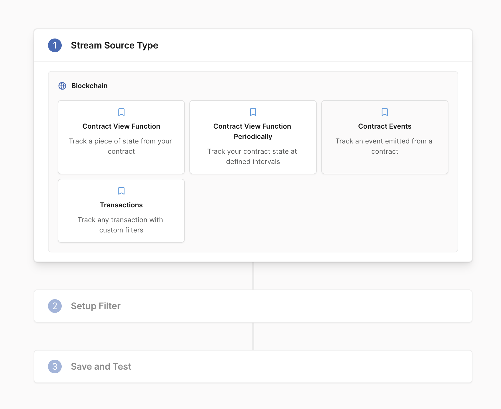
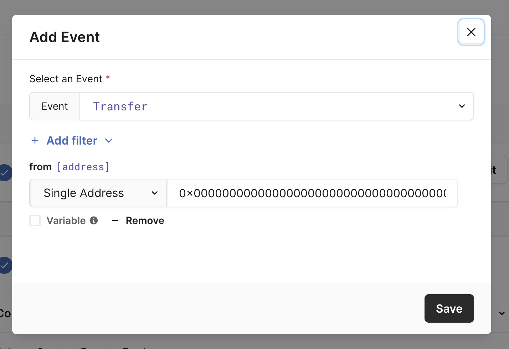
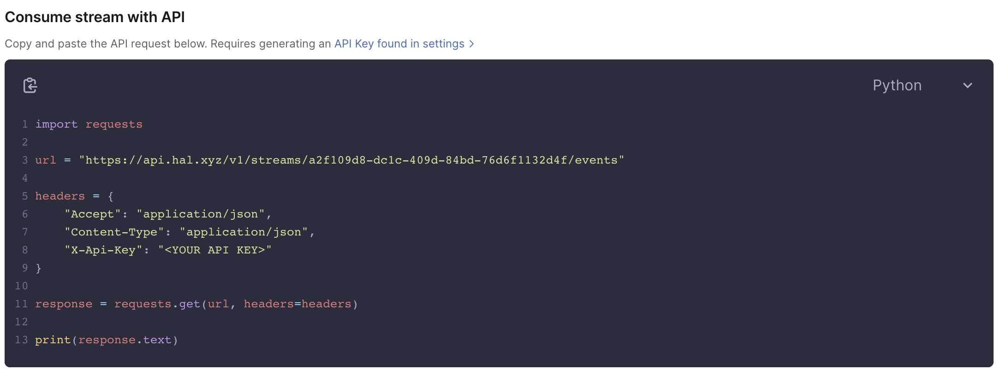
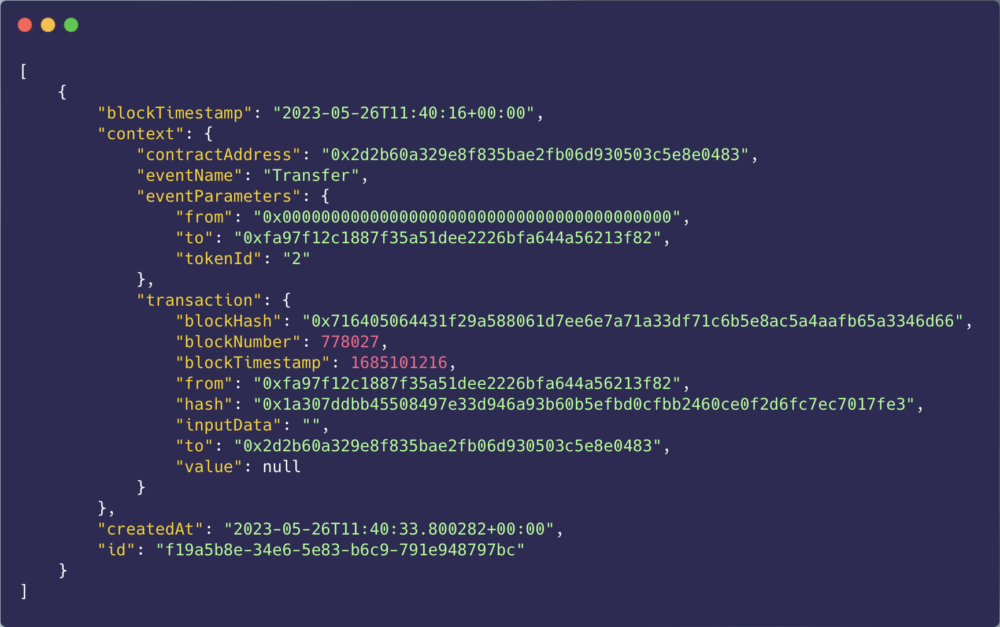
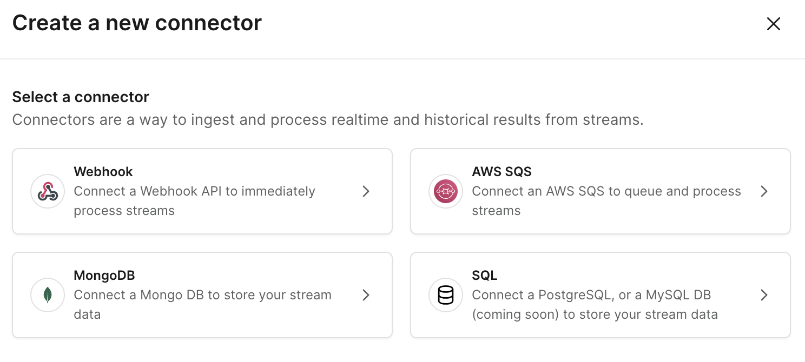

# Tracking NFT Minting on Linea Using Hal Stream

The rising demand for NFTs has put a spotlight on the need for effective tools to track their creation, movement, and trading activities. For businesses and developers working with NFTs, the ability to monitor minting events is crucial, especially with the growth of NFT based applications that Linea will enable thanks to its scaling abilities.

This article explains how you can use Hal Stream to track NFT minting on Linea.

# Table of Contents:

1. Importance of Tracking NFT Minting
2. Understanding Hal Stream
3. How to Use Hal Stream on Linea to Track NFT Minting
4. Applications of Hal Stream for NFTs on Linea
5. Conclusion

## 1. Importance of Tracking NFT Minting

Tracking the creation or "minting" of NFTs provides valuable insights into the dynamics of the NFT market. Developers need this data to manage NFT applications, update their backend, follow trends, identify new opportunities, or simply do some analysis.

## 2. Understanding Hal Stream

Hal Stream is a powerful tool that allows developers to monitor blockchain data from specific contracts, wallets, or NFT collections. With Hal Stream, you can filter and query data based on specific conditions, all through a single REST API. The best part is that it requires no coding and supports multiple EVM-compatible blockchains including Linea.

## 3. How to Use Hal Stream on Linea to Track NFT Minting

Because Linea is a zkEVM, it behaves the same way as any other EVM chains as far as setting up Hal Stream is concerned, enabling you to setup your monitoring with no friction while benefit from Linea’s fast and scalable throughput.

To use Hal Stream to monitor NFT minting on Linea, follow these steps: First, create a Blueprint by logging into your Hal account. Select "Contract Events ».

Next, enter the contract address of the NFT you want to monitor. Make sure this is a Linea NFT contract, in this example we’ll be using a test collection that we created using NFTS2ME.

After adding the contract address, click "Continue". You will have the option to filter event data. To track NFT minting, you want to monitor the 'transfer' event, and more specifically, with the 0X0000… address in the ‘from’ field (as per the ERC721 standard). To do this, select the event from the event list and click "Add filter" to specify the ‘from’ address.

Finally, give your stream a name, then "Save and Deploy". Now, whenever an NFT is minted from the monitored contract, Hal Streams will capture the event data and make it accessible through a REST API using your API key. In your dashboard, you can see the stream alongside all the events that have been added to it, and an easy way for me to consume it.

When consuming this API, Hal stream will return a list of events that matched your filtering.

If pulling the data from the API isn’t what’s best in your workflow, connectors will help Hal Stream push to your system directly, whether it’s using webhook, SQS or databases.

## 4. Applications of Hal Stream for NFTs on Linea

Tracking NFT minting can be applied in various scenarios. And with Linea’s scalability, it can go further than collectible and step into gaming for example, where developers need to identify the newly minted NFTs owned by each player. With Hal Stream, they can easily correlate the NFT minting event to a user's wallet and update their in-game inventory accordingly. In a real estate application, developers can use Hal Stream to monitor the minting of property NFTs, providing a transparent and secure way of managing property ownership and transfers.

## 5. Conclusion

Tracking NFT minting is essential for businesses and developers in the NFT space. With Hal Stream, monitoring these minting events on Linea becomes a breeze. Start tracking NFT minting on Linea with Hal Stream today, and unlock the valuable insights you need to thrive in the NFT market.
