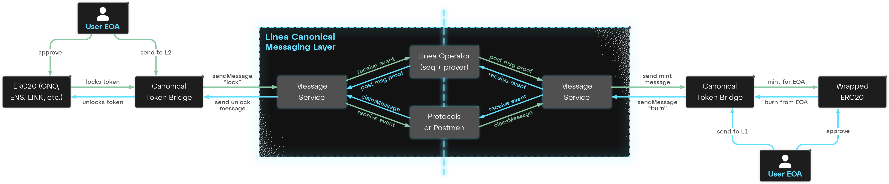

# Architecture overview

## Layers of the bridging ecosystem

1. **[Message Service](./message-service.mdx):** responsible for cross-chain messages between Ethereum and Linea
   - A mechanism that allows a contract on the source chain to safely interact with a contract on the target chain (e.g. L1TokenBridge triggering mint on the L2TokenBridge)
   - Responsible for bridging ETH (native currency on L1 and L2)
   - Supports:
     - **push**: auto-execution on target layer if a fee is paid (not yet available)
     - **pull**: users / protocols responsible for triggering the transaction
1. **[Canonical Token Bridge](./canonical-token-bridge.mdx):** the “lock & mint” contracts that allow bridging to any ERC20
   - Relies on the [Message Service](./message-service.mdx) for cross-chain interactions.
   - Does not come with any UI
1. **Third-party liquidity bridge:** the preferred solution for an end-user
   - Has UI
   - Can bridge to and from any chain (not only between Linea and Ethereum)
   - Has close to zero execution delay
   - Relies on the Canonical Token Bridge to balance liquidity on both chains
1. **Metabridge:** the official UI for Linea
   - Aggregates third-party liquidity bridge services
   - Will only be available for mainnet
