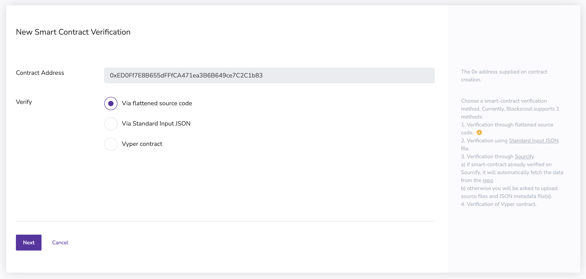

To verify your contracts with Foundry, you can use Blockscout's verification page and Foundry's nifty utility, [`forge flatten`](https://book.getfoundry.sh/reference/forge/forge-flatten)!

To do so, we'll walk through verifying the `Counter` smart contract we deployed in the [Foundry deployment quickstart](../deploy-smart-contract/foundry.md).

## Navigate to the Blockscout verification page

To use Blockscout's verification page, go to the [Linea block explorer](https://explorer.goerli.linea.build/) and search for your deployed contract address. You can find it as the `Deployed to` address from the Foundry deployment output.

```bash
Deployer: YOUR_ACCOUNT_NUMBER
Deployed to: 0xED0Ff7E8B655dFFfCA471ea3B6B649ce7C2C1b83
Transaction hash: 0x967e1290b285e67b3d74940ee19925416734c345f58bd1ec64dcea134647d7ee
```

In our example, the address is `0xED0Ff7E8B655dFFfCA471ea3B6B649ce7C2C1b83`.

After entering the address into the Blockscout search bar, select the Code option on the page. Before a contract has been verified, it should look something like this:


Now, in order to verify, let's click the `Verify & Publish` button, which will take you to the Blockscout verification page pre-populated with your contract address. Select `via flattened source code`, and hit `Next`.



## Flatten the contract source code

In order to verify the contract, `Foundry` offers nifty functionality called `forge flatten`, which flattens a smart contract and all of its import into one file. To do so, call `forge flatten <CONTRACT_FILE_PATH> --output <OUTPUT_FILE_PATH> like so:

```bash
forge flatten src/Counter.sol --output ./flat.sol
```

Open up `flat.sol` and copy paste the code inside:

```javascript
// SPDX-License-Identifier: UNLICENSED
pragma solidity ^0.8.13;

contract Counter {
    uint256 public number;

    function setNumber(uint256 newNumber) public {
        number = newNumber;
    }

    function increment() public {
        number++;
    }
}
```

In our case, `Counter.sol` is incredibly simple, so the flattened code matches `Counter` code, but oftentimes your smart contracts may import libraries and other smart contracts, and the file will look different.

## Get your compiler version

Foundry compiles your code using the compiler version found in `~/.svm`. In order to get it, run `ls ~/.svm`. In this example, the compiler version is `0.8.17`.


## Fill out the Blockscout verification page

Now, you have all the information to fill out the verification page. It should look something like this:


After clicking `Verify & Publish`, Blockscout should auto-direct you to the verified contract page:


