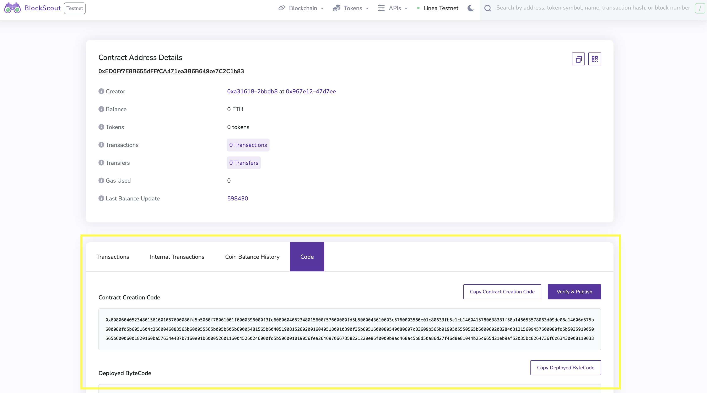
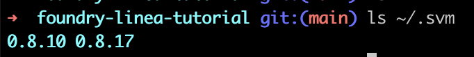
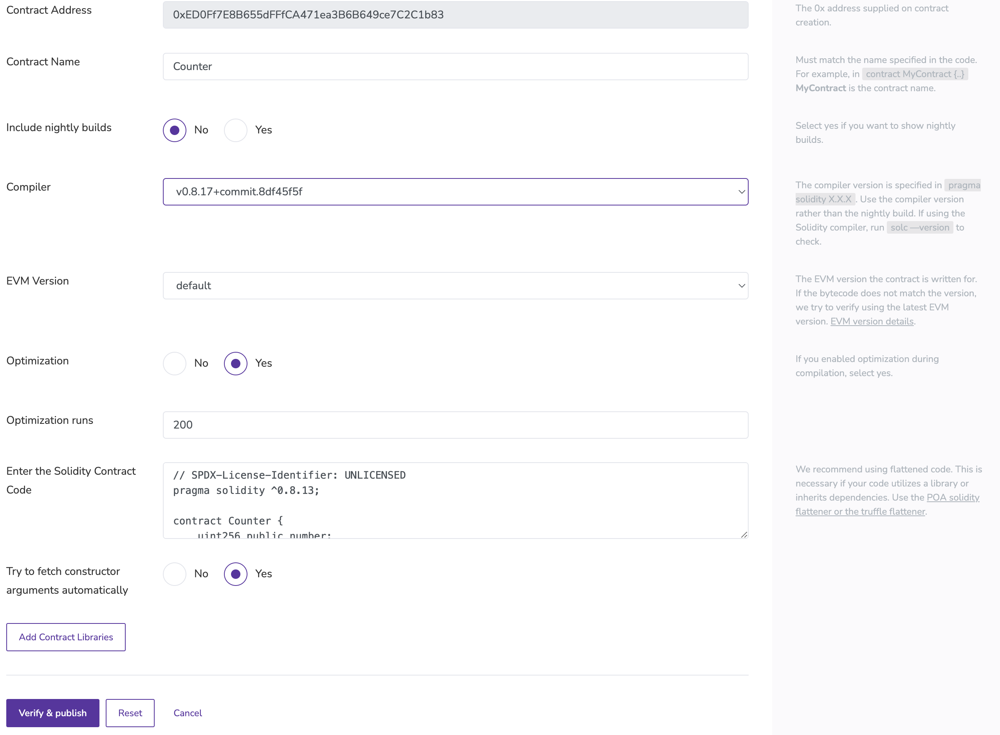
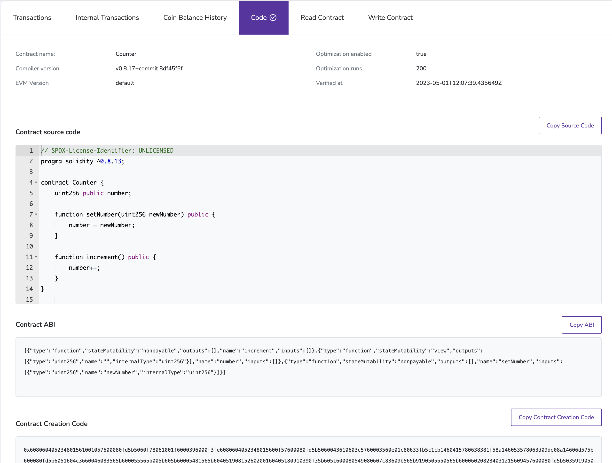

To verify your contracts with Foundry, use Blockscout's verification page and Foundry's [`forge flatten`](https://book.getfoundry.sh/reference/forge/forge-flatten) utility.

In this example, we'll walk through verifying the `Counter` smart contract we deployed in the [Foundry deployment quickstart](../deploy-smart-contract/foundry.md).

## Access the Blockscout verification page

In the [Linea block explorer](https://explorer.goerli.linea.build/), search for your deployed contract address. You can find it in the `Deployed to` address in the Foundry deployment output. In our example, the address is `0xED0Ff7E8B655dFFfCA471ea3B6B649ce7C2C1b83`.

```bash
Deployer: YOUR_ACCOUNT_NUMBER
Deployed to: 0xED0Ff7E8B655dFFfCA471ea3B6B649ce7C2C1b83
Transaction hash: 0x967e1290b285e67b3d74940ee19925416734c345f58bd1ec64dcea134647d7ee
```

Enter the address in the Blockscout search bar, then select the **Code** tab on the page. An unverified contract should look something like this:



To verify the contract, select **Verify & Publish**, which takes you to the Blockscout verification page pre-populated with your contract address. Select **Via flattened source code**, and select **Next**.


## Flatten the contract source code

To verify the contract, use the `forge flatten` utility to flatten the smart contract and all its imports into one file. Run the `forge flatten` command as follows:

<!--tabs-->

# Syntax

```bash
forge flatten <CONTRACT_FILE_PATH> --output <OUTPUT_FILE_PATH>
```

# Example

```bash
forge flatten src/Counter.sol --output ./flat.sol
```

<!--/tabs-->

In the example, open `flat.sol` and copy paste the code inside:

```javascript
// SPDX-License-Identifier: UNLICENSED
pragma solidity ^0.8.13;

contract Counter {
    uint256 public number;

    function setNumber(uint256 newNumber) public {
        number = newNumber;
    }

    function increment() public {
        number++;
    }
}
```

In our case, the flattened code matches the `Counter.sol` code, but oftentimes your smart contracts may import libraries and other smart contracts, and the file will look different.

## Get your compiler version

Foundry compiles your code using the compiler version found in `~/.svm`. To get the compiler version, run `ls ~/.svm`. In this example, the compiler version is `0.8.17`.



## Fill out the Blockscout verification page

Now, you have all the information to fill out the verification page. It should look something like this:



Click **Verify & Publish** and you'll be directed to the verified contract page:


