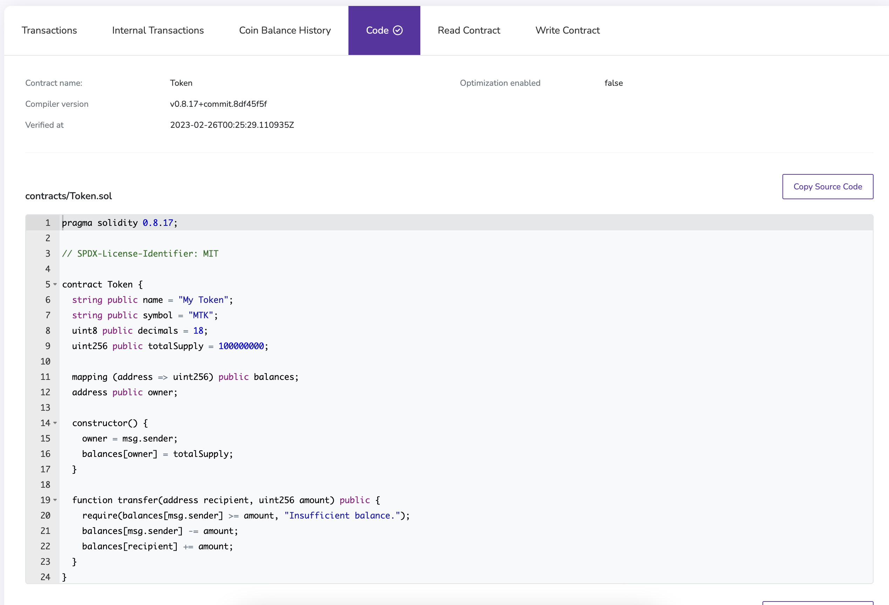

To verify your Hardhat contracts, you can use [Hardhat's Etherscan plugin](https://hardhat.org/hardhat-runner/plugins/nomiclabs-hardhat-etherscan) to verify contracts on BlockScout.

:::note

Note that this is included as part of the `hardhat-toolbox` plugin.

:::

These steps assume you stored your secret keys in a `.env` file, which you can read more about [here](../deploy-smart-contract/hardhat.md/#deploy-your-contract).

## Download the plugin

If you aren't already using `@nomicfoundation/hardhat-toolbox`, download the etherscan plugin:

```bash
npm install --save-dev @nomiclabs/hardhat-etherscan
```

And add the plugin to the top of your `hardhat.config.js` file:

```javascript
require("@nomiclabs/hardhat-etherscan");
```

## Add your Etherscan API Key

We'll be using a `.env` file to store our sensitive information:

```bash
npm i -D dotenv
```

Next, you'll need to get an Etherscan key by creating an account at https://etherscan.io/. Grab your key, and add it to the `.env` file:

```
PRIVATE_KEY=YOUR_PRIVATE_KEY_HERE
ETHERSCAN_API_KEY=YOUR_API_KEY_HERE
```

Then, add the key to your `hardhat.config.js` as follows:

```javascript
require("@nomicfoundation/hardhat-toolbox");
require("dotenv").config();
const { PRIVATE_KEY, ETHERSCAN_API_KEY } = process.env;

module.exports = {
  solidity: "0.8.17",
  networks: {
    linea: {
      url: `https://rpc.goerli.linea.build/`,
      accounts: [PRIVATE_KEY],
    },
  },
  etherscan: {
    apiKey: linea,
  },
};
```

## Add the custom chain

Because Linea is not supported by the network yet, we'll have to add a custom chain like so:

```javascript
etherscan: {
  apiKey: {
    linea: ETHERSCAN_API_KEY
  },
  customChains: [
    {
      network: "linea",
      chainId: 59140,
      urls: {
        apiURL: "https://goerli.lineascan.build/api",
        browserURL: "https://goerli.lineascan.build/"
      }
    }
  ]
}
```

:::note

The Etherscan apiKey and network name for your custom chain must match the network name under `networks` in your `hardhat.config.js`.

:::

## Verify the smart contract

To verify your contract, run the following command:

```bash
npx hardhat verify --network linea <DEPLOYED_CONTRACT_ADDRESS>
```

Don't worry if your result looks like this:

```bash
Successfully submitted source code for contract
contracts/Token.sol:Token at 0xF0d4039a96b01F3767010dEf837EfB3CCfe54675
for verification on the block explorer. Waiting for verification result...

Error in plugin @nomiclabs/hardhat-etherscan: The API responded with an unexpected message.
Contract verification may have succeeded and should be checked manually.
Message: Unknown UID

For more info run Hardhat with --show-stack-traces
```

You can check that it was verified correctly by navigating to the [block explorer](https://goerli.lineascan.build/) and pasting in the deployed contract address.



:::info

[Learn more about different configurations for verifying your smart contracts](https://docs.blockscout.com/for-users/verifying-a-smart-contract/hardhat-verification-plugin).

:::
