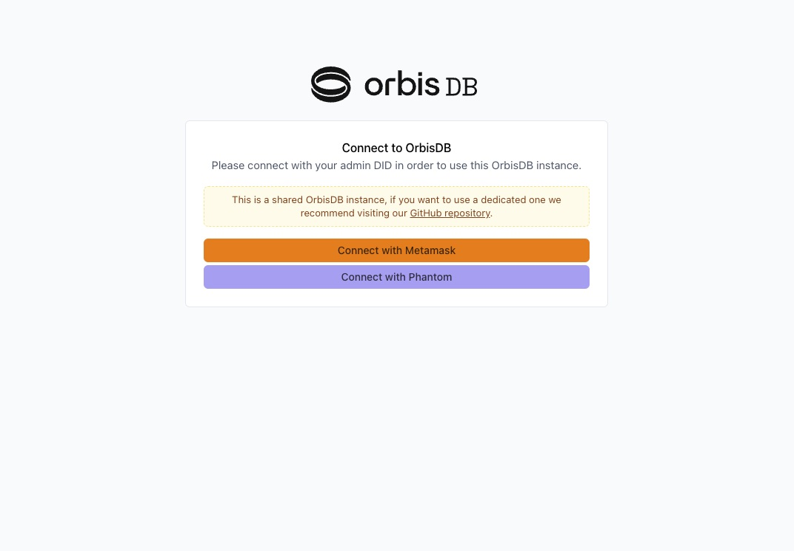
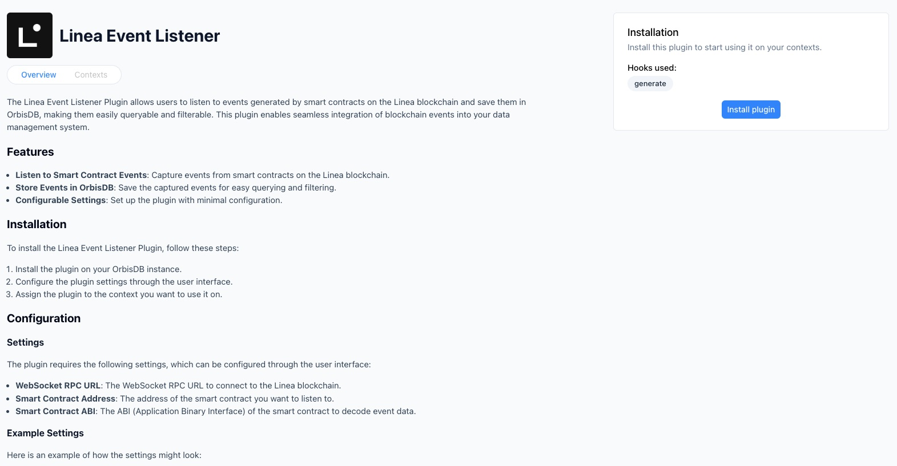
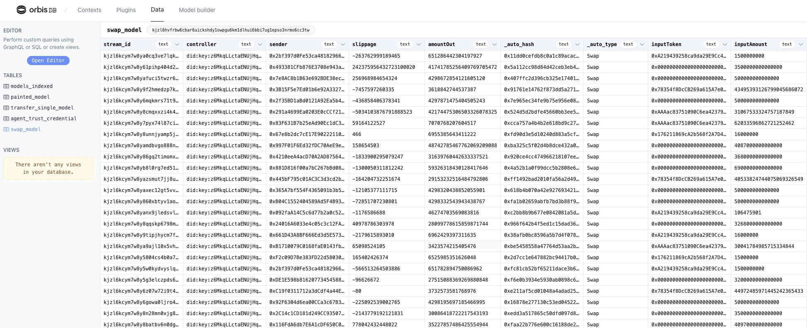
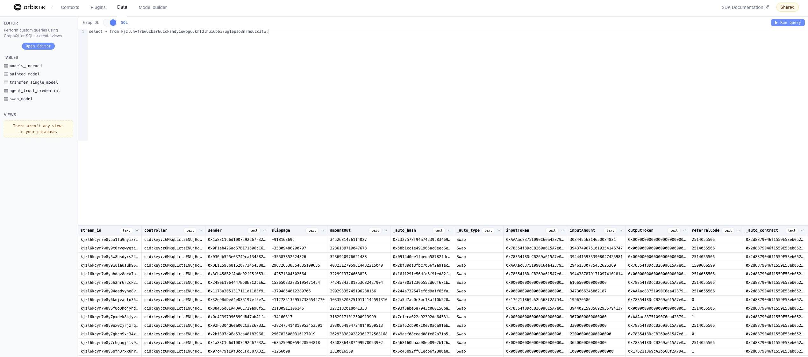

## Blockchain Event Indexing with OrbisDB on Ceramic

[Ceramic](https://ceramic.network/) is a decentralized data network built for verifiable data at scale. The Ceramic Network blends the trust, provenance, and composability of a blockchain together with the performance and scale of traditional databases and event-driven systems to empower organizations to derive more value from their data.

### How does Ceramic work?

The Ceramic Protocol operates on decentralized event streams, where user accounts—powered by decentralized identifiers (DIDs)—cryptographically sign data events and submit them to the network. These events are synchronized across subscribing nodes in the network and arranged into event logs, or Ceramic "streams." Each stream offers the flexibility to hold various types of content, making Ceramic suitable for a wide range of data applications, including user profiles, posts, relationships, and more, while retaining the history of changes the stream has undergone throughout its lifetime.

To extend Ceramic's functionality, most developers utilize a database interface that sits on top of the Ceramic protocol, enabling flexible options for preferred database types, hosting methods, and other developer tools.

### OrbisDB

This guide will demonstrate how to use OrbisDB, an open-source relational database that inherits data ownership, composability, and the decentralized properties of the network it’s built on (Ceramic). OrbisDB offers many developer-friendly features in a highly scalable way, including multiple ways to query data, a built-in dashboard UI, shared nodes for testing and iteration, and an ecosystem of plugins that extend its data functionality.

This guide will also show developers how to use the on-chain event listener plugin to index events from a Linea smart contract.

## Getting Started

Developers can choose from multiple options when using OrbisDB:

1. Using the hosted [OrbisDB Studio](https://studio.useorbis.com/) and the default shared endpoints (ideal for testing, rapid iteration, and low-volume data production applications)
2. A [local instance](https://www.notion.so/d3e9dd97e97b4c00a530b6ada20a8536?pvs=21)
3. A [self-hosted](https://www.notion.so/603eb88f811f4bd596c2af38d187ac81?pvs=21) (running in the cloud is suitable for production)

These configuration options give developers as much or as little control over how their nodes are operated as they feel comfortable with. As such, for ease of use and to get started quickly, this guide will use the hosted [OrbisDB Studio](https://studio.useorbis.com/) version

### Enter the OrbisDB Studio

Visit the [OrbisDB Studio](https://studio.useorbis.com/) in your browser to get started. If it is your first time to the shared studio, you will likely see the following screen:



You will be prompted to connect with your wallet and configure a new shared instance (free for developers). You should also see a signature message appear in your wallet requesting you to create a session on the Ceramic Network.

Signing this message will create an authenticated browser-side session that will be used on your behalf to write verified data to Ceramic using OrbisDB. As you'll see later when we explore the studio, developers can create new data models, implement plugins, and perform other write actions through the studio view. This browser session allows the front end to do so.

### Exploring the Studio view

The OrbisDB studio interface is split into 4 parts:

**Contexts**

This is where you can define new application contexts, as well as a view into your Ceramic node URL, OrbisDB instance endpoint, and environment ID (all of which are needed when using the SDK).

**Plugins**

A section where you can configure various plugins to extend your data's functionality. You can also build your own if running a local or self-hosted OrbisDB instance.

**Data**

This is where our data will appear once records are made using our node endpoints and environment ID. You can also query your data using this view (which will be explored later in this guide).

**Model Builder**

Finally, the model builder allows developers to design and deploy new schemas to their OrbisDB instance.

### Create a New Context

Contexts allow developers to organize their data across different applications or projects. Developers can create sub-contexts within each context for a more detailed and granular approach.

Create a new context in the "Contexts" tab by clicking "Add context". You can name this context whatever you prefer.

### Configure the Event Listener Plugin

Now that you've established a new context you can set up your plugin. Navigate to the "Plugins" tab in the studio view and click on the "Linea Event Listener" plugin. 

Once on the plugin page, you'll notice instructions conveniently listed for you:

Click "Install plugin" on the right-hand side to apply the plugin to your OrbisDB instance.



Next, assign your plugin to the context you created in the previous step.

You will be prompted to add additional information on the following screen:

1. WebSocket RPC URL - you can obtain one for free by creating a new project in your [Infura](https://app.infura.io/) dashboard. Configure your project to use Linea Mainnet. Finally, append your API key to `wss://linea-mainnet.infura.io/ws/v3/` - once appended, enter this as your WebSocket URL.
2. Contract address - select any active contract you wish to observe. For example, you can use the [Odos: Router V2](https://lineascan.build/address/0x2d8879046f1559e53eb052e949e9544bcb72f414) contract (`0x2d8879046f1559E53eb052E949e9544bCB72f414`).
3. Contract ABI - this must be the contract's ABI for the same contract address you entered in Step 2 above. You can use Lineascan for many verified contracts by going to the [Contract tab](https://lineascan.build/address/0x2d8879046f1559e53eb052e949e9544bcb72f414#code) and copying the matching value for "Contract ABI".
4. Contract Event Name - finally, select the smart contract event from that contract you want to track.

Once ready, click the "Save" button to save your plugin configuration.

## Viewing and Querying Data

The event listener plugin will not retroactively index events, so depending on the frequency with which the event you chose is emitted within the contract, your corresponding OrbisDB table may already start taking records. Navigate back to the "Data" tab in your studio view. Over time, as events are triggered and indexed, your view might look something like this:



At the top of your table's view, you'll see a string that begins with "k" next to the name of your table (which is semantically associated with the event you're listening for). This string is the static identifier for the table in Ceramic Stream ID format. You'll use this in most cases in queries and application code when performing reads against this table's values. Go ahead and copy this value to your clipboard.

As mentioned above, developers can query their data within the OrbisDB UI. Click the "Open Editor" button on the upper left-hand side from within the "Data" tab. You can toggle between GraphQL or SQL to test queries:



### Using the SDK

In most cases, developers want to query data from within their application logic. Using our Odos Router example above, this may look something like:

```TypeScript
import { OrbisDB } from "@useorbis/db-sdk";

// bring in the identifier for our table (or import from a private env file)
const SWAP_MODEL = "kjzl6hvfrbw6cbar6uickshdy1owpgu6km1dlhui6bbi7ug1epso3nrmo6cc3tw";

// instantiate an OrbisDB client
const orbis = new OrbisDB({
      ceramic: {
        // this is the gateway from your "Contexts" tab in your studio
        gateway: "https://ceramic-orbisdb-mainnet-direct.hirenodes.io/",
      },
      nodes: [
        {
          // both of the below are also from your studio view
          gateway: "https://studio.useorbis.com",
          env: "<your-env-ID>"
        },
      ],
  });

// below is an example of running raw SQL
const recordsQueryRaw = await orbis
  .select()
  .raw(`SELECT * FROM ${SWAP_MODEL} as table WHERE table.inputToken = '0xe5D7C2a44FfDDf6b295A15c148167daaAf5Cf34f'`)
  .context(CONTEXT_ID);
  .run();

// using the built-in ORM
const recordsQuery = await orbis
  .select("sender", "slippage", "inputToken", "inputAmount")
  .from(SWAP_MODEL)
  .where({ inputToken: "0xe5D7C2a44FfDDf6b295A15c148167daaAf5Cf34f" })
  .context(CONTEXT_ID);
  .run();

// using GraphQL - you can find your endpoint in your studio view
const postQuery = await fetch(GRAPHQL_ENDPOINT, {
    method: "POST",
    headers: {
      "Content-Type": "application/json",
    },
    body: JSON.stringify({
            query: `
              query {
                swap_model {
                  sender
                  slippage
                  inputToken
                  inputAmount
                }
              }
            `,
          }),
    });

```

## Conclusion

You can now configure a blockchain event listener to monitor, index, and query events on Linea!

For more information on how to start extending your decentralized data with Ceramic, visit:

- [Ceramic Documentation](https://developers.ceramic.network/)
- [Ceramic Blog](https://blog.ceramic.network/)
- [OrbisDB Website](https://useorbis.com/)
- [Get in touch](https://ceramic.network/contact-us) with the Ceramic team