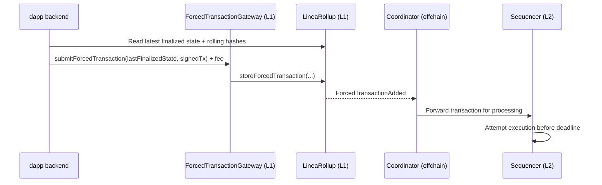

Forced transactions allow users to submit transactions directly to Ethereum (L1) with a guaranteed processing deadline. This manual submission mechanism helps users submit transactions even when the normal L2 path is blocked or delayed.

## What are forced transactions?

Forced transactions are an anti-censorship mechanism that bypasses the normal L2 submission path and submits transactions directly to the L1. When a user submits a forced transaction, they submit a signed L2 transaction to the L1, with a requirement that the sequencer processes the transaction by a specified block deadline. 

Typically, the sequencer will process the transaction well before the deadline -- the deadline is the **latest acceptable block, not the target block**. If the sequencer fails to meet the deadline, finalization will revert.

Forced transactions are chained using an MiMC-based rolling hash. The rolling hash commits to the complete ordered sequence of forced transactions, ensuring processing and storage. This mechanism prevents skipped forced transactions, unauthorized inserted transactions, and reordering attacks.

### Processing vs. execution

A forced transaction can be processed by the sequencer, but still fail on the L2. The sequencer only processes the transaction; it does not attempt to execute it. After a forced transaction is processed by the sequencer, it will be attempted by the L2 prover. 

At this stage, the transaction may fail to execute on the L2. Reasons for failure include: 

| Failure Reason | Description |
|----------------|-------------|
| **Invalid Nonce** | The signer's nonce on L2 has changed since the transaction was signed. Another transaction may have executed first. |
| **Insufficient Gas** | The `gasLimit` specified is too low for the transaction to complete. |
| **Insufficient Balance** | The signer doesn't have enough ETH on L2 to cover `value + (gasLimit * maxFeePerGas)`. |
| **Contract Revert** | The target contract's logic reverted the call (require failed, custom error, etc.). |
| **Out of Gas During Execution** | Complex computation exhausted the gas limit mid-execution. |
| **Invalid Signature** | Edge cases where the signature is technically valid but doesn't match L2 state. |

### Use cases

Ideal forced transaction use cases include transactions that need strong delivery guarantees, such as:

- Withdrawal requests and claims
- Liquidation and risk-management actions
- Guaranteed governance transaction processing
- Emergency controls and safety operations.

## Enable the forced path

Forced transaction submission is not enabled by default. To enable forced transaction submission for your smart contract, you need to:

1. Deploy the `AddressFilter` contract 
2. Deploy the `ForcedTransactionGateway` contract

Once both contracts are deployed, a LineaRollup admin will grant the relevant `FORCED_TRANSACTION_SENDER_ROLE` to the `ForcedTransactionGateway` contract, allowing your contract to submit forced transactions.

## Submit a forced transaction

To submit a forced transaction, you first need to query the latest finalized state and rolling hashes from the L1.

Once you have the latest finalized state and rolling hashes, you can construct an L1 forced transaction submission with the following fields:

LastFinalizedState:
- `timestamp`
- `messageNumber`
- `forcedTxNumber`
- `messageRollingHash`
- `forcedTxRollingHash`

Then, sign an EIP-1559 transaction destined for the L2:

```bash
struct Eip1559Transaction {
    uint256 nonce;
    uint256 maxPriorityFeePerGas;
    uint256 maxFeePerGas;
    uint256 gasLimit;
    address to;
    uint256 value;
    bytes input;
    AccessList[] accessList;
    uint8 yParity;
    uint256 r;
    uint256 s;
}
```

When submitting the transaction, the gateway will validate that:

- the last finalized state matches
- the transaction details are within limits
- the appropriate fee has been paid.

At this stage, the transaction will also be checked by the `AddressFilter` to ensure that certain addresses, such as precompiles, are not called directly.

The gateway will then send the transaction to the LineaRollup for storage.

## Technical components

When a user submits a forced transaction, the following components validate and process the transaction:

- `ForcedTransactionGateway`: Validates and submits the transaction to the Linea rollup.
- `LineaRollup`: Stores the transaction in the rollup and generates a rolling hash.
- Coordinator: Forwards the transaction to the sequencer for processing.
- Sequencer: Processes the transaction before the deadline.
- Prover: Generates a proof of the transaction and submits it to the finalization layer.


When a user submits a forced transaction to the `ForcedTransactionGateway`, the gateway calculates the deadline with a buffer, validates that the gas limit is within the allowed range, validates the current state, and submits the transaction to the `LineaRollup`.

The Linea rollup stores the transaction in a queue of forced transactions, generating a rolling hash. The rollup also enforces processing by the deadline. At this stage, the transaction is also checked by the `AddressFilter` to ensure that certain addresses, such as precompiles, are not called directly.

The transaction is then sent to the coordinator, an offchain component that forwards the transaction to the sequencer for processing. The sequencer receives the transaction and must process it before the deadline.

Once processed, the prover generates a proof of the transaction and the corresponding rolling hash and submits the proof to the finalization layer.

The complete lifecycle of a forced transaction is as follows:



