Linea transactions progress from submission to soft, and then to hard finality.

## Transaction finality

Public Linea Mainnet transactions are finalized on Ethereum, making Ethereum the layer 1 (L1) and
Linea the layer 2 (L2).

Finality switches between three states, pending, soft, and hard:

- Pending: A transaction is submitted and various compatibility and logic checks are underway.
- Soft finality: The transaction is confirmed on Linea. This takes two seconds (Linea's block time). 
  > For simplicity, Linea is guaranteed to not reorg—remove competing versions of blockchain history in favor of a canonical one—the L1, however, may reorg.
- Hard finality: The proof submitted to L1 has been verified and two epochs have elapsed. 

:::info

In December 2025, Linea reached a median hard finality time of less than 1 hour and 40 mintues. This median time will continue to decrease, and is expected to reach ~30 minutes in the near future. Occasionally, high gas costs and upgrades can cause delays in finalization, but hard finality timing should never exceed 16 hours.

:::

The following sequence diagram matches the 6 steps described below to detail the finality state of a 
transaction.

```mermaid
sequenceDiagram
    participant User as User / Client
    participant Node as RPC / Full node
    participant Builder as Block builder
    participant Sequencer as Sequencer
    participant Stack as Linea stack
    participant L1 as Finalization layer (Ethereum)

    %% ======================
    %% L2 phase (soft finality)
    %% ======================
    rect rgb(64, 69, 76)
        User->>Node: Step 1: Submit transaction
        Node->>Builder: Step 1: Enter mempool

        Builder->>Builder: Step 2a: Add tx to block (assemble block)
        Builder->>Sequencer: Step 2b: Propose block

        Sequencer->>Sequencer: Step 2b: Validate and commit block (Linea Mainnet)

        Sequencer->>Stack: Step 3: Soft finality achieved
    end

    %% ======================
    %% L2 batching and proving
    %% ======================
    rect rgb(64, 69, 76)
        Stack->>Stack: Step 4: Conflation
        Stack->>Stack: Step 5: Expand traces and generate proofs
    end

    %% ======================
    %% L1 phase (hard finality)
    %% ======================
    rect rgb(64, 69, 76)
        Stack->>L1: Step 6: Submit proof and blob data
        L1->>L1: Step 6: Hard finality after L1 verification
    end

```

::::info

For [custom deployments](../../stack/how-it-works/deployment-models.mdx), Linea network operators may select an [alternative finalization layer](/stack/how-it-works/data-availability-finalization#finalization-layer-options), and select [validator logic](/stack/how-it-works/data-availability-finalization#finality-design-options)
thereby determining how and where transactions reach hard finality.

::::

To reach hard finality, a transactions must complete the following steps:

## Step 1: Submission

> **Finality:** None (pending)

A user signs a transaction and broadcasts it to Linea. These transactions enter the mempool as
pending.

- Components: [RPC nodes](../../protocol/architecture/index.mdx#rpc-nodes),
  [full nodes](../../protocol/architecture/index.mdx#full-nodes).

## Step 2: Block building

> **Finality:** None (executing)

The Linea [sequencer](../../protocol/architecture/sequencer/index.mdx) is responsible for ordering,
building, and executing blocks.

The sequencer checks the validity of each transaction added to the mempool, rejecting transactions
as necessary.

The sequencer orders transactions, taking into account the
[priority fee paid](../how-to/gas-fees.mdx#understand-the-gas-price-calculation). Valid
transactions are placed into blocks in the correct sequence and executed.

::::note[Validity]

While the Linea chain may be followed using any Ethereum-compatible client, transaction validity
conditions are specific to Linea, and differ slightly from those of other networks, including
Ethereum.

::::

At this point, the execution layer's state changes and the block containing the transaction is
added to the "head" of the Linea blockchain--the most recent block--and a transaction receipt is
returned to the user's wallet as confirmation.

- **Components:** [Besu](../how-to/run-a-node/linea-besu.mdx#run-using-docker) with sequencer plugins

## Step 3: State tracking

> **Finality:** Soft finality (Linea)

Data about the transaction and the state of the network at its time of execution are recorded in
**traces**, an output of part of the sequencer called the
[trace generator](../../protocol/architecture/sequencer/traces-generator.mdx).

Traces are passed to the state manager block-by-block and then used to record and track state
changes for batching and proof generation. With the transaction executed and state updated, the
transaction has reached **soft finality** and the user sees the transaction reflected and confirmed
in their wallet.

From Linea's perspective, the transaction is complete, however, an
[L2 like Linea](../../protocol/overview.mdx#what-is-linea) must still reach hard finality on the
finality layer.

- **Components:** [Besu](../how-to/run-a-node/linea-besu.mdx#run-using-docker) with tracer plugins

## Step 4: Conflation

> **Finality:** Soft finality (Linea)

The transaction's block undergoes
[conflation](../../protocol/architecture/sequencer/conflation.mdx): multiple consecutive blocks are
merged into a single batch that forms part of the package of data posted to Ethereum.

Combining transaction data lets the system generate one proof for many transactions, reducing the
cost of submitting proofs to the finalization layer.

Occasionally, a batch may only consist of one block, with no conflation having taken place. This
occurs when chain activity levels are particularly high, and the block size is larger than normal.

- **Components:** [Coordinator](../../protocol/architecture/coordinator.mdx)

## Step 5: Blob and proof generation

> **Finality:** Soft finality (Linea)

This prover uses the transaction data, when prompted by the
[coordinator](../../protocol/architecture/coordinator.mdx), Linea's
[prover](../../protocol/architecture/prover/trace-expansion.mdx) **expands** the trace, preparing it
for inclusion in the proof. 

The prover generates proofs that the original and conflated--compressed--versions are computationally 
equivalent; after collecting several such proofs, the prover then compresses the proofs themselves, reducing the
proof size by generating a single succinct proof which can be posted to the Layer 1. 

This final zk-SNARK attests to the conflated batch (multiple blocks), enabling a single proof to
verify many transactions. The coordinator combines batches into blobs for data availability.

::::info[Proving]

Linea's prover employs a two-stage method for developing the proofs, providing an inner and outer
proof. The [inner proof](https://paragraph.com/%40linea/the-linea-prover-for-a-very-smart-high-schooler)
uses a combination of tools, including Arcane and Vortex, to recursively reduce the proof size. The
outer proof is generated using the Consensys-maintained library
[`gnark`](https://docs.gnark.consensys.net/), compressing the proof size even further. The
resulting proof is the zk-SNARK: the proof that's submitted to Ethereum.

::::

- **Components:** [Prover](../../protocol/architecture/prover/index.mdx),
  [tracer](../../protocol/architecture/sequencer/traces-generator.mdx),
  [coordinator](../../protocol/architecture/coordinator.mdx),
  [Shomei state manager](../../protocol/reference/repos.mdx#shomei)

## Step 6: Batch finalization

> **Finality:** Hard finality (Ethereum)

The proof for the batch is submitted to Ethereum Mainnet. This proof attests to the execution of
all transactions in the batch, including our user's transaction introduced in
[step 1](#step-1-submission).

Two elements are submitted to the L1:

- Blob data: which contains L2 transaction and messaging data
- The proof: as [detailed in step 5](#step-5-blob-and-proof-generation)

The blob data shared with the L1 can be used to reconstruct Linea's state and verify the data
underlying the proof--before it disappears from the L1, after 4,096 epochs (~18 days). The Linea
rollup contract on L1 calls the Ethereum verifier contract which uses the blob data to determine
whether or not to accept the batch as valid.

You can view finalized batches on [LineaScan](https://lineascan.build/batches).

Once the proof is verified by the L1 and two epochs have passed, the transaction becomes immutable
history, and reaches **hard finality**. Its lifecycle is complete.

- **Components:** Coordinator, Ethereum finalization contract

## Hard finality when?

The time to hard finality depends on:

- The proof generation time and other elements unrelated to network stress but linked to the prover configuration.
- The network conditions of the finality layer, which determine the inclusion time of the committed L2 state.
- The the time it takes for a block to be finalized once it has been included. For example, Ethereum requires 64 slots, approximately 13 minutes, to finalize.

## Next steps

- Learn more about the [protocol architecture](../../protocol/architecture/index.mdx)
- Access the [source code](../../protocol/reference/repos.mdx) underpinning the Linea tech stack
