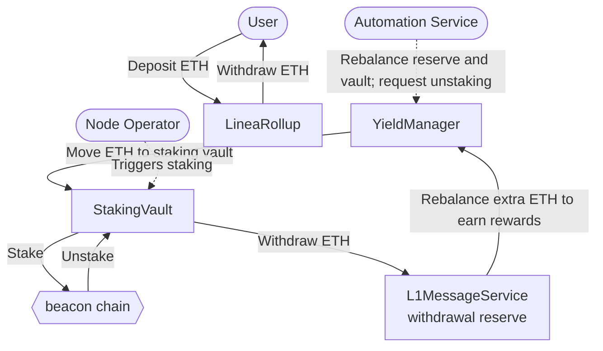
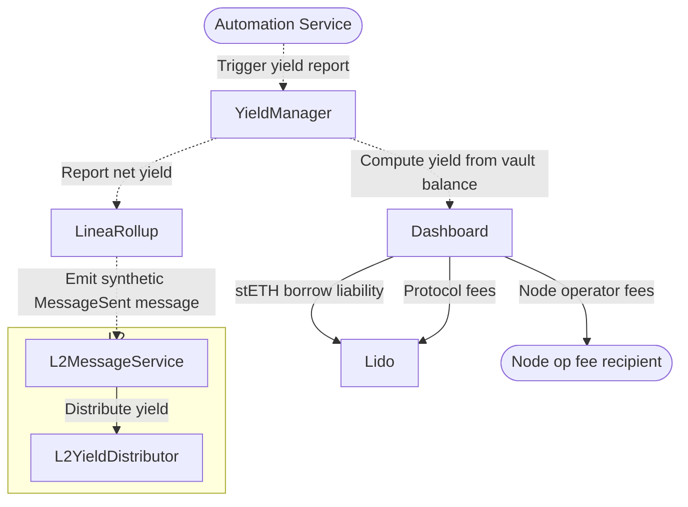
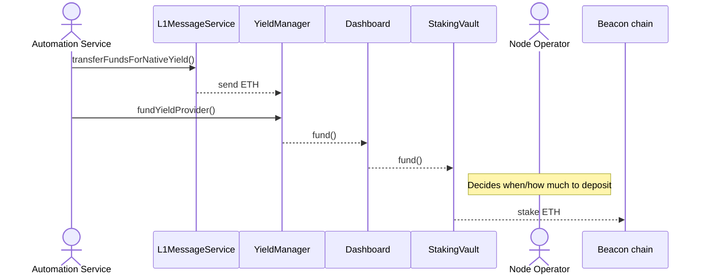
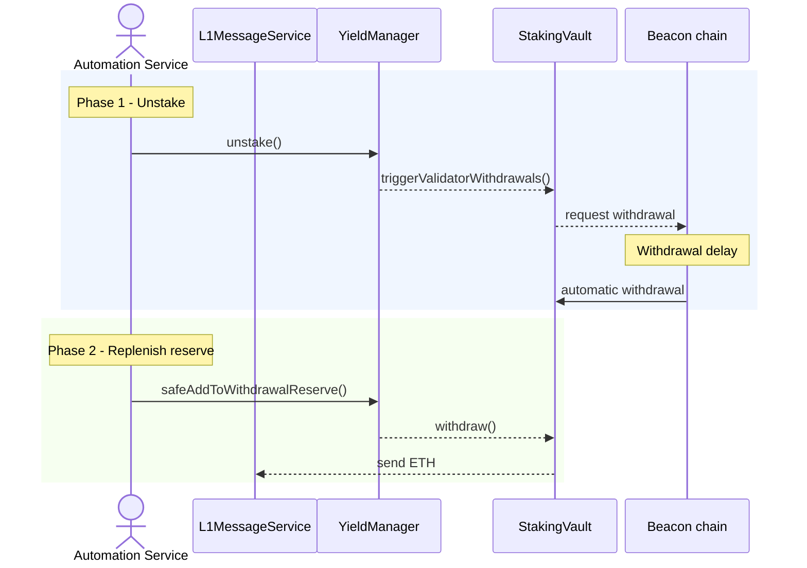
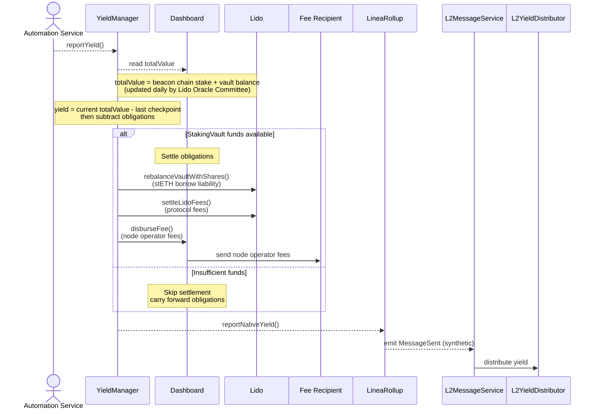
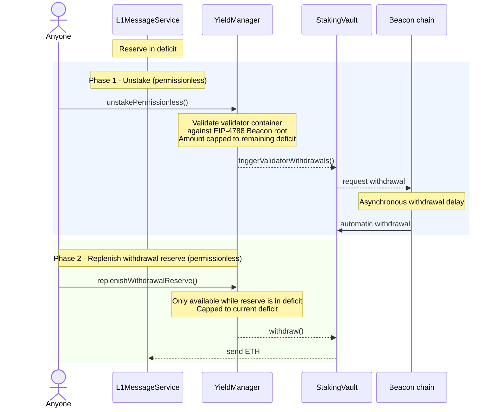
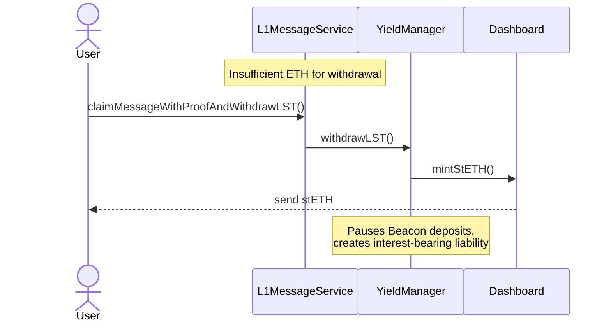
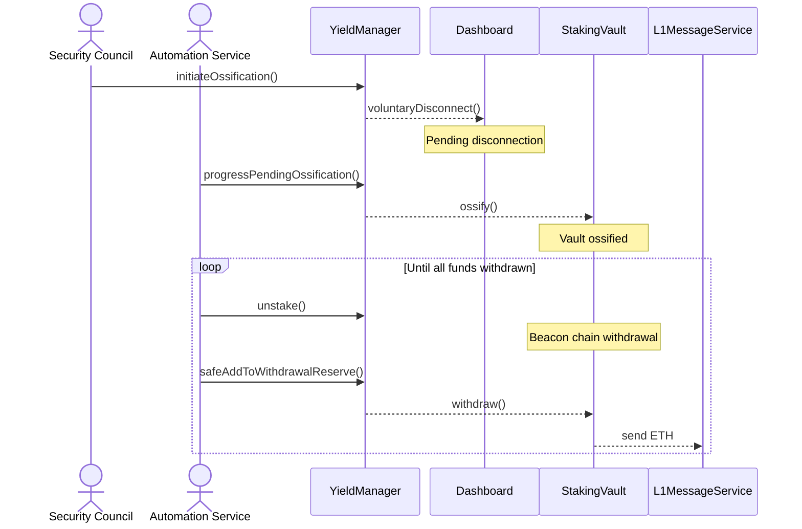

# Yield Boost technical overview

:::caution[status]

🚧 Yield Boost is in a phased rollout. Initial infrastructure has been deployed
on mainnet, with early ETH movements into the `YieldManager` and `StakingVault`.
This documentation describes the intended steady-state design, and some
components may not yet be active.

:::

This page describes where ETH moves in Yield Boost and which roles control each
movement. For user-facing behavior, see the
[Yield Boost overview](./index.mdx). For risks, see
[Risk disclosures](./risk-disclosures.mdx). The
[canonical technical specification](https://hackmd.io/@kyzooroast/Hk7DQXH6lx)
governs if this page and the spec conflict.

## High-level architecture

Surplus ETH above the `L1MessageService` withdrawal reserve minimum may be
staked via a Lido V3 stVault (`StakingVault`). Beacon-chain rewards are reported
as net yield to Linea (L2) for distribution.

### Key participants

- **User:** Bridges ETH to and from Linea via the
  [`LineaRollup`](../../build/contracts#deployed-contracts).
- **[Security Council](https://github.com/LFDT-Lineth/lineth-monorepo/blob/main/contracts/docs/security-council-charter.md):**
  Multisig that can pause staking, configure the yield manager, and initiate
  ossification.
- **[Lido Oracle Committee](https://docs.lido.fi/token-guides/steth-superuser-functions/#oracle-and-accounting-flow):**
  5-of-9 operators that submit vault accounting reports to Lido.
- **Node operator:** Runs validators and deposits from the `StakingVault` under
  the agreed deposit trigger.
- **`NativeYieldAutomationService`:** Offchain service for routine rebalance,
  yield reporting, and (if initiated) ossification processing.
- **`LidoUpgradeMonitor`:** Offchain service that alerts the Security Council to
  relevant Lido governance proposals.

### L1 ETH flow

When a user deposits ETH into `LineaRollup`, that ETH remains on L1. Surplus
above the minimum reserve may be staked. Withdrawals back to the user are paid
from the `L1MessageService` reserve when liquid ETH is available.

- [**`LineaRollup`:**](../../build/contracts#deployed-contracts) L1 bridge and
  accounting anchor for Yield Boost.
- **`L1MessageService`:** Holds the withdrawal reserve (unstaked ETH that pays
  bridge redemptions). Distinct from the `LineaRollup` accounting anchor.
- **`YieldManager`:** Moves ETH between the `L1MessageService` reserve and the
  `StakingVault`, and calculates net yield after fees and liabilities.
- **`StakingVault`:** Lido V3 stVault; validator withdrawals return here before
  ETH moves back to the `L1MessageService` reserve.
- **Beacon chain:** Where validators stake and earn rewards.
- **Node operator:** Deposits from the vault to the beacon chain.
- **Automation service:** Triggers routine stake/unstake, reserve top-ups, and
  yield reports.

> The node operator's deposit trigger is part of an automated process agreed
> beforehand. The node operator runs validator infrastructure.

### Yield reporting and L2 distribution

- **`YieldManager`:** L1 accounting and settlement (see
  [L1 ETH flow](#l1-eth-flow)).
- **[Dashboard](https://docs.lido.fi/contracts/dashboard#what-is-dashboard):**
  Lido V3 management layer around the `StakingVault`.
- **[Lido](https://docs.lido.fi/):** Provides the `StakingVault` and dashboard.
- **Fee recipient:** Receives node operator fees when settled.
- **Security Council:** See [Key participants](#key-participants).
- **[L2MessageService](../../build/contracts):** Receives L1 messages and unlocks
  ETH on L2.
- **L2YieldDistributor:** Sends unlocked yield to designated recipients.

Steps:

1. The automation service triggers a yield report on the `YieldManager`.
2. The `YieldManager` reads vault `totalValue` from the dashboard (beacon stake
   plus vault balance; updated by the Lido Oracle Committee).
3. Yield is current `totalValue` minus the last checkpoint, minus outstanding
   obligations.
4. If funds allow, the `YieldManager` settles obligations (stETH liabilities and
   protocol fees to Lido; operator fees to the fee recipient). Otherwise
   obligations carry forward.
5. The `YieldManager` reports remaining net yield to the `LineaRollup`.
6. The `LineaRollup` emits a synthetic `MessageSent` event. The
   `L2MessageService` unlocks the corresponding ETH on L2.
7. The `L2YieldDistributor` sends unlocked ETH to designated recipients.

**Legend**

- **Solid line:** Fund movement (ETH/stETH transfer)
- **Dashed line:** Function call or event (no funds move)

No ETH is bridged during yield reporting. The synthetic `MessageSent` event
states how much new yield is available on L2. Reported yield is net of
obligations so L2 minting stays matched to L1 collateral growth.

## Roles and permissions

| Role | Held by | Permissions |
| --- | --- | --- |
| `YIELD_PROVIDER_STAKING_ROLE` | Automation Service, Security Council | Rebalance excess ETH from the `L1MessageService` reserve into the `StakingVault` |
| `YIELD_PROVIDER_UNSTAKER_ROLE` | Automation Service, Security Council | Request validator withdrawals and replenish the `L1MessageService` reserve |
| `YIELD_REPORTER_ROLE` | Automation Service, Security Council | Trigger yield reporting, including settlement of fees and liabilities from staking rewards |
| `STAKING_PAUSE_CONTROLLER_ROLE` | Automation Service, Security Council | Pause or resume node operator deposits |
| `OSSIFICATION_PROCESSOR_ROLE` | Automation Service, Security Council | Progress and finalize vault ossification |
| `OSSIFICATION_INITIATOR_ROLE` | Security Council | Begin permanent shutdown of the staking vault |
| `SET_YIELD_PROVIDER_ROLE` | Security Council | Register or remove yield providers. Emergency removal may bypass the remaining-user-funds check and transfer Dashboard or vault ownership to a supplied nonzero address |
| `SET_L2_YIELD_RECIPIENT_ROLE` | Security Council | Add or remove permitted recipients of yield reported to L2 |
| `WITHDRAWAL_RESERVE_SETTER_ROLE` | Security Council | Configure the minimum and target withdrawal reserve amounts and percentages |
| `PAUSE_NATIVE_YIELD_STAKING_ROLE` / `UNPAUSE_NATIVE_YIELD_STAKING_ROLE` | Security Council | Pause or resume funding of yield providers |
| `PAUSE_NATIVE_YIELD_UNSTAKING_ROLE` / `UNPAUSE_NATIVE_YIELD_UNSTAKING_ROLE` | Security Council | Pause or resume operator-led unstaking and reserve replenishment |
| `PAUSE_NATIVE_YIELD_PERMISSIONLESS_ACTIONS_ROLE` / `UNPAUSE_NATIVE_YIELD_PERMISSIONLESS_ACTIONS_ROLE` | Security Council | Pause or resume permissionless unstaking and reserve replenishment |
| `PAUSE_NATIVE_YIELD_REPORTING_ROLE` / `UNPAUSE_NATIVE_YIELD_REPORTING_ROLE` | Security Council | Pause or resume yield reporting |
| `PAUSE_ALL_ROLE` / `UNPAUSE_ALL_ROLE` | Security Council | Pause or resume all pausable `YieldManager` operations |
| `SECURITY_COUNCIL_ROLE` | Security Council | Create indefinite pauses, bypass pause cooldown restrictions, and manage pause expiry |
| `DEFAULT_ADMIN_ROLE` | Security Council | Grant or revoke `YieldManager` roles |
| `SET_YIELD_MANAGER_ROLE` | Security Council | Configure which `YieldManager` the `LineaRollup` uses |
| Permissionless | Anyone | Donate ETH; call permissionless unstake and reserve replenishment when the `L1MessageService` reserve is below the minimum threshold |

## Fund flows

1. **Staking** (routine): Automation moves surplus from the `L1MessageService`
   reserve into the `StakingVault`.
2. **Reserve replenishment** (routine): Automation requests validator withdrawal,
   then moves arrived ETH back to the reserve.
3. **Yield reporting** (routine): Net yield after obligations is relayed to L2.
4. **Permissionless flows** (fallback): Anyone may call
   `unstakePermissionless` and `replenishWithdrawalReserve` when the reserve is
   in deficit. Both are deficit-gated and capped to the remaining deficit.
5. **LST withdrawal** (last resort): If the reserve lacks ETH, the recipient can
   claim stETH.
6. **Ossification withdrawal** (terminal): After Security Council ossification,
   staked funds are progressively returned to the reserve.

Under reserve deficit, beacon-chain fulfilment is asynchronous, so ETH
withdrawal can be delayed even when permissionless calls succeed. See
[Risk disclosures](./risk-disclosures.mdx).

### 1. Staking

Surplus ETH in the `L1MessageService` withdrawal reserve (above the minimum) is
routed to the `StakingVault` for beacon-chain staking.

### 2. Reserve replenishment

Two phases: request beacon-chain withdrawal, then move arrived ETH to the
`L1MessageService` reserve. Replenishment after a deficit targets the configured
target reserve (not only the minimum).

### 3. Yield reporting

### 4. Permissionless flows

When the `L1MessageService` withdrawal reserve drops below the minimum, anyone
can call `unstakePermissionless()` and `replenishWithdrawalReserve()`. Both are
deficit-gated and capped to the remaining deficit.

`unstakePermissionless()` requests a partial withdrawal from a single validator.
The caller supplies a validator-container proof (pubkey, withdrawal credentials,
effective balance, and activation epochs), verified against the EIP-4788 beacon
chain root. The
amount is capped to the remaining reserve deficit that other liquidity sources
cannot cover.

Beacon-chain fulfilment is asynchronous: the withdrawal is requested onchain;
ETH arrives only after the beacon chain processes it.

`unstakePermissionless()` is capped to the remaining deficit minus available
liquidity in the `YieldManager` and provider. `replenishWithdrawalReserve()` is
capped to the current deficit and only available while the reserve is below the
minimum.

### 5. LST withdrawal

If the `L1MessageService` reserve lacks sufficient ETH, the withdrawal recipient
can request an LST withdrawal. stETH is minted against `StakingVault` collateral
and sent to the designated recipient. This is last resort.

Minting creates an LST liability that accrues interest. The system prioritizes
repaying it from later fund flows and yield. New beacon deposits are paused
while such liabilities are outstanding.

### 6. Ossification withdrawal

Ossification permanently locks the `StakingVault` implementation, opting out of
future Lido upgrades. The Security Council initiates; the automation service
progressively returns staked funds to the `L1MessageService` reserve.

## Quick reference

| Fund movement                    | Source                                                   | Destination                                 | Trigger                              | Role required                                                 |
| -------------------------------- | -------------------------------------------------------- | ------------------------------------------- | ------------------------------------ | ------------------------------------------------------------- |
| Stake excess reserve             | `L1MessageService` reserve                               | `StakingVault`                              | Automation Service                   | `YIELD_PROVIDER_STAKING_ROLE`                                 |
| Beacon chain deposit             | `StakingVault`                                           | Node operators                              | Node Operator decision               | Node Operator                                                 |
| Report yield to L2               | synthetic MessageSent event                              | L2YieldDistributor                          | Automation Service                   | `YIELD_REPORTER_ROLE`                                         |
| Operator replenish reserve       | `StakingVault`                                           | `L1MessageService` reserve                  | Reserve below target                 | `YIELD_PROVIDER_UNSTAKER_ROLE`                                |
| Permissionless unstake           | Validators                                               | `StakingVault`                              | Reserve below minimum                | Permissionless                                                |
| Permissionless replenish reserve | `StakingVault`                                           | `L1MessageService` reserve                  | Reserve below minimum                | Permissionless                                                |
| LST withdrawal                   | Lido Protocol (minted against `StakingVault` collateral) | User                                        | Insufficient ETH for user withdrawal | Permissionless (user)                                         |
| Ossification withdrawal          | `StakingVault`                                           | `L1MessageService` reserve                  | Security Council initiates           | `OSSIFICATION_INITIATOR_ROLE` + `OSSIFICATION_PROCESSOR_ROLE` |
| Donation                         | External                                                 | `L1MessageService` reserve / `StakingVault` | Voluntary                            | Permissionless                                                |

## See also

- [Yield Boost overview](./index.mdx)
- [Risk disclosures](./risk-disclosures.mdx)
- [Canonical technical specification](https://hackmd.io/@kyzooroast/Hk7DQXH6lx)
- [Security Council record](../../../changelog/security-council-record#february-26-2026)
