<<<<<<< HEAD
:::caution[Status]

🚧 Forced transactions are not yet live. This documentation describes the intended design.

:::

Forced transactions allow users to submit L2 transactions directly to the L1 with a guaranteed processing deadline 
on the L2. This manual submission mechanism ensures that users can submit transactions even when the normal L2 path is 
blocked or delayed.

:::info

In the case of the Linea public network, the L1 is Ethereum which serves as the 
[finality layer](../network/overview/known-finality-state#transaction-finality).

:::

## What are forced transactions?

Forced transactions are an anti-censorship mechanism that bypass the normal L2 submission path to submit transactions 
directly to the L1. To undertake a forced transaction, the user submits a signed L2 transaction to the L1. 

Forced transactions are guaranteed to be processed by the sequencer within a specified block deadline. Typically, the 
sequencer will process the transaction well before this deadline -- the deadline is
the **latest acceptable block, not the target block**. If the sequencer fails to process the forced transaction before its deadline, the L1 proof verification transaction for that batch will revert. As a result, the batch cannot be finalized on Ethereum. This potential for batch failure effectively forces the sequencer to process the transaction else the rollup cannot make forward progress.

Forced transactions are chained using a rolling hash that commits to the complete ordered sequence of forced transactions, 
ensuring processing and storage. This mechanism prevents skipped forced transactions, unauthorized inserted transactions, 
and reordering attacks.

### Processing vs. execution

Note that forced transactions guarantee *inclusion* not success. For example, while sequencer's role is to process the 
transaction; it does not attempt to execute it. This means that a forced transaction successfully processed by the sequencer 
can still fail on the L2. 

After a forced transaction is processed by the sequencer, the prover attempts to generate a zero-knowledge  proof attesting 
to the validity of the state transition for that batch. At this stage, the transaction may fail to execute on the L2 for reasons
that include:

| Failure reason | Description |
|----------------|-------------|
| **Invalid nonce** | The signer's nonce on L2 has changed since the transaction was signed. Another transaction may have executed first. |
| **Insufficient gas** | The `gasLimit` specified is too low for the transaction to complete. |
| **Insufficient balance** | The signer doesn't have enough ETH on L2 to cover `value + (gasLimit * maxFeePerGas)`. |
| **Contract revert** | The target contract's logic reverted the call (require failed, custom error, etc.). |
| **Out of gas during execution** | Complex computation exhausted the gas limit mid-execution. |
| **Invalid signature** | Edge cases where the signature is technically valid but doesn't match L2 state. |

## Forced transaction lifecycle

When a user submits a forced transaction, the following components validate and process the transaction:

- `ForcedTransactionGateway`: Validates and submits the transaction to the `LineaRollup`.
- [`LineaRollup`](../network/build/contracts): The Linea Rollup and L1 Message Service stores the transaction in the 
rollup and generates a rolling hash.
- [Coordinator](./architecture/coordinator.mdx): Forwards the transaction to the sequencer for processing.
- [Sequencer](./architecture/sequencer/index.mdx): Processes the transaction before the deadline.
- [Prover](./architecture/prover/index.mdx): Generates a proof of the transaction and submits it to the finalization layer.

### Step 1: Submission

When a user submits a forced transaction to the `ForcedTransactionGateway`, the gateway calculates the deadline with 
a buffer, validates that the gas limit is within the allowed range, validates the current state, and submits the 
transaction to the `LineaRollup` contract.

### Step 2: Ordering

The `LineaRollup` stores the transaction in a queue of forced transactions, generating a Minimal 
Multiplicative Complexity (MiMC)-based rolling hash.

### Step 3: Processing

The coordinator listens for when the `LineaRollup` contract emits a `ForcedTransactionAdded` event and retrieves the 
corresponding forced transaction. It then forwards the transaction to the sequencer for processing before the deadline.

Once processed, the prover generates a proof of the transaction and the corresponding rolling hash and submits the 
proof to the finalization layer.

The complete lifecycle of a forced transaction is as follows:

```mermaid
sequenceDiagram
    participant App as Dapp backend
    participant Gateway as ForcedTransactionGateway (L1)
    participant Rollup as LineaRollup (L1)
    participant Coordinator as Coordinator (offchain)
    participant Sequencer as Sequencer (L2)
    participant Stack as Proving stack
    participant L1 as Finalization layer (Ethereum)

    %% ======================
    %% Step 1: Submission (L1)
    %% ======================
    rect rgb(64, 69, 76)
        App->>Rollup: Step 1a: Read latest finalized state + rolling hashes
        App->>Gateway: Step 1b: submitForcedTransaction(...) + fee
        Gateway->>Rollup: Step 1c: Store forced transaction
    end

    %% ======================
    %% Step 2: Ordering (L1 enforced)
    %% ======================
    rect rgb(64, 69, 76)
        Rollup-->>Coordinator: Step 2a: Emit ForcedTransactionAdded
        Coordinator->>Sequencer: Step 2b: Forward in canonical order
    end

    %% ======================
    %% Step 3: Processing (L2 → L1 finalization)
    %% ======================
    rect rgb(64, 69, 76)
        Sequencer->>Sequencer: Step 3a: Process before deadline
        Sequencer->>Stack: Step 3b: Include in batch
        Stack->>Stack: Step 3c: Generate zk proof
        Stack->>L1: Step 3d: Submit proof + state root
        L1->>L1: Step 3e: Verify and finalize batch
    end
```

<small>

> `LineaRollup` (L1): Refers to the smart contract that provides the [Linea rollup and L1 message 
> service](../network/build/contracts). This contract is deployed on Ethereum and stores forced 
> transactions, maintains rolling hashes, enforces deadlines, and verifies zk proofs.

</small>

## Next steps

- Learn how to [enable forced transactions](../stack/how-to/forced-transactions.mdx)
- Consider the normal [transaction lifecycle](./architecture/index.mdx#transaction-lifecycle).
- See the [changelog](../changelog/release-notes.mdx#beta-v60) detailing when Linea made forced transactions available.
