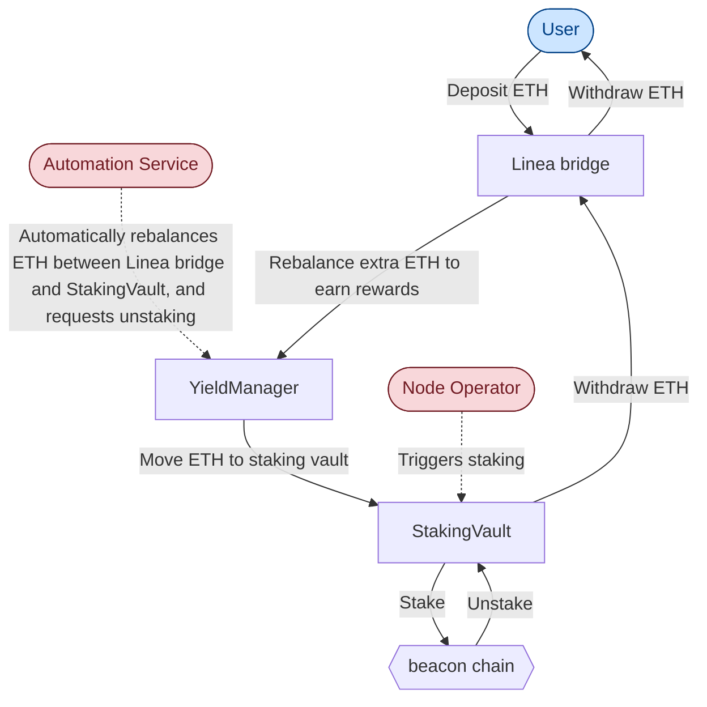
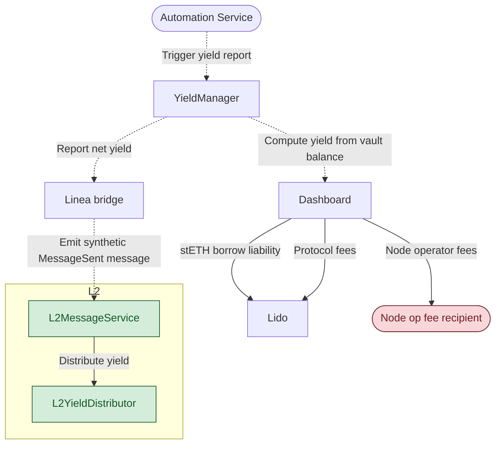
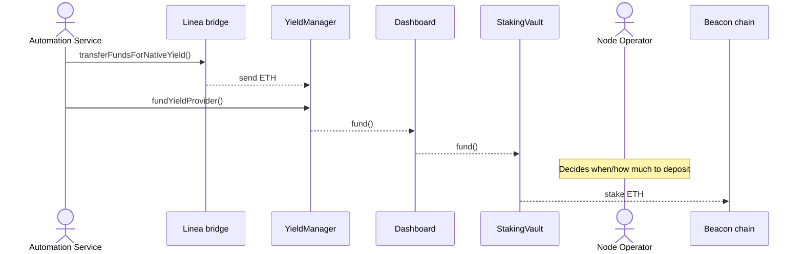
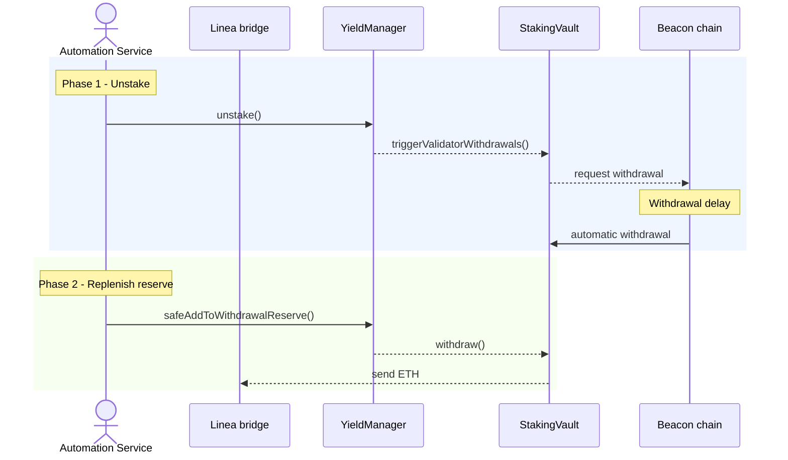
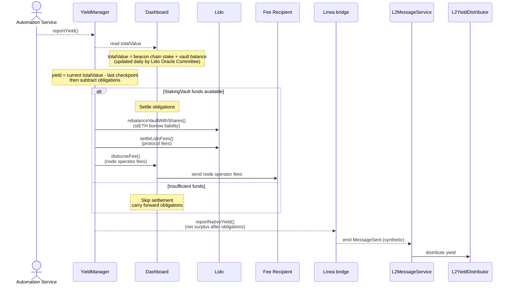
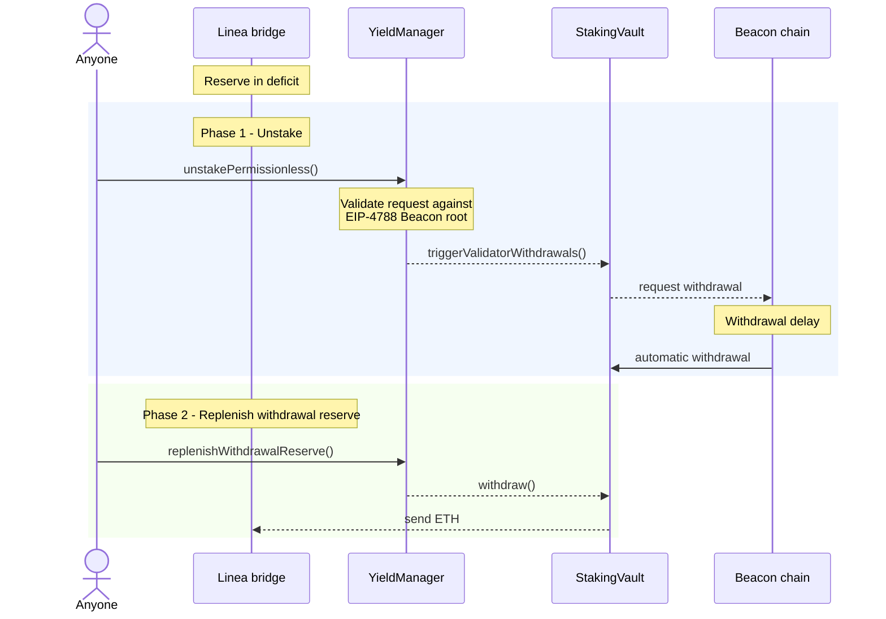
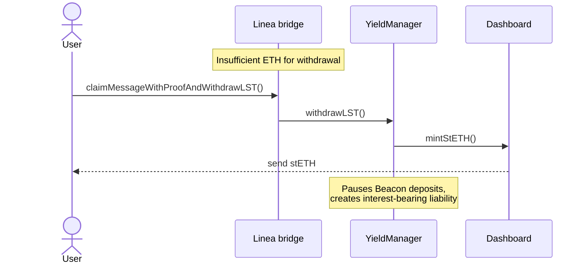
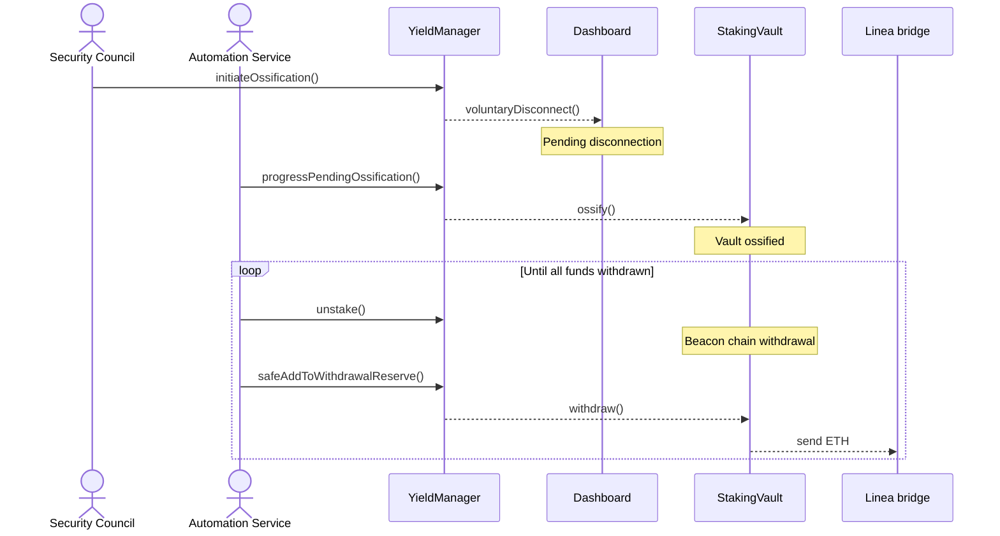

# Yield Boost technical overview

:::caution[status]

🚧 Yield Boost is not yet live. This documentation describes the intended design.

:::

## What is it?

[Linea Yield Boost](../network/overview/yield-boost/) is a protocol-level mechanism implemented on the [Public network](../network/quickstart) that automatically stakes a proportion of the ETH held in the Linea bridge and distributes the staking rewards back into the Linea ecosystem. When a user bridges ETH from Ethereum (L1) to Linea (L2) via the canonical bridge, these assets may be programmatically deposited into a dedicated [Lido v3 stVault](https://docs.lido.fi/lido-v3-whitepaper) on Ethereum Mainnet. The resulting staking rewards are distributed back into the Linea ecosystem to incentivize liquidity providers (LPs) and support DeFi protocols.

This page maps the high-level architecture of Yield Boost, including where ETH flows and which roles control each movement. 

## High-level architecture

Linea bridge deposits on Ethereum (L1) are staked via a Lido V3 stVault to generate beacon chain rewards, which are [distributed on Linea (L2)](../network/overview/yield-boost.mdx#why-yield-boost-exists). The following is a breakdown of the major components and flows of the Yield Boost system.

### Key participants

- **User:** Interacts with the system by bridging ETH to and from Linea via the [`L1MessageService`](../network/build/contracts#deployed-contracts).
- **[Security Council](https://github.com/Consensys/linea-monorepo/blob/main/contracts/docs/security-council-charter.md):** A multisig composed of Linea and external industry members responsible for safeguarding the network, managing incidents, and mitigating operational risks.
- **[Lido Oracle Committee](https://docs.lido.fi/token-guides/steth-superuser-functions/#oracle-and-accounting-flow):** A 5-of-9 committee of independent operators who monitor validator states and submit regular, audited reports to Lido's smart contracts.
- **Node operator:** The Linea-assigned validator bound to the agreed deposit trigger to stake ETH from the stVault, and validate the beacon chain to earn rewards.
- **`NativeYieldAutomationService`:** An offchain service that executes onchain routine operations, including yield reporting, rebalancing the liquidity buffer, and settling system obligations. It operates in a default `YIELD_REPORTING` mode and switches to an `OSSIFICATION_PROCESSOR` mode if the Security Council initiates the [ossification process](#6-ossification-withdrawal).
- **`LidoUpgradeMonitor`:** An offchain service that monitors Lido's onchain governance for contract upgrade proposals and alerts the Security Council.

### L1 ETH flow

When a user deposits ETH from Ethereum Mainnet (L1) into the Linea bridge to use it on Linea (L2), that ETH remains on the L1 and may be staked on Ethereum’s beacon chain to earn rewards. The following components manage how that ETH moves from the bridge contract into staking, how rewards are handled, and how the ETH is returned to the user on the L1 when they withdraw it from Linea.

- **Native token bridge:** Linea bridge contract on L1; holds user-deposited ETH and receives staking yield.
- **YieldManager:** L1 contract that moves ETH between the Linea bridge and the StakingVault, and calculates net yield after fees and liabilities.
- **StakingVault:** Lido V3 stVault that holds ETH awaiting beacon chain staking; all validator withdrawals return here before moving back to the Linea bridge.
- **Beacon chain:** Ethereum's proof-of-stake consensus layer where validators lock/stake ETH to secure the network and earn staking rewards.
- **Node operator:** Runs beacon chain validators on behalf of Linea and decides when to trigger staking and unstaking.
- **Automation service:** Offchain service that triggers routine onchain operations: moving ETH to/from staking, topping up reserves, and reporting yield.

The following diagram details the flow:

> The node operator's deposit trigger is part of an automated process whose logic is agreed beforehand. The node operator is only responsible for running the validator infrastructure.

### Yield reporting and L2 distribution

The yield earned from the beacon chain is transferred to the L2 for distribution. The following components are involved:

- **YieldManager:** L1 accounting and settlement contract (see [L1 Eth flow](#l1-eth-flow)).
- **[Dashboard](https://docs.lido.fi/contracts/dashboard#what-is-dashboard):** Lido V3 management layer around the StakingVault; handles fee accounting and deposit/withdrawal operations.
- **[Lido](https://docs.lido.fi/):** Third-party staking protocol that provides the StakingVault and dashboard infrastructure used by Yield Boost.
- **Fee recipient:** Address that collects the staking rewards earned by the node operator.
- **Security Council:** Linea governance multisig (see [Key participants](#key-participants)).
- **[L2MessageService](../network/build/contracts):** L2 contract that receives messages from L1 and unlocks the corresponding ETH on L2.
- **L2YieldDistributor:** Distributes L2 unlocked ETH staking rewards to designated recipients.

The following steps and diagram detail the flow:

1. The automation service triggers a yield report on the YieldManager.
2. The YieldManager reads the vault's `totalValue` from the Dashboard. This value--the sum of beacon chain stake and vault balance--is updated daily by the Lido Oracle Committee.
3. Yield is the difference between the current `totalValue` and the last stored checkpoint, minus outstanding obligations.
4. If the StakingVault has sufficient funds, the YieldManager settles obligations: stETH borrow liabilities and protocol fees go to Lido, and operator fees go to the node operator's fee recipient. If funds are insufficient, settlement is skipped and obligations carry forward.
5. The YieldManager reports the remaining net yield to the Linea bridge.
6. The Linea bridge emits a synthetic `MessageSent` event (no ETH is bridged). The L2MessageService picks it up and unlocks the corresponding ETH on L2.
7. The L2YieldDistributor sends the unlocked ETH to designated recipients.

**Legend**
- **Solid line:** Fund movement (ETH/stETH transfer)
- **Dashed line:** Function call or event (no funds move)
- **Red:** Privileged operator
- **Blue:** Permissionless
- **Green:** L2

## Roles and permissions

The Yield Boost system is governed by a set of roles and permissions that control the flow of funds and the operations of the system. The following roles and permissions are defined:

| Role | Held by | Permissions |
|------|---------|----------------------|
| `YIELD_PROVIDER_STAKING_ROLE` | Automation Service | Rebalance excess ETH from the bridge into the StakingVault |
| `YIELD_PROVIDER_UNSTAKER_ROLE` | Automation Service | Rebalance ETH back from node operators into the bridge |
| `YIELD_REPORTER_ROLE` | Automation Service | Trigger yield reporting, which may involve payment of fees and liabilities from staking rewards |
| `STAKING_PAUSE_CONTROLLER_ROLE` | Security Council | Pause or resume node operator deposits (no ETH movement) |
| `OSSIFICATION_INITIATOR_ROLE` | Security Council | Begin permanent shutdown of the staking vault; Lido may require fee settlement before proceeding |
| `OSSIFICATION_PROCESSOR_ROLE` | Automation Service | Finalize vault ossification; Lido may require fee settlement before proceeding |
| `SET_YIELD_MANAGER_ROLE` | Security Council | Configure which YieldManager contract the bridge uses (no ETH movement) |
| Permissionless | Anyone | Donate ETH to the bridge or vault; trigger unstaking and reserve top-up when the bridge balance is too low |

## Fund flows

Each scenario below traces a specific ETH movement end-to-end, showing the contracts involved and the role that triggers it.

1. **Staking** (routine) -- the Automation Service rebalances surplus ETH from the Linea bridge into the StakingVault for validator staking.
2. **Reserve replenishment** (routine) -- the Automation Service rebalances ETH back from validators into the Linea bridge when the withdrawal reserve runs low.
3. **Yield reporting** (routine) -- earned rewards are calculated, obligations settled, and net yield relayed to L2.
4. **Permissionless flows** (fallback) -- anyone can trigger unstaking and replenishment when the reserve drops below minimum.
5. **LST withdrawal** (last resort) -- if the Linea bridge does not hold enough ETH to fulfill a user's withdrawal, the user can claim stETH instead.
6. **Ossification withdrawal** (terminal) -- all staked funds are progressively withdrawn after the Security Council ossifies the vault.

### 1. Staking

Surplus ETH in the Linea bridge (above the minimum reserve) is routed to the StakingVault for beacon chain staking.

### 2. Reserve replenishment

Replenishing the withdrawal reserve is a two-phase process: first the beacon chain withdrawal is triggered, then funds are routed back to the Linea bridge once they arrive in the vault.

### 3. Yield reporting

The Automation Service triggers yield reporting. Before the net surplus is relayed to Linea, the YieldManager settles outstanding obligations.

No ETH is bridged during yield reporting. The `MessageSent` event is synthetic: it tells Linea how much new yield is available without actually bridging any ETH.

Staking rewards grow the L1 collateral by the same amount that the L2 mints, so the system stays fully collateralized.

### 4. Permissionless flows

When the Linea bridge balance drops below the minimum reserve, anyone can trigger the YieldManager to initiate unstaking and reserve replenishment.

`unstakePermissionless()` is capped to the remaining deficit minus available liquidity in the YieldManager and provider. `replenishWithdrawalReserve()` is similarly capped to the current deficit.

### 5. LST withdrawal

If the Linea bridge lacks ETH for a user withdrawal, stETH is minted against the StakingVault collateral and sent directly to the user as a last-resort mechanism.

This creates an LST liability that accrues interest; the system prioritizes repaying it from subsequent fund flows and yield.

### 6. Ossification withdrawal

Ossification permanently locks the StakingVault implementation, opting out of future Lido upgrades. Ossification is initiated by the Security Council; the Automation Service then progressively withdraws all staked funds back to the Linea bridge.

## Risk mitigation

The Yield Boost system is designed to be resilient to various risks, including:

- Slashing
- Withdrawal delay

### Slashing

If a validator makes conflicting attestations or block proposals, they may have their staked ETH confiscated, and the staking rewards lost. This is known as slashing, and is a general risk associated with the validator role. 

While the risk of slashing is rare (only 0.04% of all Ethereum validators have ever been slashed, and the slashed amounts are on average less than .001% of that validator's staked ETH), the Yield Boost system has the following mitigations in place:

- Node operators will only be selected for participation in the Yield Boost system if they have never been slashed. Selected node operators must also have a diverse infrastructure with more than 99.9% uptime, safeguards to prevent double-signing, and world-class security practices.
- 20% of node operator validator rewards will be retained for a year to create an insurance fund to cover slashing events. Any user in the Yield Boost system impacted by a slashing event will be eligible to access this fund.

### Withdrawal delay

In certain market conditions, such as a sharp increase in the demand for bridging ETH to Ethereum, the withdrawal reserve may be depleted. This can cause a delay in the withdrawal of ETH from Linea back to Ethereum.

The Yield Boost system has the following mitigations in place:

- The withdrawal reserve is maintained at a minimum of 40% of the Total Value Staked (TVS).
- The Automation Service will trigger a rebalancing of funds to replenish the withdrawal reserve after a withdrawal transaction is initiated.
- In the unlikely event that the withdrawal reserve is depleted, users can [trigger unstaking](/protocol/yield-boost-architecture#4-permissionless-flows) to replenish the withdrawal reserve.
- As a last resort, users can [withdraw their funds as stETH](/protocol/yield-boost-architecture#5-lst-withdrawal) rather than ETH.

## Quick reference

| Fund Movement | Source | Destination | Trigger | Role Required |
|--------------|--------|-------------|---------|---------------|
| Stake excess reserve | Linea bridge | StakingVault | Automation Service | `YIELD_PROVIDER_STAKING_ROLE` |
| Beacon chain deposit | StakingVault | Node operators | Node Operator decision | Node Operator |
| Report yield to L2 | synthetic MessageSent event | L2YieldDistributor | Automation Service | `YIELD_REPORTER_ROLE` |
| Operator replenish reserve | StakingVault | Linea bridge | Reserve below target | `YIELD_PROVIDER_UNSTAKER_ROLE` |
| Permissionless unstake | Validators | StakingVault | Reserve below minimum | Permissionless |
| Permissionless replenish reserve | StakingVault | Linea bridge | Reserve below minimum | Permissionless |
| LST withdrawal | Lido Protocol (minted against StakingVault collateral) | User | Insufficient ETH for user withdrawal | Permissionless (user) |
| Ossification withdrawal | StakingVault | Linea bridge | Security Council initiates | `OSSIFICATION_INITIATOR_ROLE` + `OSSIFICATION_PROCESSOR_ROLE` |
| Donation | External | Linea bridge / StakingVault | Voluntary | Permissionless |

## Next steps

See the [Yield Boost overview](../network/overview/yield-boost/) page for a more general overview of Yield Boost, including the user experience and withdrawal resilience strategy.

See the [Security Council record](../changelog/security-council-record#february-26-2026) page for a record of the Security Council transaction implementing this protocol.