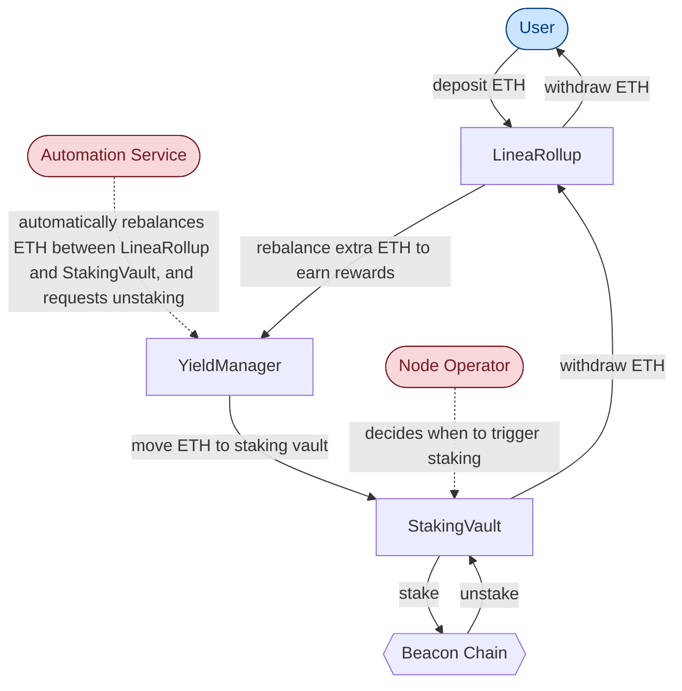
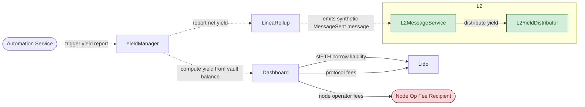
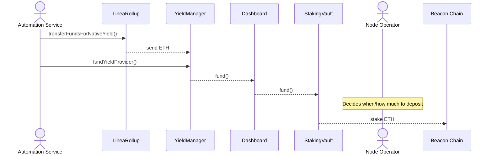
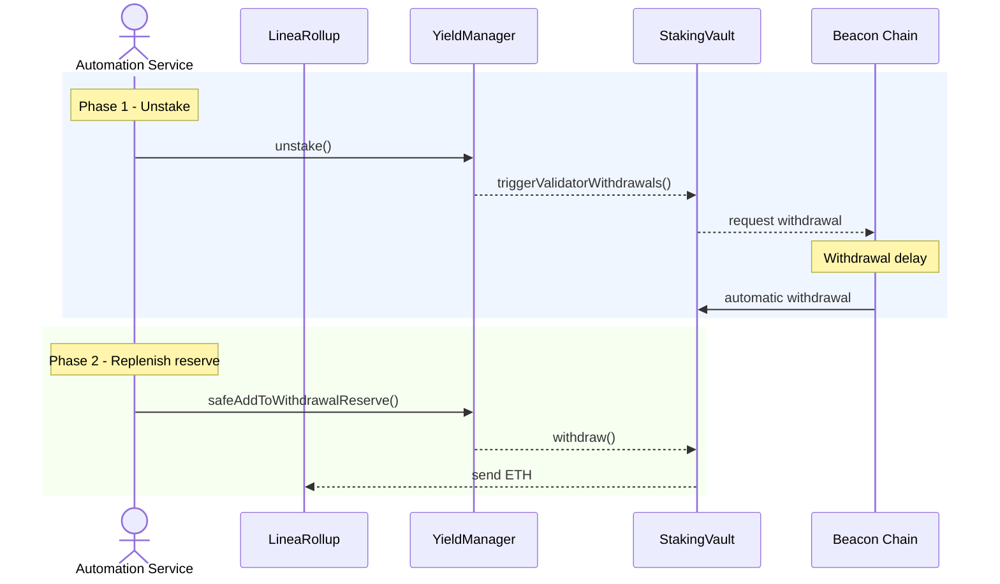
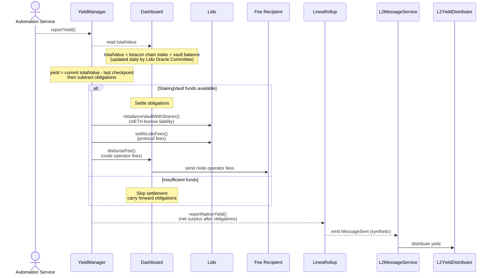
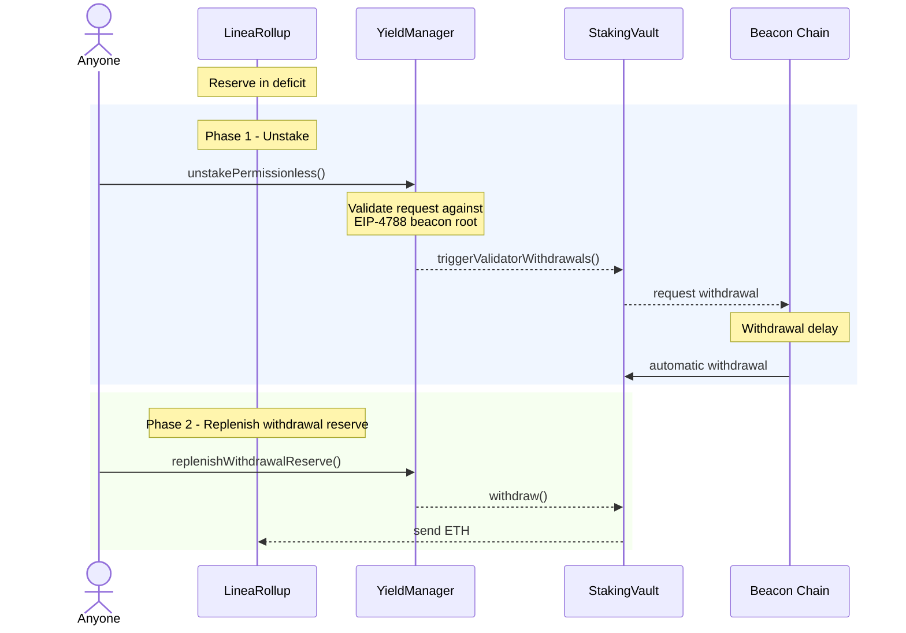
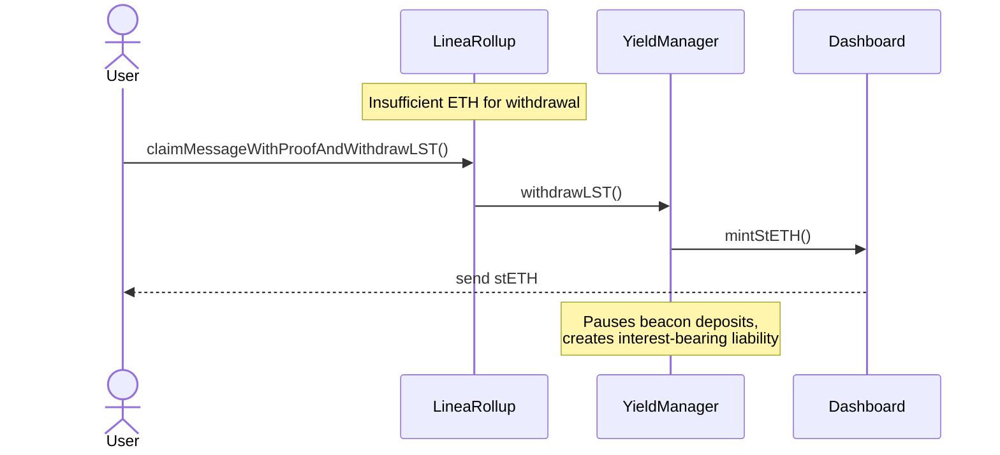
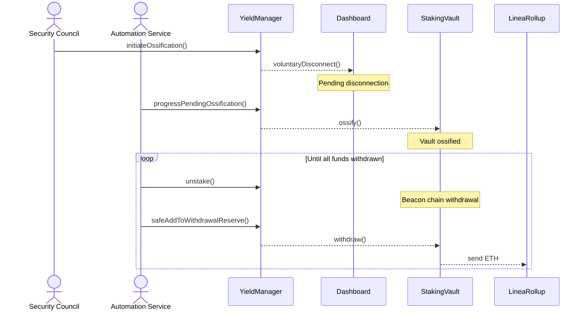

# Yield Boost - ETH fund flow

:::caution
Yield Boost is not yet live. This documentation describes the intended design.
:::

## Overview

Linea Yield Boost is a protocol-level mechanism that automatically stakes some of the ETH held in the Linea bridge, or LineaRollup, and distributes those staking rewards back to the L2 ecosystem. This page maps the high-level architecture, including where ETH flows and which roles control each movement.

## High-level architecture

LineaRollup deposits on Ethereum L1 are staked via Lido V3 stVaults to generate beacon chain rewards, which are reported to L2 for distribution.

### Key entities:

- **LineaRollup** - Main Linea bridge contract on L1; holds user-deposited ETH and receives it back after staking.
- **YieldManager** - L1 contract that moves ETH between LineaRollup and the StakingVault, and calculates net yield after fees and liabilities.
- **Dashboard** - Lido V3 management layer around the StakingVault; handles fee accounting and deposit/withdrawal operations.
- **StakingVault** - Lido V3 vault that holds ETH awaiting beacon chain staking; all validator withdrawals return here.
- **Beacon Chain** - Ethereum's proof-of-stake consensus layer where validators lock ETH to secure the network and earn staking rewards.
- **Lido** - Third-party staking protocol that provides the StakingVault and Dashboard infrastructure used by Yield Boost.
- **Node Operator** - Runs beacon chain validators on behalf of Linea and decides when to deposit ETH from the StakingVault into validators.
- **Fee Recipient** - Address that collects the node operator's share of staking rewards.
- **Automation Service** - Off-chain bot that triggers routine operations: moving ETH to/from staking, topping up reserves, and reporting yield.
- **Security Council** - The Linea Security Council multisig.
- **L2MessageService** - L2 contract that receives yield reports from L1 and unlocks the corresponding ETH on L2.
- **L2YieldDistributor** - Distributes L2 ETH unlocked from staking rewards to designated recipients.

### L1 ETH flow

> The Node Operator's deposit trigger is part of an automated process whose logic is agreed beforehand with the node operator. The recommended approach is for the Node Operator to greedily stake newly deposited funds in the vault.

### Yield reporting and L2 distribution

1. The Automation Service triggers a yield report on the YieldManager.
2. The YieldManager reads the vault's `totalValue` from the Dashboard. This value - the sum of beacon chain stake and vault balance - is updated daily by the Lido Oracle Committee.
3. Yield is the difference between the current `totalValue` and the last stored checkpoint, minus outstanding obligations.
4. If the StakingVault has sufficient funds, the YieldManager settles obligations: stETH borrow liabilities and protocol fees go to Lido, and operator fees go to the node operator's fee recipient. If funds are insufficient, settlement is skipped and obligations carry forward.
5. The YieldManager reports the remaining net yield to LineaRollup.
6. LineaRollup emits a synthetic `MessageSent` event (no ETH is bridged). The L2MessageService picks it up and unlocks the corresponding ETH on L2.
7. The L2YieldDistributor sends the unlocked ETH to designated recipients.

**Legend**
- **Solid line** - actual fund movement (ETH/stETH transfer)
- **Dashed line** - function call or event (no funds move)
- **Red** - privileged operator
- **Blue** - permissionless
- **Green** - L2

## Roles and fund movement permissions

| Role | Held By | What This Role Can Do |
|------|---------|----------------------|
| `YIELD_PROVIDER_STAKING_ROLE` | Automation Service | Rebalance excess ETH from the bridge into the StakingVault |
| `YIELD_PROVIDER_UNSTAKER_ROLE` | Automation Service | Rebalance ETH back from validators into the bridge |
| `YIELD_REPORTER_ROLE` | Automation Service | Trigger yield reporting, which may involve payment of fees and liabilities from staking rewards |
| `STAKING_PAUSE_CONTROLLER_ROLE` | Security Council | Pause or resume validator deposits (no ETH movement) |
| `OSSIFICATION_INITIATOR_ROLE` | Security Council | Begin permanent shutdown of the staking vault; Lido may require fee settlement before proceeding |
| `OSSIFICATION_PROCESSOR_ROLE` | Automation Service | Finalize vault ossification; Lido may require fee settlement before proceeding |
| `SET_YIELD_MANAGER_ROLE` | Security Council | Configure which YieldManager contract the bridge uses (no ETH movement) |
| Permissionless | Anyone | Donate ETH to the bridge or vault; trigger unstaking and reserve top-up when the bridge balance is too low |

## Fund flow scenarios

Each scenario below traces a specific ETH movement end-to-end, showing the contracts involved and the role that triggers it.

1. **Staking** (routine) - the Automation Service rebalances surplus ETH from LineaRollup into the StakingVault for validator staking.
2. **Reserve replenishment** (routine) - the Automation Service rebalances ETH back from validators into LineaRollup when the withdrawal reserve runs low.
3. **Yield reporting** (routine) - earned rewards are calculated, obligations settled, and net yield relayed to L2.
4. **Permissionless flows** (fallback) - anyone can trigger unstaking and replenishment when the reserve drops below minimum.
5. **LST withdrawal** (last resort) - if LineaRollup does not hold enough ETH to fulfill a user's withdrawal, the user can claim stETH instead.
6. **Ossification withdrawal** (terminal) - all staked funds are progressively withdrawn after the Security Council ossifies the vault.

### 1. Staking

Surplus ETH in LineaRollup (above minimum reserve) is routed to the StakingVault for beacon chain staking.

### 2. Reserve replenishment

Two-phase process: first trigger beacon chain withdrawal, then route funds to LineaRollup once they arrive in the vault.

### 3. Yield reporting

The Automation Service triggers yield reporting. Before the net surplus is relayed to L2, the YieldManager settles outstanding obligations.

> No ETH is bridged during yield reporting. The MessageSent event is synthetic: it tells L2 how much new yield is available without actually bridging any ETH.

> This is safe because staking rewards grow L1 collateral by the same amount that L2 mints, so the system stays fully collateralized.

### 4. Permissionless flows

When LineaRollup balance drops below the minimum reserve, anyone can trigger unstaking and reserve replenishment.

`unstakePermissionless()` is capped to the remaining deficit minus available liquidity in the YieldManager and provider. `replenishWithdrawalReserve()` is similarly capped to the current deficit.

### 5. LST withdrawal - last resort

If LineaRollup lacks ETH for a user withdrawal, stETH is minted against StakingVault collateral and sent directly to the user as a last resort.

This creates an LST liability that accrues interest; the system prioritizes repaying it from subsequent fund flows and yield.

### 6. Ossification withdrawal

Ossification permanently locks the StakingVault implementation, opting out of future upgrades. The Security Council initiates it; the Automation Service then progressively withdraws all staked funds back to LineaRollup.

## Quick reference

| Fund Movement | Source | Destination | Trigger | Role Required |
|--------------|--------|-------------|---------|---------------|
| Stake excess reserve | LineaRollup | StakingVault | Automation Service | `YIELD_PROVIDER_STAKING_ROLE` |
| Beacon chain deposit | StakingVault | Validators | Node Operator decision | Node Operator |
| Report yield to L2 | synthetic MessageSent event | L2YieldDistributor | Automation Service | `YIELD_REPORTER_ROLE` |
| Operator replenish reserve | StakingVault | LineaRollup | Reserve below target | `YIELD_PROVIDER_UNSTAKER_ROLE` |
| Permissionless unstake | Validators | StakingVault | Reserve below minimum | Permissionless |
| Permissionless replenish reserve | StakingVault | LineaRollup | Reserve below minimum | Permissionless |
| LST withdrawal | Lido Protocol (minted against StakingVault collateral) | User | Insufficient ETH for user withdrawal | Permissionless (user) |
| Ossification withdrawal | StakingVault | LineaRollup | Security Council initiates | `OSSIFICATION_INITIATOR_ROLE` + `OSSIFICATION_PROCESSOR_ROLE` |
| Donation | External | LineaRollup / StakingVault | Voluntary | Permissionless |
