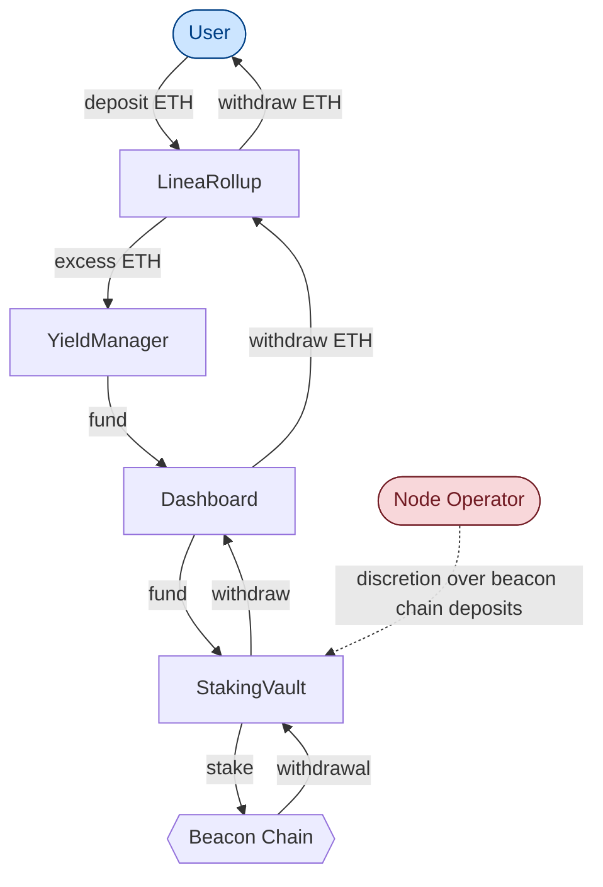
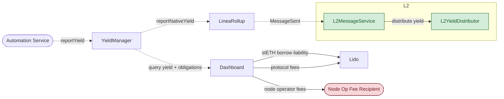
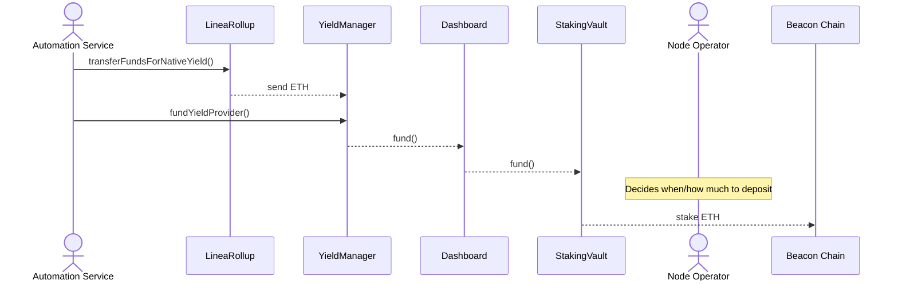
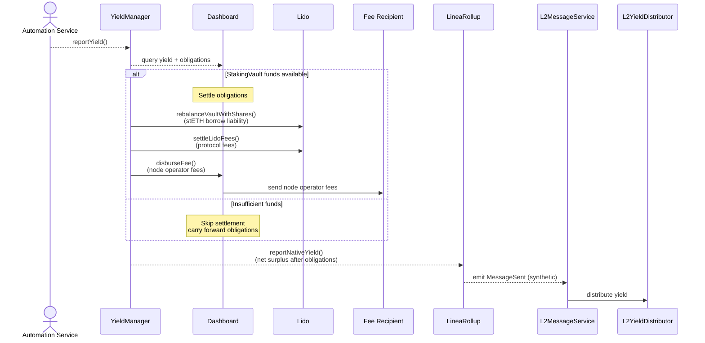
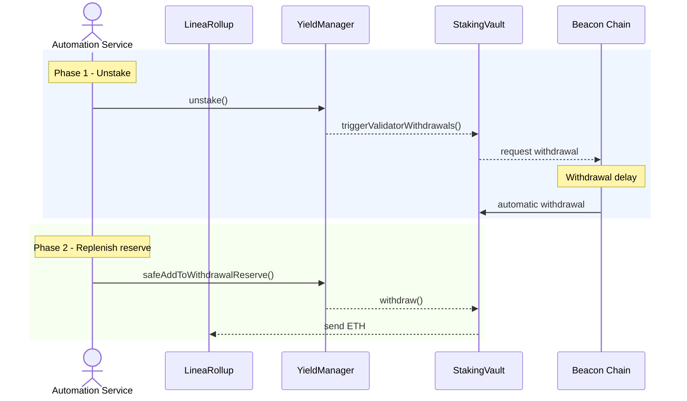
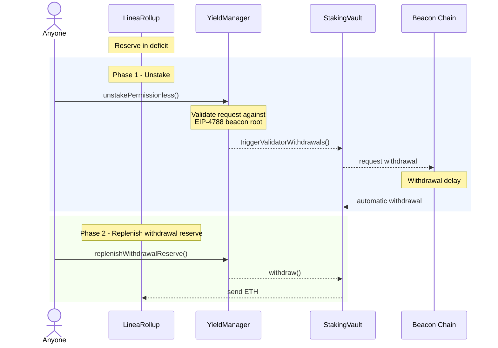
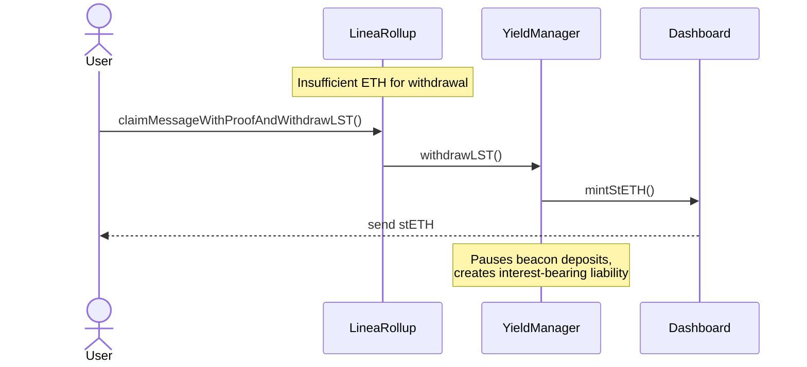
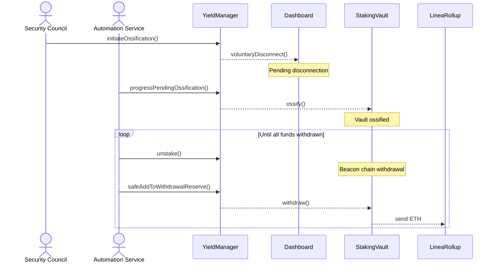

# Yield Boost - ETH fund flow

:::caution
Yield Boost is not yet live. This documentation describes the intended design.
:::

## Overview

Yield Boost earns staking rewards on ETH deposited into LineaRollup and distributes those rewards back to users on L2. This page maps where ETH flows and which roles control each movement.

## High-level architecture

LineaRollup deposits on Ethereum L1 are staked via Lido V3 stVaults to generate beacon chain rewards, which are reported to L2 for distribution.

**Key entities:**

- **YieldManager** - Core L1 contract that routes ETH between LineaRollup and external staking strategies, and calculates reportable yield after deducting obligations.
- **Dashboard** - Lido V3 utility contract that wraps the StakingVault with operator fee handling and convenience functions for deposits and LST minting.
- **StakingVault** - Lido V3 vault that holds ETH for beacon chain staking. The vault owner controls deposits and withdrawals; withdrawal credentials point to the vault.
- **Node Operator** - Runs beacon chain validators on behalf of Linea. Has sole authority over when and how much ETH to deposit from the StakingVault into validators.
- **Automation Service** - Off-chain service that executes routine yield operations: reporting, reserve rebalancing, and obligation settlement.
- **L2MessageService** - L2 contract that receives yield messages from L1 and releases corresponding L2 ETH into circulation.
- **L2YieldDistributor** - Distributes newly circulated L2 ETH (backed by L1 staking rewards) to eligible recipients.

### L1 ETH flow

### Yield reporting and L2 distribution

**Legend**
- **Solid line** - actual fund movement (ETH/stETH transfer)
- **Dashed line** - function call or event (no funds move)
- **Red** - privileged operator
- **Blue** - permissionless
- **Green** - L2

## Roles and fund movement permissions

| Role | Held By | ETH Movement Authorized |
|------|---------|------------------------|
| `YIELD_PROVIDER_STAKING_ROLE` | Automation Service | LineaRollup → YieldManager → StakingVault |
| `YIELD_PROVIDER_UNSTAKER_ROLE` | Automation Service | Validators → StakingVault → YieldManager → LineaRollup |
| `YIELD_REPORTER_ROLE` | Automation Service | Settles obligations from StakingVault (LST liabilities, protocol fees, operator fees); emits synthetic yield message to L2 |
| `STAKING_PAUSE_CONTROLLER_ROLE` | Security Council | None (pauses/unpauses beacon deposits) |
| `OSSIFICATION_INITIATOR_ROLE` | Security Council | Initiates full withdrawal of all staked funds |
| `OSSIFICATION_PROCESSOR_ROLE` | Automation Service | Progressive withdrawal during ossification |
| `SET_YIELD_MANAGER_ROLE` | Security Council | None (configuration) |
| Permissionless | Anyone | `fund()` donations; `unstakePermissionless()` + `replenishWithdrawalReserve()` during deficit |

## Fund flow scenarios

### 1. Staking

Surplus ETH in LineaRollup (above minimum reserve) is routed to the StakingVault for beacon chain staking.

### 2. Yield reporting

The Automation Service triggers yield reporting. Before the net surplus is relayed to L2, the YieldManager settles outstanding obligations.

No L1 ETH moves for the yield report itself - obligation payments (solid arrows) are the only L1 ETH transfers. The `MessageSent` event is synthetic: it relays the net surplus to L2 for distribution without bridging ETH.

### 3. Reserve replenishment - operator

Two-phase process: first trigger beacon chain withdrawal, then route funds to LineaRollup once they arrive in the vault.

### 4. Permissionless flows

When LineaRollup balance drops below the minimum reserve, anyone can trigger unstaking and reserve replenishment.

`unstakePermissionless()` is capped to the remaining deficit minus available liquidity in the YieldManager and provider. `replenishWithdrawalReserve()` is similarly capped to the current deficit.

### 5. LST withdrawal - last resort

If LineaRollup lacks ETH for a user withdrawal, stETH is minted against StakingVault collateral and sent directly to the user as a last resort.

This creates an LST liability that accrues interest; the system prioritizes repaying it from subsequent fund flows and yield.

### 6. Ossification withdrawal

Ossification permanently freezes the StakingVault implementation, opting out of future upgrades. The Security Council initiates it; the Automation Service then progressively withdraws all staked funds back to LineaRollup.

## Quick reference

| Fund Movement | Source | Destination | Trigger | Role Required |
|--------------|--------|-------------|---------|---------------|
| Stake excess reserve | LineaRollup | StakingVault | Automation | `YIELD_PROVIDER_STAKING_ROLE` |
| Beacon chain deposit | StakingVault | Validators | Node Operator decision | Node Operator |
| Report yield to L2 | synthetic MessageSent event | L2YieldDistributor | Automation | `YIELD_REPORTER_ROLE` |
| Operator replenish reserve | StakingVault | LineaRollup | Reserve below target | `YIELD_PROVIDER_UNSTAKER_ROLE` |
| Permissionless unstake | Validators | StakingVault | Reserve below minimum | Permissionless |
| Permissionless replenish reserve | StakingVault | LineaRollup | Reserve below minimum | Permissionless |
| LST withdrawal | Lido Protocol (minted against StakingVault collateral) | User | Insufficient ETH | Permissionless (user) |
| Ossification withdrawal | StakingVault | LineaRollup | Security Council initiates | `OSSIFICATION_INITIATOR_ROLE` + `OSSIFICATION_PROCESSOR_ROLE` |
| Donation | External | LineaRollup / StakingVault | Voluntary | Permissionless |
