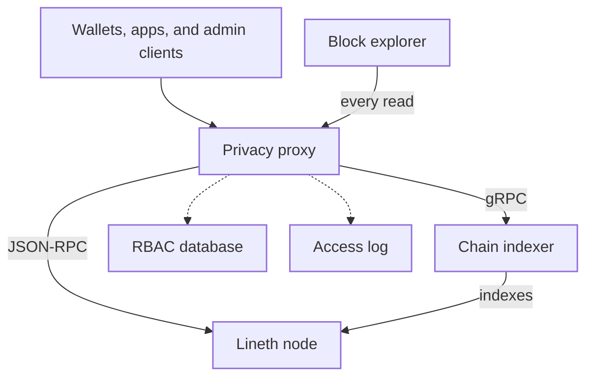

import GlossaryTerm from '@theme/GlossaryTerm';

This page describes how a <GlossaryTerm term="Lineth" /> deployment can control access to JSON-RPC, APIs,
and tooling.
In a restricted deployment, a privacy proxy authenticates callers, evaluates role-based permissions, and
traces calls.

For data visibility choices, see [Privacy and data visibility](../evaluate/validium.mdx).

:::important

Access control is not cryptographic privacy.
The privacy proxy limits who can use protected services and data surfaces, but it does not make public
chain data private, replace zero-knowledge proofs, or provide data availability.

:::

## Access control stack

Operators can choose to configure access control, independent of
[deployment model](../evaluate/deployment-models.mdx) and
[data availability](data-availability-finalization.mdx).
The access control stack consists of the following services:

- **Privacy proxy:** An [Open Privacy Suite](https://gateway-fm.github.io/open-privacy-suite/) JSON-RPC
  reverse proxy.
  Every wallet, app, and admin request to the Lineth node goes through it.
  [RBAC](#role-based-access-control-rbac) records live in a PostgreSQL database.
  A separate database records JSON-RPC access logs.
- **Block explorer:** Displays blocks, transactions, logs, and transfers in a web interface.
  The explorer's API is a backend-for-frontend (BFF).
  It holds no chain data of its own.
  Every read goes to the proxy, which redacts the response for that caller.
- **Chain indexer:** Indexes blocks, transactions, and logs from the node and serves raw chain data over
  gRPC on a trusted network.
  It has no authentication, access policy, or redaction.
  Only the proxy consumes the indexer.

A public or private deployment can configure access control.
In a public deployment, transaction data is posted to the
<GlossaryTerm term="Finalization layer">finalization layer</GlossaryTerm>, so the proxy restricts who uses
the operator's interfaces; it does not hide onchain data.
A <GlossaryTerm term="Validium">private validium</GlossaryTerm> keeps transaction data offchain, so the
proxy is the path to chain data as well as the operator's interfaces.

### Role-based access control (RBAC)

The privacy proxy uses a role-based access control (RBAC) model: permissions are organization-scoped and group-centric.
After the proxy authenticates the caller, it checks the group's method allowlist, claims, and contract grants.

- An **organization** is the tenant boundary.
  Users, groups, and contract registrations belong to an organization.
- A **group** is a named collection of users that share one permission set.
  Groups can be marked as organization admin or read-only admin.
- A **user** is an individual member of one or more groups, identified by a decentralized identifier (DID).
  Optional flags cover KYC status and bans.

A group's permission set includes:

- **Method allowlist:** Which JSON-RPC methods members may call.
- **Claims:** Extra permissions on top of the method allowlist: `deploy` (create contracts), `upgrade`
  (upgrade proxy contracts), and `admin` (includes deploy and upgrade).
- **Contract grants:** Per-group permission on a registered contract: this group may use this contract,
  optionally limited to function selectors, parameter constraints, and event topics.
  Contracts stay private until a grant exists.
  - A missing function list means all functions on that contract are allowed.
  - An empty function list means all functions on that contract are denied.
  - An explicit list allows only those function selectors, optionally with parameter constraints (for
    example, a parameter that must equal the caller's own address).
  - Event rules can deny logs, allow all, or allow specific event topics.

Operators manage organizations, groups, users, and contract grants through the proxy's admin API and dashboard.
See the [Open Privacy Suite RBAC docs](https://gateway-fm.github.io/open-privacy-suite/docs/rbac/) for more information.

### Explorer and indexer

A restricted deployment uses its own block explorer and chain indexer.
The explorer uses data from the indexer (blocks, transactions, logs, and transfers).
The indexer always stores real addresses and values, and returns whatever is requested.

The privacy proxy sits between the explorer and chain indexer.
Only the proxy consumes the indexer, and every explorer read goes to the proxy, which applies the same
[RBAC](#role-based-access-control-rbac) permissions and redaction used on JSON-RPC.
Explorer responses must not be cached across callers, and you must not set a direct indexer URL.

### Audit logs

The privacy proxy writes two streams:

- **Access log:** One record per JSON-RPC decision (allow or deny), stored in a database separate from
  RBAC data, with a restricted append-only role and a hash chain over entries.
- **Control-plane audit:** One record each time an organization, group, user, membership, contract, or
  contract grant is created, updated, deleted, assigned, or revoked.
  These records live with the RBAC data.

These logs are evidence that a request was allowed or denied under the active
[RBAC](#role-based-access-control-rbac) permissions at that time.

## How a request is evaluated

Clients send JSON-RPC requests to the proxy, not to the node.
A typical request is evaluated in this order:

1. Authenticate the caller via JSON Web Token (JWT).
2. Reject globally blocked methods (including `debug_*` and `admin_*` namespaces, and multicall patterns
   that would otherwise bypass contract grants).
3. Resolve the caller's organization, groups, and permissions.
4. Check the method against the group's RPC method allowlist.
5. If the call targets a contract, check that contract grant (and function selector, parameter, and event
   rules where they exist).
6. Simulate the call with `debug_traceCall` and reject it if any internal `CALL`, `DELEGATECALL`,
   `STATICCALL`, or `CREATE` target is outside the caller's organization.
7. Forward the request to the node, then redact the response before returning it.

The proxy binds the call's sender to the authenticated account, so a caller cannot inherit another
account's onchain permissions by spoofing `from`.

Evaluation is fail-closed: a missing permission, an unknown contract, a tracing failure, or an unreachable
node during simulation denies the request.
Denied JSON-RPC calls are returned to the client as a generic "method not found" error.
The detailed reason is written to the access log for operators.

Anonymous, unauthenticated requests can be limited to claim-free metadata such as `eth_chainId` and `eth_blockNumber`.
They do not receive a view of private contracts or transaction data.

## See also

- [Privacy and data visibility](../evaluate/validium.mdx): How private validium deployments use offchain
  data availability and controlled access.
- [Trust and responsibilities](../evaluate/trust-model.mdx): What participants can verify when access and
  data availability are restricted.
