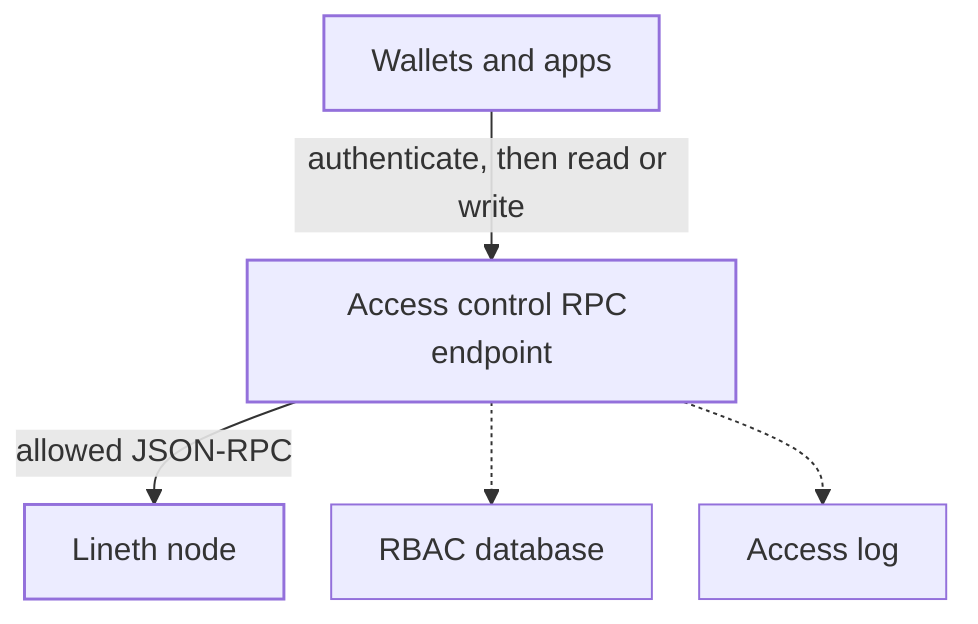

import GlossaryTerm from '@theme/GlossaryTerm';

This page describes how a <GlossaryTerm term="Lineth" /> deployment can restrict JSON-RPC access.
In a restricted deployment, clients send all reads and writes to a single RPC endpoint.
That endpoint authenticates callers and enforces role-based access control (RBAC) permissions.

For data visibility choices, see [Privacy and data visibility](../evaluate/validium.mdx).

:::important

Access control is not cryptographic privacy.
It limits who can use the operator's RPC, but it does not make public chain data private, replace
zero-knowledge proofs, or provide data availability.

:::

## Access control stack

Operators can configure access control independently of
[deployment model](../evaluate/deployment-models.mdx) and
[data availability](data-availability-finalization.mdx).

A restricted deployment exposes **one RPC endpoint**.
Wallets, apps, and other clients access this endpoint, not the Lineth node directly.

The access control endpoint:

- Authenticates the caller.
- Enforces rules for who can call which JSON-RPC methods and which contracts.
- Forwards allowed requests to the node.
- Returns only data the caller is permitted to see.

Permission data and JSON-RPC access logs are recorded in [audit databases](#audit-logs).

Applications built on the stack must implement authentication to communicate with the
endpoint, as well as their own read and write flows on top of the endpoint.

A public or private deployment can configure access control.
In a public deployment, transaction data is posted to the
<GlossaryTerm term="Finalization layer">finalization layer</GlossaryTerm>, so the endpoint restricts who
uses the operator's RPC; it does not hide onchain data.
A <GlossaryTerm term="Validium">private validium</GlossaryTerm> keeps transaction data offchain, so the
endpoint is also the path to chain data.

### Role-based access control (RBAC)

The endpoint evaluates a role-based access control (RBAC) model: permissions are
organization-scoped and group-centric.
After the endpoint authenticates the caller, it checks the group's method allowlist, claims, and
contract grants.

- An **organization** is the tenant boundary.
  Users, groups, and contract registrations belong to an organization.
- A **group** is a named collection of users that share one permission set.
  Groups can be marked as organization admin or read-only admin.
- A **user** is an individual member of one or more groups, identified by a decentralized identifier
  (DID).
  Optional flags cover KYC status and bans.

A group's permission set includes:

- **Method allowlist:** Which JSON-RPC methods members may call.
- **Claims:** Extra permissions on top of the method allowlist: `deploy` (create contracts), `upgrade`
  (upgrade contracts), and `admin` (includes deploy and upgrade).
- **Contract grants:** Per-group permission on a registered contract: this group may use this contract,
  optionally limited to function selectors, parameter constraints, and event topics.
  Contracts stay private until a grant exists.
  - A missing function list means all functions on that contract are allowed.
  - An empty function list means all functions on that contract are denied.
  - An explicit list allows only those function selectors, optionally with parameter constraints (for
    example, a parameter that must equal the caller's own address).
  - Event rules can deny logs, allow all, or allow specific event topics.

This RBAC data is stored in a PostgreSQL database.
The access control endpoint reads that data when it evaluates a request.

### Audit logs

The access control endpoint writes two streams:

- **Access log:** One record per JSON-RPC decision (allow or deny), stored in a database separate from
  RBAC data, with a restricted append-only role and a hash chain over entries.
- **Control-plane audit:** One record each time an organization, group, user, membership, contract, or
  contract grant is created, updated, deleted, assigned, or revoked.
  These records live with the RBAC data.

These logs are evidence that a request was allowed or denied under the active
[RBAC](#role-based-access-control-rbac) permissions at that time.

## How a request is evaluated

Clients send JSON-RPC requests to the access control endpoint, not to the Lineth node.
The endpoint evaluates a typical request in this order:

1. Authenticate the caller via JSON Web Token (JWT).
2. Reject globally blocked methods (including `debug_*` and `admin_*` namespaces, and multicall
   patterns that would otherwise bypass contract grants).
3. Resolve the caller's organization, groups, and permissions.
4. Check the method against the group's RPC method allowlist.
5. If the call targets a contract, check that contract grant (and function selector, parameter, and
   event rules where they exist).
6. Simulate the call with `debug_traceCall` and reject it if any internal `CALL`, `DELEGATECALL`,
   `STATICCALL`, or `CREATE` target is outside the caller's organization.
7. Forward the request to the node, then redact the response before returning it.

The endpoint binds the call's sender to the authenticated account, so a caller cannot inherit another
account's onchain permissions by spoofing `from`.

Evaluation is fail-closed: a missing permission, an unknown contract, a tracing failure, or an
unreachable node during simulation denies the request.
Denied JSON-RPC calls are returned to the client as a generic "method not found" error.
The detailed reason is written to the access log for operators.

Anonymous, unauthenticated requests can be limited to claim-free metadata such as `eth_chainId` and
`eth_blockNumber`.
They do not receive a view of private contracts or transaction data.

## See also

- [Privacy and data visibility](../evaluate/validium.mdx): How private validium deployments use offchain
  data availability and controlled access.
- [Trust and responsibilities](../evaluate/trust-model.mdx): What participants can verify when access and
  data availability are restricted.
