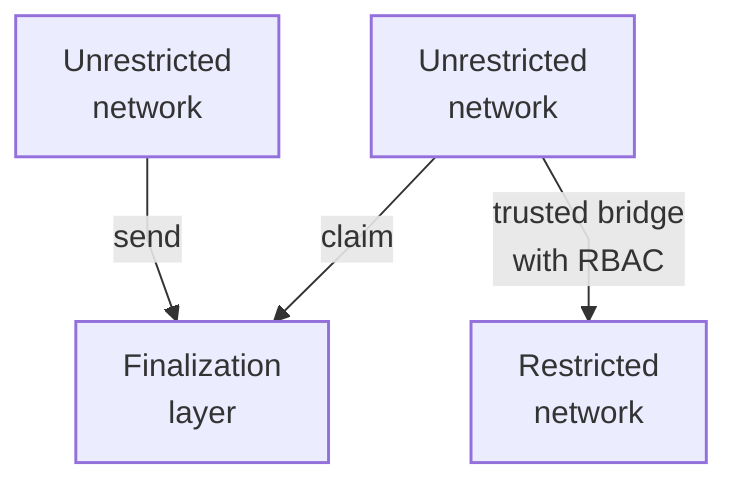
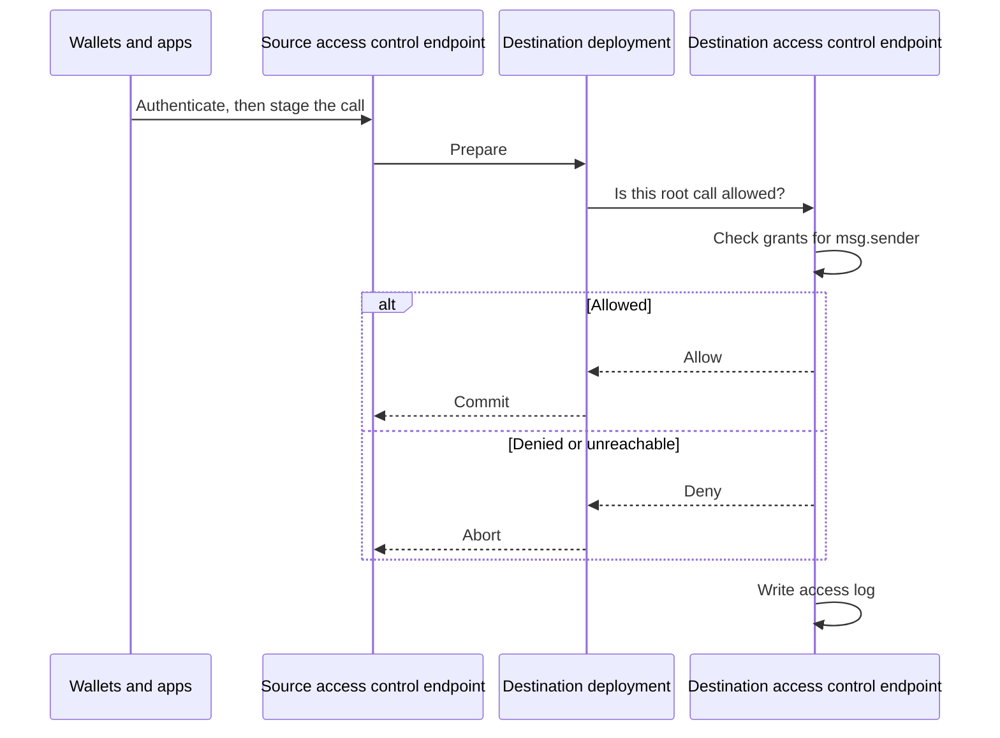

import GlossaryTerm from '@theme/GlossaryTerm';

This page describes how two <GlossaryTerm term="Lineth" /> deployments communicate with each
other.

A Lineth network communicates with its
<GlossaryTerm term="Finalization layer">finalization layer</GlossaryTerm> through
[canonical interoperability](../../protocol/architecture/interoperability/index.mdx), using
the message service and token bridge.
Claiming is permissionless: anyone who can submit the claim can execute the message.

When a Lineth network wants to communicate with another Lineth network that is not
[access controlled](access-control.mdx) (unrestricted), and the networks share a
finalization layer, they can use canonical interoperability: the source network sends a
message to the finalization layer, and the destination network claims it from the finalization layer.

When a Lineth network wants to communicate with an [access controlled](access-control.mdx) (restricted)
network, or the two deployments do not share a finalization layer, they communicate
directly with each other over a trusted bridge.
The destination network's access control endpoint checks the inbound call against role-based
access control (RBAC) permissions before it accepts the call.

## Communicating with a restricted network

Two restricted networks can communicate with each other as follows:

1. Each operator onboards organizations, groups, and users at that deployment's
   [access control](./access-control.mdx) endpoint, and registers the contracts those groups may use.
2. Users present credentials to the endpoint and send reads and writes to that RPC.
   Wallets and apps do not talk to the Lineth node directly.
3. The destination operator configures that node with the access control endpoint's
   address and the admin credential the endpoint expects.
   Set both, or set neither.
   If only one is set, the node refuses to start, so a half-configured check cannot skip
   authorization or reject every inbound call.
   If neither is set, inbound calls are allowed without asking the endpoint.
4. A user (or contract) stages a cross-chain call to a peer deployment.
5. The two deployments run a two-phase commit: **prepare**, then **commit** or **abort**.
   In the prepare phase, they simulate the inbound call until both sides agree on the same
   result.
6. The policy subject is the source address: `msg.sender` at the cross-chain root, not `tx.origin`.
   The destination qualifies that address with the source chain and looks it up in its own org,
   group, and contract grant records.
7. In the commit phase, the destination asks its access control endpoint whether that agreed
   call would be allowed as a live RPC request.
   If the endpoint allows the call, both sides commit.
   If it denies the call, or if the endpoint is unreachable, both sides abort.
   Evaluation is fail-closed.
8. Both deployments record the decision on their append-only access logs.

The destination allowlists which contracts may be called cross-chain by using the same contract
grants as live RPC.
The source deployment still enforces per-user access before the call is staged.
There is not a separate permission list for cross-chain calls.

:::info Trust assumptions and networking

Deployment interoperability is a [trusted bridge](../evaluate/trust-model.mdx): there is no shared proof across the two
Lineth networks that replaces operator and relayer trust.
Each side trusts its own access control configuration (if any), its own permissions, and the peer
deployment endpoints it has configured.

The wire between peer deployments is gRPC.
Mutual TLS is not required today.
Until it is, run that channel on an isolated operator network and restrict it with firewalls; do
not expose peer endpoints to the public internet.

:::

## See also

- [Access control](./access-control.mdx): Permission model, request pipeline, and audit.
- [Interoperability](../../protocol/architecture/interoperability/index.mdx): Canonical messaging
  and token bridging to the finalization layer.
- [Trust and responsibilities](../evaluate/trust-model.mdx): Trusted-bridge row and what
  participants can verify.
- [Privacy and data visibility](../evaluate/validium.mdx): Offchain data availability versus access
  policy.
