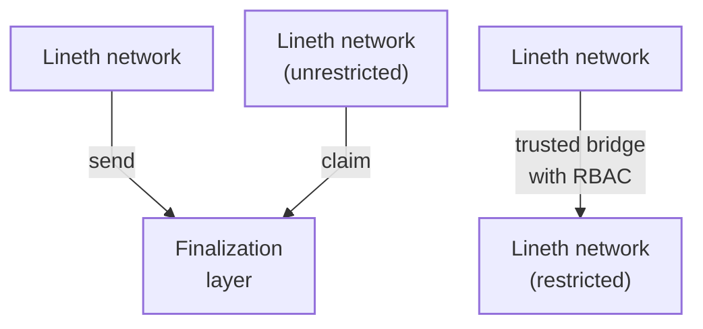
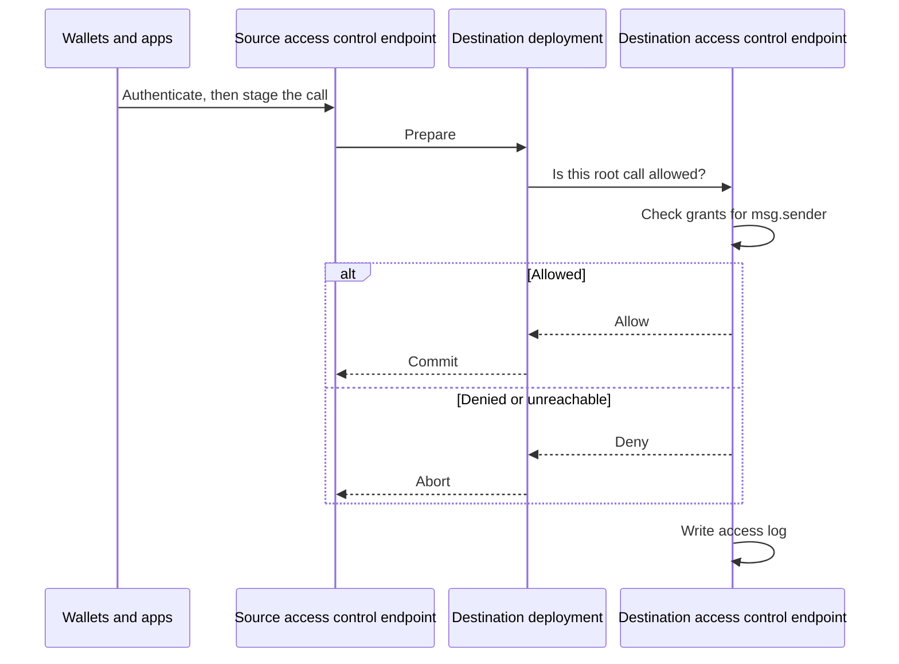

import GlossaryTerm from '@theme/GlossaryTerm';

This page describes how two <GlossaryTerm term="Lineth" /> deployments communicate with each
other.

A Lineth network communicates with its
<GlossaryTerm term="Finalization layer">finalization layer</GlossaryTerm> through
[canonical interoperability](../../protocol/architecture/interoperability/index.mdx), using
the message service and token bridge.
Claiming is permissionless: anyone who can submit the claim can execute the message.

When a Lineth network wants to communicate with another Lineth network that is not
[access controlled](access-control.mdx) (unrestricted), and the networks share a
finalization layer, they can use canonical interoperability: the source network sends a
message to the finalization layer, and the destination network claims it from the finalization layer.

When a Lineth network wants to communicate with an [access controlled](access-control.mdx) (restricted)
network, or the two deployments do not share a finalization layer, they communicate
directly with each other over a trusted bridge.
The destination network's access control endpoint checks the inbound call against role-based
access control (RBAC) permissions before it accepts the call.

## Communicating with a restricted network

Two restricted networks can communicate with each other as follows:

1. Operators of each network configure [role-based access control (RBAC)](./access-control.mdx)
   permissions for their network.
   They onboard organizations, groups, and users; and register the contracts those groups may use.
2. Each operator configures their Lineth node so its access control endpoint can evaluate the permissions
   of inbound cross-chain calls.
   The configuration requires the endpoint's address and an admin credential.
3. A user (or contract) from one network initiates a cross-chain call to the other network.
4. The two networks run a two-phase commit: **prepare**, then **commit** or **abort**.
   In the prepare phase, they simulate the call until both sides agree on the same result.
5. In the commit phase, the destination asks its access control endpoint whether that
   agreed call would be allowed as a live RPC request.
   The endpoint evaluates the original caller against the destination's own RBAC policy:
   `msg.sender` of the cross-chain call, not `tx.origin` of the source transaction.
   If the endpoint allows the call, both sides commit.
   If it denies the call, or if the endpoint is unreachable, both sides abort.
6. The destination access control endpoint records the decision on its append-only
   access log.

:::info Trust assumptions

Deployment interoperability is a [trusted bridge](../evaluate/trust-model.mdx): there is no shared proof across the two
Lineth networks that replaces operator and relayer trust.
Each side trusts its own access control configuration, its own permissions, and the peer
deployment endpoints it has configured.

:::

## See also

- [Access control](./access-control.mdx): The access control stack for restricted deployments.
- [Interoperability](../../protocol/architecture/interoperability/index.mdx): Canonical messaging
  and token bridging to the finalization layer.
