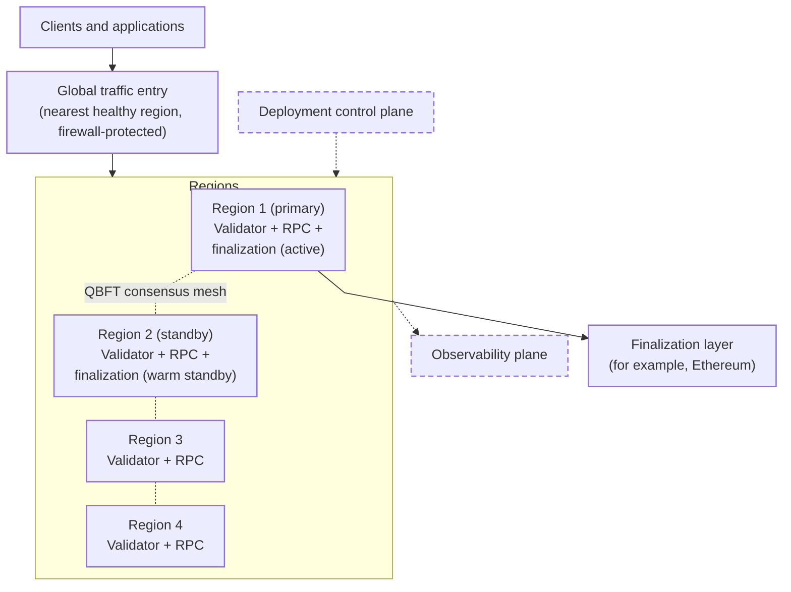
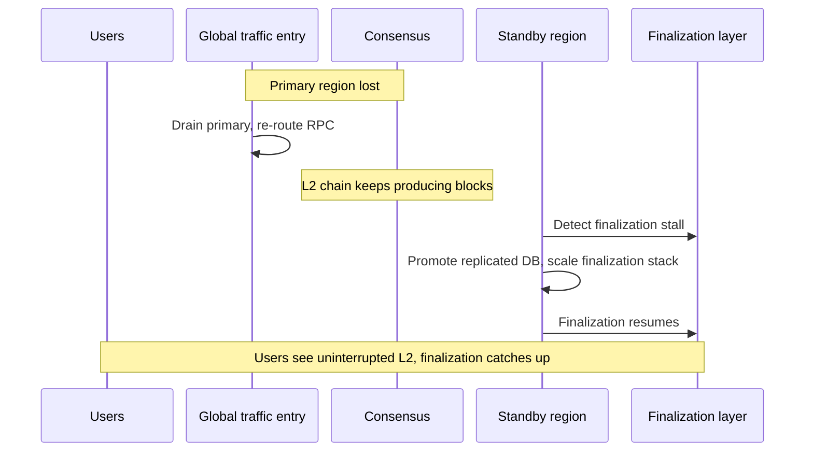

import GlossaryTerm from '@theme/GlossaryTerm';

This page describes how a <GlossaryTerm term="Lineth" /> deployment can be designed for high
availability (HA).
It uses an example multi-region enterprise topology that keeps block production available through the loss
of a single cloud region, fails over finalization to a warm standby, and fails safe if two regions are
lost at once.

Detailed production topology and supported tooling for a given deployment can be confirmed with the
[Lineth team](/support) in enterprise engagements.

## Example multi-region design

An example HA topology includes four independent cloud regions, which is the smallest
<GlossaryTerm term="Quorum Byzantine Fault Tolerance (QBFT)">QBFT</GlossaryTerm> validator set that can
tolerate the loss of one region (`n=4`, `f=1`).

In this example, each region is a self-contained deployment.
Two of the four regions run the finalization pipeline (primary and warm standby).
Two supporting planes sit outside the transaction path: deployment control and observability.

Each region includes:

- **Consensus and block production:** A <GlossaryTerm term="Maru" /> consensus client paired with a
  <GlossaryTerm term="Linea Besu" /> execution client (one
  <GlossaryTerm term="Quorum Byzantine Fault Tolerance (QBFT)">QBFT</GlossaryTerm>
  validator per region).
  That layout is what keeps block production available when a single region is
  lost.
  For QBFT topology, latency, and setup, see
  [Multi-validator consensus](./distributed-sequencing.mdx) and
  [Set up distributed sequencing](../how-to/set-up-distributed-sequencing.mdx).
- **RPC services:** Public and/or private JSON-RPC endpoints in front of near-head and archive nodes, with
  [access control](./rbac.mdx) where required.
- **Finalization pipeline** *(primary and standby regions only):* The
  <GlossaryTerm term="Coordinator">coordinator</GlossaryTerm>,
  <GlossaryTerm term="Prover">provers</GlossaryTerm>, and supporting services that batch L2 blocks,
  generate proofs, and submit them to the
  <GlossaryTerm term="Finalization layer">finalization layer</GlossaryTerm>.

Losing the control plane or observability plane does not stop the running network.
Those planes can be rebuilt independently.

The following table describes what capabilities run in each region in the example topology:

| Capability | Regions 1 and 2 (primary and standby) | Regions 3 and 4 |
| --- | --- | --- |
| Validator (consensus + block building) | Active | Active |
| Public or private RPC services | Active | Active |
| Finalization pipeline (coordinator, provers, related services) | Active in primary; warm standby in secondary | Not deployed |
| Coordinator and bridge databases | Primary has the live (writable) DB; standby keeps a replica that can take over on failover | Not deployed |
| L1 submission signing | Available in both finalization regions | Not deployed |

### Traffic and RPC

Client RPC can enter through a global entry point that routes each client to the nearest
healthy region (for example, [AWS Global Accelerator](https://aws.amazon.com/global-accelerator/)),
protected by a web application firewall, then a regional load balancer, reverse proxy with
[RBAC](./rbac.mdx), and JSON-RPC routers to
[near-head and archive nodes](../../protocol/architecture/rpc-services.mdx).

Keep consensus peer-to-peer traffic on a path separate from this RPC routing so
RPC failover does not disturb validator communication.

In this reference design:

- Unhealthy regions are drained automatically and traffic redistributes to healthy regions (on the order
  of tens of seconds), without client reconfiguration.
- Public RPC uses the global entry point.
- Private RPC can use private connectivity into each region (for example, AWS PrivateLink) for clients
  that require end-to-end private JSON-RPC.

### Finalization failover

Unlike validators and RPC nodes, the coordinator that submits data and finalization proofs must
not run as two live submitters at once.
Only one region may actively submit to the finalization layer at a time.

In the reference design, that role runs in the primary region, with a warm standby in the
secondary region ready to take over if the primary fails.
Failover from primary to standby is automated.
In this design, end-to-end recovery of finalization is on the order of about 15 minutes.

- The standby monitors primary availability and finalization progress on the finalization layer
  over an observation interval.
- On failover, the standby promotes the replicated coordinator database and scales up the
  finalization stack.
- Intermediate proving artifacts are typically rebuilt from chain and finalization-layer data rather
  than cross-region replicated.
- If both regions briefly submit, duplicate submissions are rejected by the onchain contract rather than
  corrupting state.
- A manual override remains available for planned failovers.

Failback to the original primary is typically a controlled operator step after the incident is resolved.

Finalization failover depends on keeping the right data available in the standby region, and on
choosing what to replicate versus rebuild:

- **Coordinator and bridge databases:** Cross-region replication (for example,
  [Amazon Aurora Global Database](https://aws.amazon.com/rds/aurora/global-database/)) keeps
  standby lag low and supports automatic promotion during finalization failover.
- **Intermediate proving artifacts:** Prefer regenerate-on-demand over cross-region copy of large proving artifacts.
  Within a region, a shared file system (for example, [Amazon EFS](https://aws.amazon.com/efs/))
  can still let coordinator, <GlossaryTerm term="Tracer">tracer</GlossaryTerm>, and prover
  workloads share traces and related files.
- **State snapshots:** Checkpoint L2 state so services can restore from a trusted snapshot instead of
  replaying from genesis.
  Design snapshot frequency with database backups and, for
  <GlossaryTerm term="Validium">private validium</GlossaryTerm> deployments,
  [data availability](./data-availability-finalization.mdx#private-validium) redundancy.

### Key custody

Signing keys for platform transactions on the finalization layer should use hardware-backed key
management (for example, cloud KMS with HSM, integrated through <GlossaryTerm term="Web3Signer" />):

- Private key material stays in the HSM boundary.
- Multi-region keys (or equivalent) let primary and standby sign from the same onchain address after
  failover, without a new key ceremony.
- Access is least-privilege and auditable.

### Failure scenarios

| Event | What happens | Impact |
| --- | --- | --- |
| Single availability-zone loss | Workloads reschedule across zones; multi-AZ databases and storage continue | None to minor |
| One non-primary region lost | Consensus continues on three validators; RPC drains from the lost region | No chain downtime; occasional delayed block when the missing validator would have proposed; RPC capacity redistributes |
| Primary region lost | Automated finalization failover to the standby region; L2 keeps producing | L2 continues; finalization pauses then resumes after failover |
| Two regions lost at once | Chain pauses safely at below-quorum; resumes when a region returns | Write pause until quorum returns; state remains intact |
| Control-plane loss | Running network unaffected | New deployments or config changes pause until rebuilt |
| Observability-plane loss | Telemetry buffers; monitoring rebuilt from replicated data | Temporary monitoring gap |
| Finalization-layer provider outage | L2 keeps producing; finalization catches up when the provider returns | Finalization delay only |

For trust boundaries and what participants can verify without trusting the operator, see
[Trust and responsibilities](../evaluate/trust-model.mdx).

## Within-region redundancy

Multi-region HA still depends on solid within-region design:

- Run multiple replicas of RPC nodes, proxies, and other stateless or horizontally scalable services
  across availability zones.
- Use multi-AZ managed databases inside a region as well as cross-region replicas for finalization failover.
- Keep shared proving storage local to the region that runs coordinator and prover workloads.
- Monitor service health, finalization lag, and storage capacity.

[Multi-validator consensus](./distributed-sequencing.mdx) improves sequencer fault tolerance.
It does not by itself make coordinator, prover, RPC, bridge, or finalization submission highly available.
Those surfaces use the patterns described on this page.

For private validium deployments, data availability redundancy and backup remain operator responsibilities:
participants cannot reconstruct full history from the finalization layer alone.
See [Data availability and finalization](./data-availability-finalization.mdx#private-validium).
