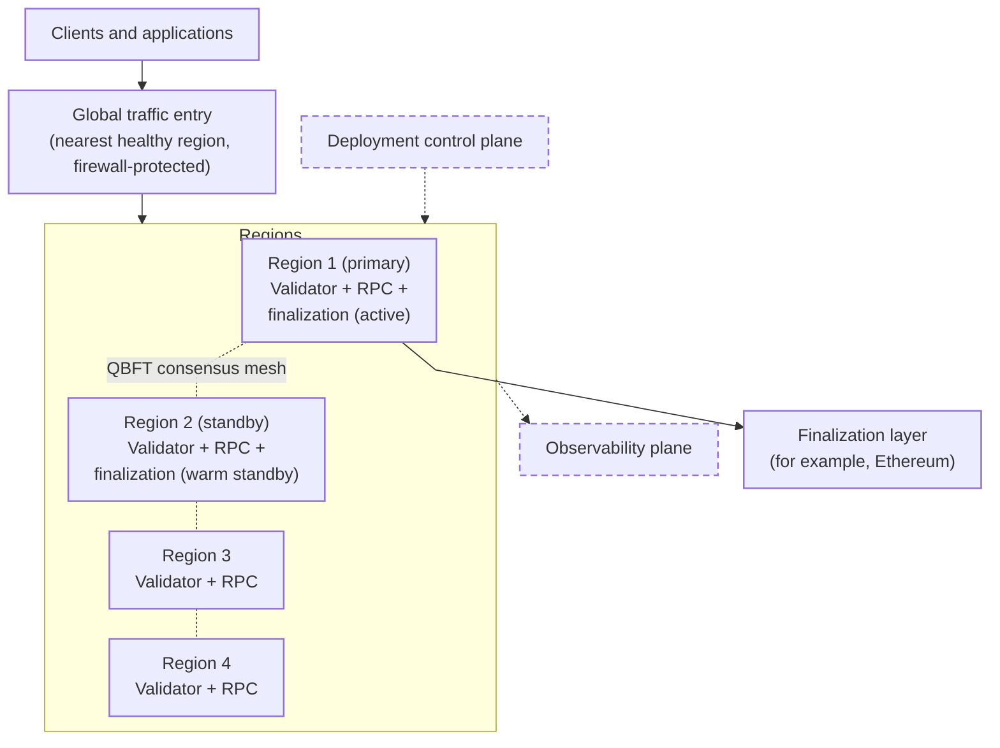
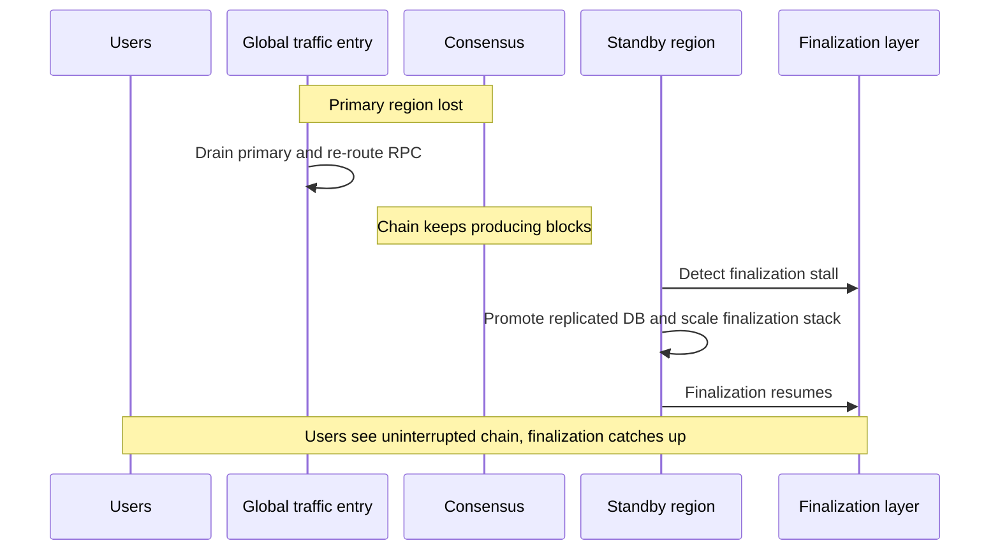

import GlossaryTerm from '@theme/GlossaryTerm';

This page describes how a <GlossaryTerm term="Lineth" /> deployment can be designed for high
availability (HA).
It uses an example that spans multiple cloud regions: the chain keeps producing blocks if one region
fails, moves finalization to a standby region when needed, and stops safely if two regions fail at once.

Detailed production topology and supported tooling for a given deployment can be confirmed with the
[Lineth team](/support) in enterprise engagements.

## Example multi-region design

An example HA topology includes four independent cloud regions, which is the smallest
<GlossaryTerm term="Quorum Byzantine Fault Tolerance (QBFT)">QBFT</GlossaryTerm> validator set that can
tolerate the loss of one region (`n=4`, `f=1`).

In this example, each region is a self-contained deployment.
Two of the four regions (primary and warm standby) run the finalization pipeline.
Two supporting planes sit outside the transaction path: deployment control and observability.

Each region runs a <GlossaryTerm term="Maru" /> consensus client paired with a
<GlossaryTerm term="Linea Besu" /> execution client (one
<GlossaryTerm term="Quorum Byzantine Fault Tolerance (QBFT)">QBFT</GlossaryTerm>
validator per region).
Each region also runs public and/or private JSON-RPC gateways in front of
<GlossaryTerm term="RPC node">RPC nodes</GlossaryTerm>, with [access control](./rbac.mdx) where
required.
For QBFT topology, latency, and setup, see
[Multi-validator consensus](./distributed-sequencing.mdx) and
[Set up distributed sequencing](../how-to/set-up-distributed-sequencing.mdx).

Only the primary and standby regions also run the finalization pipeline: the
<GlossaryTerm term="Coordinator">coordinator</GlossaryTerm>,
<GlossaryTerm term="Prover">provers</GlossaryTerm>, and supporting services that batch blocks,
generate proofs, and submit them to the
<GlossaryTerm term="Finalization layer">finalization layer</GlossaryTerm>.

Losing the control plane or observability plane does not stop the running network.
Those planes can be rebuilt independently.

This table summarizes which components or capabilities run in which regions:

| Capability | Regions 1 and 2 (primary and standby) | Regions 3 and 4 |
| --- | --- | --- |
| QBFT validator | Active | Active |
| RPC services | Active | Active |
| Finalization pipeline (coordinator, provers, related services) | Active in primary; warm standby in secondary | Not deployed |
| Operational databases | Primary has the live (writable) DB; standby keeps a replica that can take over on failover | Not deployed |

### Traffic and RPC

Client RPC can enter through a global entry point that routes each client to the nearest
healthy region (for example, [AWS Global Accelerator](https://aws.amazon.com/global-accelerator/)),
protected by a web application firewall, then a regional load balancer, reverse proxy with
[RBAC](./rbac.mdx), and JSON-RPC routers to
[near-head and archive nodes](../../protocol/architecture/rpc-services.mdx).

Keep consensus peer-to-peer traffic on a path separate from this RPC routing so
RPC failover does not disturb validator communication.

In the example design:

- Unhealthy regions are drained automatically and traffic redistributes to healthy regions without
  client reconfiguration.
- Public RPC uses the global entry point.
- Private RPC can use private connectivity into each region (for example,
  [AWS PrivateLink](https://docs.aws.amazon.com/vpc/latest/privatelink/what-is-privatelink.html))
  for clients that require end-to-end private JSON-RPC.

### Finalization failover

Unlike validators and RPC nodes, the coordinator that submits data and finalization proofs must
not run as two live submitters at once.
Only one region may actively submit to the finalization layer at a time.

In the example design, finalization runs in the primary region, with a warm standby in the
secondary region ready to take over if the primary fails.
Failover from primary to standby is an automated process:

- The standby monitors primary availability and finalization progress on the finalization layer
  over an observation interval.
- On failover, the standby promotes the replicated coordinator database and scales up the
  finalization stack.
- If both regions briefly submit, duplicate submissions are rejected by the onchain contract rather than
  corrupting state.
- A manual override remains available for planned failovers.

Failback to the original primary region is typically a controlled
<GlossaryTerm term="Operator">operator</GlossaryTerm> step after the incident is resolved.

Finalization failover depends on keeping the right data available in the standby region, and on
choosing what to replicate versus rebuild:

- **Operational databases:** Cross-region replication (for example,
  [Amazon Aurora Global Database](https://aws.amazon.com/rds/aurora/global-database/)) keeps
  standby lag low and supports automatic promotion during finalization failover.
- **Intermediate proving artifacts:** Regenerate on demand instead of keeping a cross-region copy
  of large proving artifacts.
  Within a region, a shared file system (for example, [Amazon EFS](https://aws.amazon.com/efs/))
  can still let <GlossaryTerm term="Coordinator">coordinator</GlossaryTerm>,
  <GlossaryTerm term="Tracer">tracer</GlossaryTerm>, and
  <GlossaryTerm term="Prover">prover</GlossaryTerm>
  workloads share traces and related files.
- **State snapshots:** Checkpoint chain state so services can restore from a trusted snapshot instead of
  replaying from genesis.
  Design snapshot frequency with database backups and, for
  <GlossaryTerm term="Validium">private validium</GlossaryTerm> deployments,
  [data availability](./data-availability-finalization.mdx#private-validium) redundancy.

### Key custody

Signing keys for platform transactions on the finalization layer should use hardware-backed key
management (for example, cloud KMS with HSM, integrated through <GlossaryTerm term="Web3Signer" />):

- Private key material stays in the HSM boundary.
- Multi-region keys let primary and standby sign from the same onchain address after failover,
  without a new key ceremony.
- Access is least-privilege and auditable.

### Failure scenarios

In the example design, failures resolve as follows:

| Event | What happens |
| --- | --- |
| Single availability zone (AZ) loss | Workloads reschedule across zones; multi-AZ databases and storage continue. |
| One non-primary region lost | Consensus continues on three validators; RPC drains and redistributes; occasional delayed block when the missing validator would have proposed. |
| Primary region lost | Automated finalization failover to the standby region; chain keeps producing while finalization pauses, then resumes. |
| Two regions lost at once | Chain pauses safely below quorum until a region returns; state remains intact. |
| Control plane loss | Running network unaffected; new deployments or configuration changes pause until rebuilt. |
| Observability plane loss | Telemetry buffers; temporary monitoring gap until monitoring is rebuilt from replicated data. |
| Finalization layer provider outage | Chain keeps producing; finalization catches up when the provider returns. |

## Within-region redundancy

Multi-region high availability still depends on within-region design:

- Run multiple replicas of RPC nodes, proxies, and other stateless or horizontally scalable services
  across availability zones (AZ).
- Use multi-AZ managed databases inside a region as well as cross-region replicas for
  [finalization failover](#finalization-failover).
- Keep shared proving storage local to the region that runs
  <GlossaryTerm term="Coordinator">coordinator</GlossaryTerm> and
  <GlossaryTerm term="Prover">prover</GlossaryTerm> workloads.
- Monitor service health, finalization lag, and storage capacity.

## See also

- Learn how [multi-validator consensus](./distributed-sequencing.mdx) improves
  <GlossaryTerm term="Sequencer">sequencer</GlossaryTerm> fault tolerance and learn how to
  [set up distributed sequencing](../how-to/set-up-distributed-sequencing.mdx).
- Understand [data availability](./data-availability-finalization.mdx#private-validium)
  redundancy and backup responsibilities for
  <GlossaryTerm term="Validium">private validium</GlossaryTerm> deployments, where participants
  cannot reconstruct full history from the finalization layer alone.
