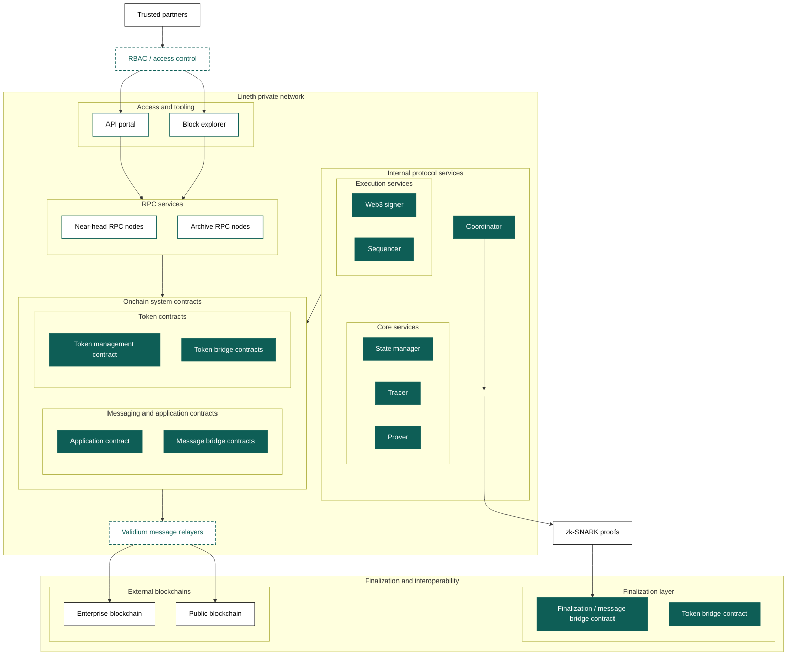

This page describes the Lineth deployment models and the trade-offs
they create for access, data availability, and finalization. Related evaluation
paths include [Trust and responsibilities](./trust-model.mdx) and
[Privacy and data visibility](./validium.mdx).

## Customization factors

An operator can customize the following in a Lineth deployment:

- Access control: who may access the mempool, ledger, and transaction data
- Data availability: how transaction data is stored and who can reconstruct it
- Finalization speed: block size and configuration affect soft finality speed
- Finalization layer: whether you finalize on Ethereum or Linea affects security assumptions and
  hard finality speed
- Transaction ordering: operators can apply custom ordering rulesets

Operators own these choices. Lineth does not recommend a specific set of customizations.

## Two primary models

Lineth supports two primary deployment models:

- [Public deployments](#public), such as Linea Mainnet, with onchain data availability
- [Private validium deployments](#private-validium), with offchain data availability and controlled
  access

When configuring a deployment, consider:

- Privacy requirements: should transaction data remain private to authorized
  participants?
- Regulatory and [compliance](./compliance.mdx) obligations: what controls does your program
  require, and who owns them?
- Data availability guarantees: how important is onchain data availability for
  your participants?
- Network topology: do you need a private network with controlled membership?
- Access control: do you need [RBAC](../deployment/rbac.mdx) on RPC endpoints and
  APIs?

## Public

Public deployments such as Linea Mainnet are fully public networks with onchain
data availability.

### Characteristics

- Data availability: transaction data is posted onchain via EIP-4844 blobs
- Public access: public RPC endpoint
- Transparency: all transactions are visible on the finalization layer
- Finalization: state commitments, proofs, and data are posted to the
  finalization layer

### Use cases

- Networks requiring maximum transparency
- Applications that benefit from onchain data availability
- Networks that prioritize open access over transaction privacy

### Security considerations

- Validator topology: if the deployment uses a
  [multi-validator QBFT design](../deployment/distributed-sequencing.mdx), at least 4
  Maru validators are required to tolerate one faulty validator
- Access controls: whether to implement [RBAC](../deployment/rbac.mdx) on RPC
  endpoints
- [Key management](../../protocol/architecture/index.mdx#web3signer): remote
  signing backed by a hardware security module (HSM) or key management service
  (KMS)

## Private validium

A private validium keeps transaction data offchain while using zk-SNARK proofs
to support state-transition correctness and finalization. Whether this model
suits a regulated environment depends on the operator's own compliance, privacy,
and access-control design; Lineth does not certify a deployment as compliant.

### Characteristics

- Data availability: transaction data can be stored offchain in a private node
  set
- Data visibility: transaction details are not posted to the finalization layer;
  what participants can see depends on the deployment's data availability and
  [RBAC](../deployment/rbac.mdx) configuration
- Access control: RPC endpoints protected by [RBAC](../deployment/rbac.mdx); only
  authorized participants can view data they are scoped to
- [Finalization](../../network/overview/transaction-finality.mdx): state
  commitments and proofs are posted to the finalization layer
- Network topology: private network with controlled node membership

In private validium deployments, participant visibility depends on RBAC settings
and data availability access. Some participants may verify only the data they
are authorized to access. For the trust trade-off, see
[Trust and responsibilities](./trust-model.mdx).

### Use cases

- Workflows where transaction data should not be public
- Multi-party workflows where participants should not see all transaction
  details
- Operators who accept the validium trade-off: state-transition correctness is
  proven onchain, but data reconstruction without the operator depends on the
  deployment's data availability arrangement

Operators with regulatory or compliance obligations are responsible for
designing their own compliance program. See
[Compliance](./compliance.mdx) for what protocol evidence exists and
what is not claimed.

### Security considerations

- Validator topology: at least 4 Maru validators are required for a
  [QBFT design](../deployment/distributed-sequencing.mdx) that tolerates one faulty
  validator
- Access controls: [RBAC](../deployment/rbac.mdx) on RPC endpoints and API portal
- [Key management](../../protocol/architecture/index.mdx#web3signer): remote
  signing backed by a hardware security module (HSM) or key management service
  (KMS)
- Network isolation: private network topology with controlled peering

### Example validium system setup

The following is an example validium network setup.
The operator determines where transaction data is
stored to suit privacy and security requirements (not shown below).

## Next steps

Also consider the design decisions required to determine the
[finality mechanism](../deployment/data-availability-finalization.mdx#finality-design-options).
