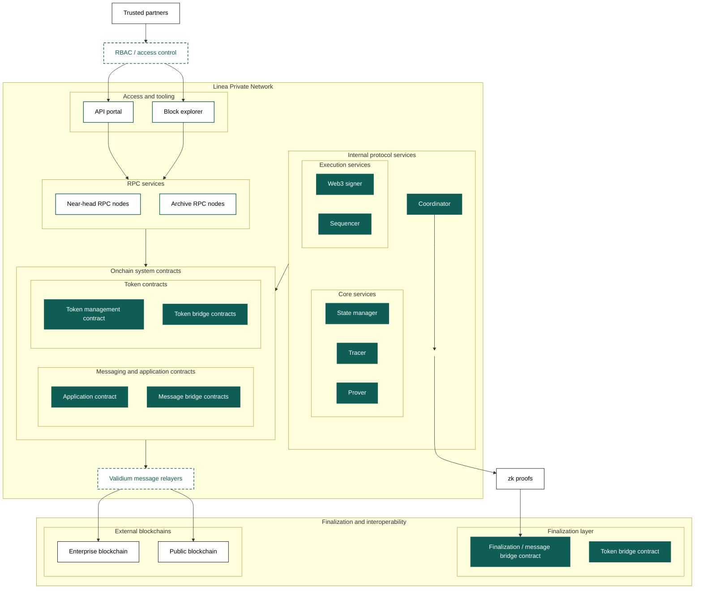

The Linea stack supports operators to fine tune the deployment model to optimize for different use cases and
requirements.

Consider these factors when configuring your deployment model design:

- Privacy requirements: Do you need transaction data to remain private?
- Regulatory compliance: Do you need KYC/KYT controls and selective disclosure?
- Data availability guarantees: How important are onchain data availability guarantees?
- Network topology: Do you need a private network with controlled membership?
- Access control: Do you need RBAC on RPC endpoints and APIs?

## Compare deployment models

## Public

Public deployments such as Linea Mainnet are fully public networks with onchain data availability.

### Characteristics

- Data availability: In Linea Mainnet, transaction data is posted onchain via EIP-4844 blobs
- Public access: RBAC on RPC endpoints served by Infura, no RBAC on public Linea RPC endpoint
- Transparency: All transactions visible on the finalization layer
- Finalization: State commitments, proofs, and data posted to the finalization layer

### Use cases

- Public networks requiring maximum transparency
- Applications benefiting from onchain data availability guarantees
- Networks prioritizing decentralization over privacy

### Security considerations

- Minimum node count: 4 nodes for QBFT fault tolerance
- Access controls: Whether or not to implement RBAC on RPC endpoints
- [Key management](../../protocol/architecture/index.mdx#web3signer): remote signing backed by a hardware
  security module (HSM) or key management service (KMS)

## Private validium

A private network instance, a validium, keeps transaction data offchain while maintaining
cryptographic guarantees through zero-knowledge (zk) proofs. This model is ideal for regulated
financial institutions requiring privacy.

### Characteristics

- Data availability: Transaction data stored offchain in a private node set
- Privacy: Transaction details not visible on the finalization layer
- Access control: RPC endpoints protected by Role-Based Access Control (RBAC); only authorized
  participants can view data
- [Finalization](../../network/features/known-finality-state.mdx): State commitments and proofs
  posted to the finalization layer
- Network topology: Private network with controlled node membership

### Use cases

For most enterprise and regulated financial use cases, a Private Validium provides the necessary
privacy, compliance, and access control features:

- Regulated financial applications requiring transaction privacy
- Institutions needing KYC/KYT compliance controls
- Applications requiring selective data disclosure to auditors and regulators
- Multi-party workflows where participants should not see all transaction details

### Data availability

Data is stored in a private node set. Participants must trust that data availability providers will
make data available when needed.

### Security considerations

- Minimum node count: 4 Maru nodes for QBFT fault tolerance
- Access controls: RBAC on RPC endpoints and API portal
- [Key management](../../protocol/architecture/index.mdx#web3signer): remote signing backed by a
  hardware security module (HSM) or key management service (KMS)
- Network isolation: Private network topology with controlled peering

### Validium differentiators

In validium mode, the Linea network proves state transitions using zk-SNARKs while retaining
transaction data within a private data availability layer. After blocks are produced by the
sequencer, they are aggregated and batched, and a zk-SNARK proof attesting to the resulting state
transition is generated and submitted to the finalization layer.

Unlike public deployments, raw transaction data is not posted onchain. The operator determines
where transaction data is stored to suit privacy and security requirements (not shown below).

### Example validium system setup

The following network setup presents how an enterprise validium instance of Linea may be configured
to serve as an interoperable payment system with KYC and KYT (know your customer and know your trade
respectively) auditing capabilities:

