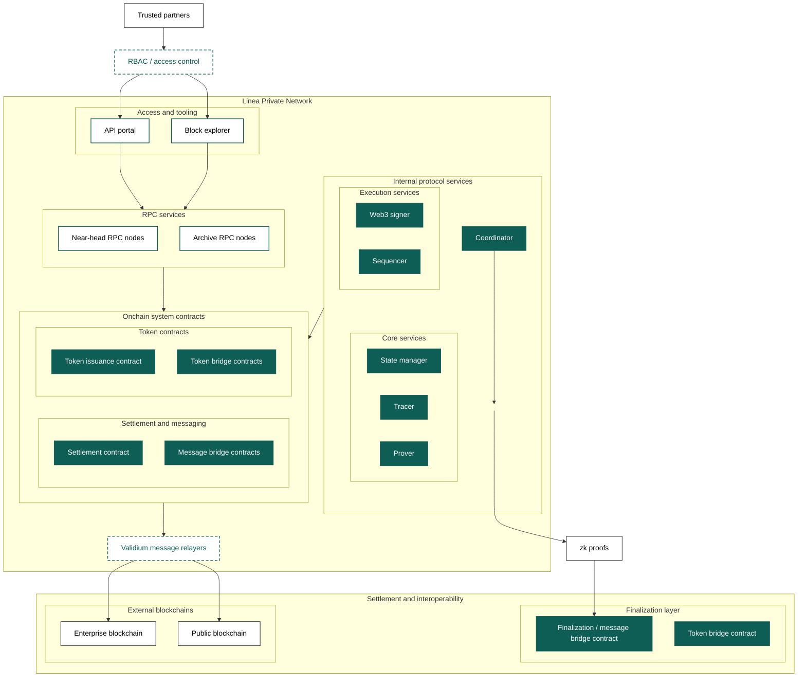

## Validium differentiators

Notice that, to support private transactions, the [operations guide](../../guides/operations-guides/index.mdx) for Validium
mode leverages:

- Private RPC nodes with RBAC
- API portal for controlled access.

In Validium mode, the Linea network proves state transitions using zk-SNARKs while retaining transaction data within a private data-availability layer. After blocks are produced by the sequencer, they are aggregated and batched, and a zk-SNARK proof attesting to the resulting state transition is generated and submitted to the finalization layer. 

Unlike public deployments, raw transaction data is not posted onchain. The operator determines where transaction data is stored to suit privacy and security requirments (not shown below).

Operators may also choose how to handle remote signing, opting for alternatives to Web3 signer if they have a preference.

<!-- todo: is it an issue that Mermaid is not yet showing how Transaction data is stored offchain in a private node set rather than posted to the finalization layer. -->

### Private network system setup

## Getting started

To deploy a private Validium instance:

1. Review [deployment models](./index.mdx) to understand the Validium characteristics.
2. Follow [deploy private Validium](../../guides/deployment-guides/deploy-private-validium.mdx) for
   step-by-step deployment.
3. Configure <!-- todo: does this need to be built out [Data availability](../../guides/configuration-guides/configure-data-availability.mdx) --> data availability
   and <!-- todo: does this need to be built out [RBAC](../../guides/configuration-guides/configure-rbac.mdx) --> RBAC.
4. Set up [Operational procedures](../../guides/operations-guides/index.mdx) for monitoring and maintenance.
