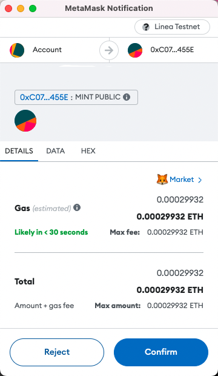
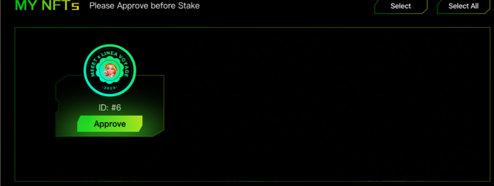
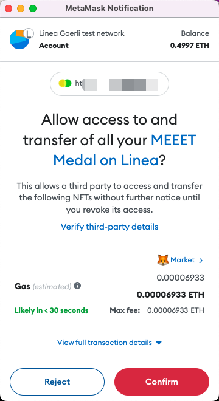
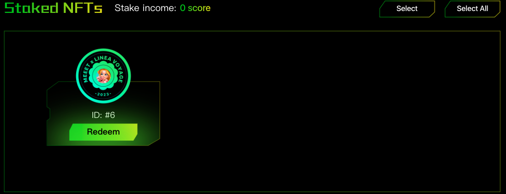

# MEEET

[MEEET](https://www.meeet.xyz/) is a social & AIGC-based blockchain game platform.

MEEET aims to introduce a variety of game products to its ecosystem and encourages user participation in product development through AIGC (Artificial Intelligence Game Currency), MOD (Modifications), and more. Together, we can build the game platform and develop the ecosystem.

Before you begin, make sure your wallet is:

1. [Configured to use Linea](/use-mainnet/set-up-your-wallet.mdx).
1. [Funded with Goerli ETH](../fund.md#get-test-eth-on-goerli)

## Claim Free MML NFT on Linea Testnet

This NFT medal is designed to celebrate the joint activities of Linea and MEEET, and holders can enjoy a unique collection experience. In the future, users who hold this NFT medal may also receive the MMT(Governance Token) airdrop of MEEET. Holders of this NFT will have additional exclusive rewards when they login to the MEEET game in the future.

1. Visit [MEEET on Linea Testnet](https://www.meeet.xyz/linea/testnet). Connect your wallet and Click “MINT”

2. Confirm in your wallet

3. Congratulations, you have minted an MML medal.

## Stake MML NFT on Linea Testnet

1. After connecting your wallet, you can view your current NFT holdings in the “My NFTs” section. You need to authorize your NFTs before staking them. Click “Approve” to grant authorization.

2. Click “Stake” and confirm in your wallet.

3. Congratulations, you have successfully staked the medal. You can view your staked NFTs in the “Stake NFTs” section.

**Please Note: Ten stake scores will be generated when each NFT is staked for 24 hours. In the future, MEEET will send MMT(Governance Token) airdrops to holders based on the leaderboard of stake scores of users' MML NFT.**

## Redeem MML NFT on Linea Testnet

1. In the “Stake NFTs” section, you can redeem your staked NFTs. Click “Redeem” to proceed and confirm in your wallet.

2. You can check your NFTs In the “My NFTs” section.
