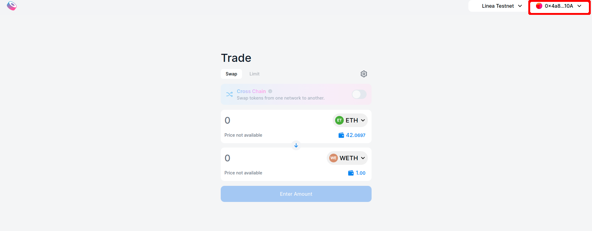
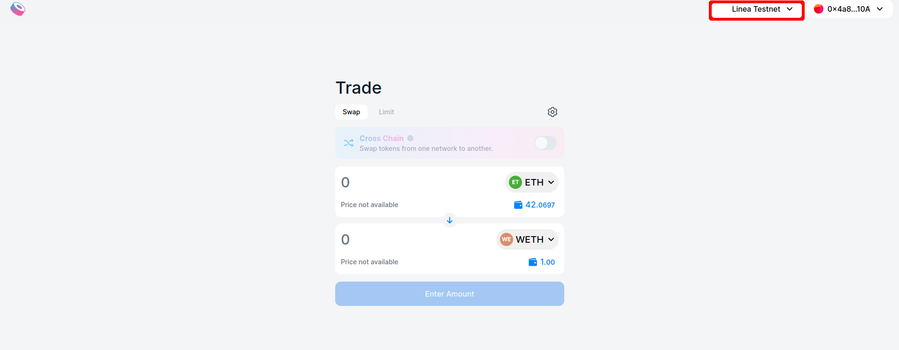
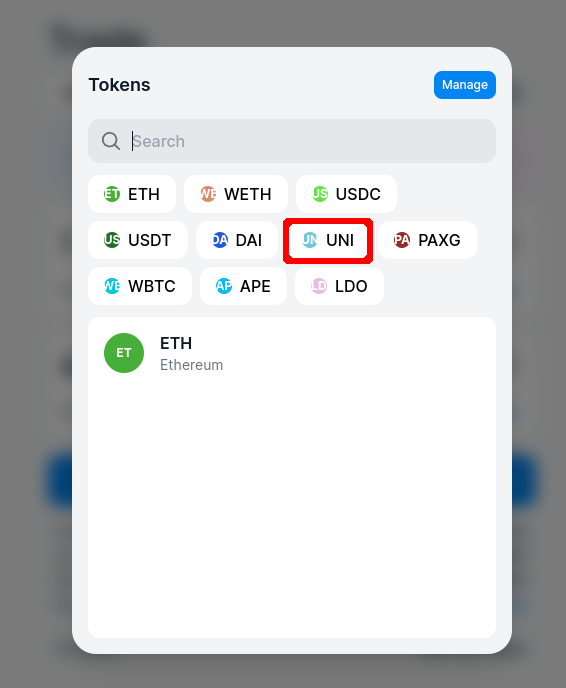
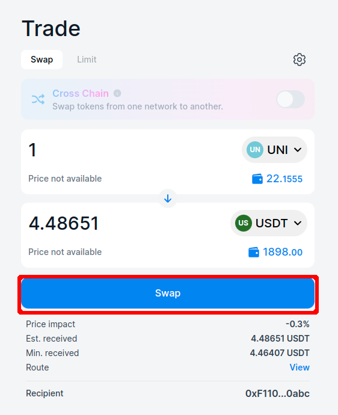
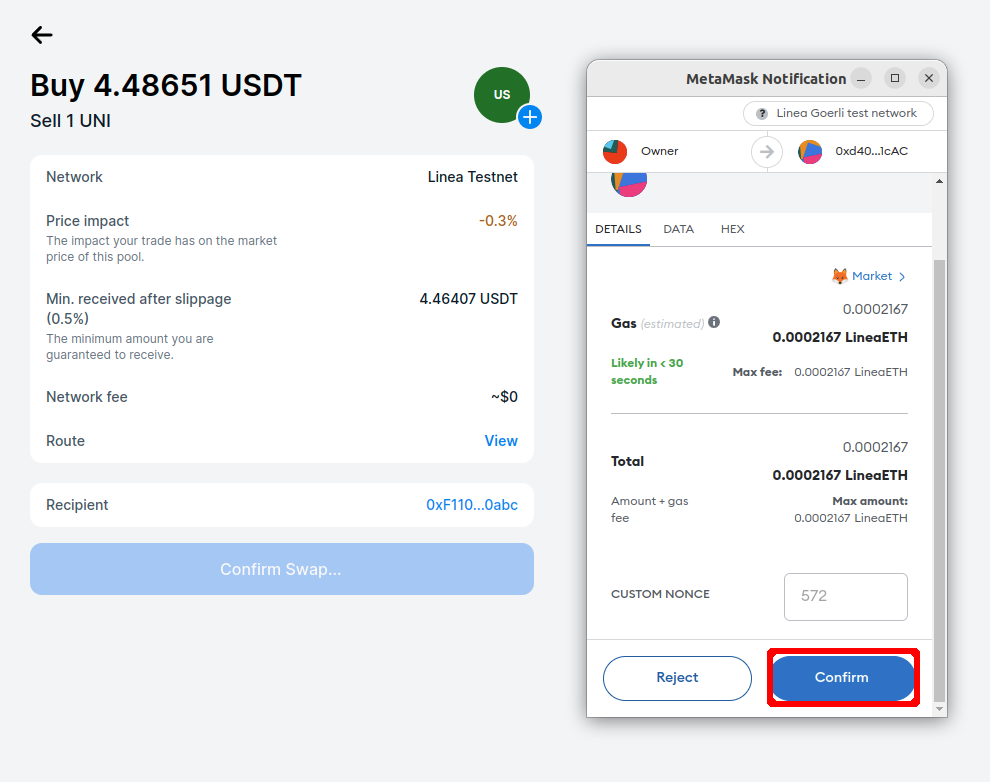

Sushiswap has deployed its contracts to showcase how Linea can be used to swap tokens on L2, where users can benefit from cheaper gas fees.

Consensys deployed a version of the Sushiswap website to let the user interact with the swap feature.

## How to make a swap on Linea Sushiswap

1. First you need tokens to make a swap on Sushiswap, navigate to the [Linea Faucet](https://faucet.goerli.linea.build/)
2. Then get some “UNI” tokens from the list of tokens available
3. Once the tokens received in your wallet navigate to [Linea Sushiswap](https://sushiswap.goerli.linea.build)
4. Connect your MetaMask wallet.

5. Make sure your wallet is connected to Linea Goerli and funded with LineaETH to pay for gas fees
6. Make sure that “Linea Testnet” is selected in the networks list on the top right

7. Select the token you want to receive (for the quest select USDT)

8. Choose the amount you want to swap (there is no limit for the quest)
9. Select the token you want to receive (for the quest select USDT)

10. Click on the button “Approve” button as a first step to allow Sushiswap to make the swap
11. A Metamask popup appears, click on “Use default”, then “Next”, then “Approve”

12. On the top right, a message indicating “Approving …” is displayed, wait until the “Successfully approved” message appears.

13. Click on “Swap”

14. A new page is displayed with the swap summary, click on the swap button

15. In the Metamask popup click on confirm

16. Wait for the transaction to go through, once confirmed you’re done!

