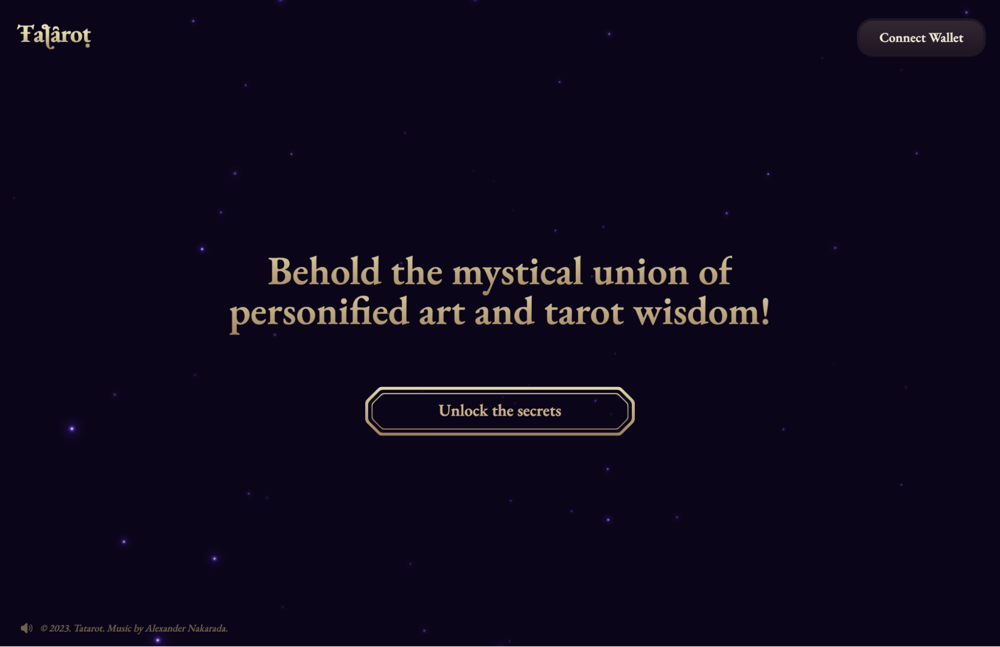
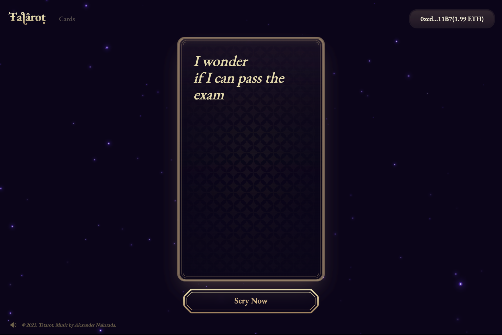
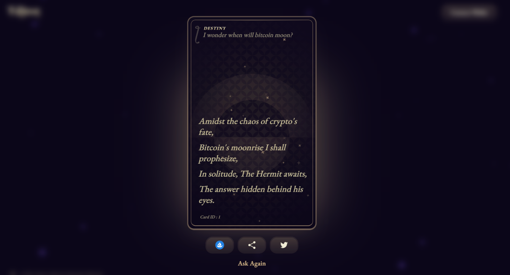

# Tatarot

[Tatarot](https://tatarot.ai/) is using AI-powered computer engineering to allow users to entwine the intricate threads of their fate into the timeless images of the tarot. This allows Tatarot to generate an infinite array of new cards that is infused with unique blockchain technology.

Enter into this mystical realm of digital enchantment, and who knows, you might get something more than just your fortune.

This guide will provide step-by-step instructions on how to mint a magical Tatarot NFT card on Linea.

Before you begin, ensure your wallet is:

1. [Configured to use Linea](/use-mainnet/set-up-your-wallet.mdx)
1. [Funded with Goerli ETH](../fund.md#get-test-eth-on-goerli)

## Mint a Tatarot NFT card

1. Navigate to [https://tatarot.ai/](https://tatarot.ai/)

   

1. Click “Connect Wallet” on the top right of the page to connect your wallet.
1. Click "Unlock The Secrets".
1. Type in your question to receive a customized tarot reading.

   

1. Click "Scry Now" to generate your unique Tatarot card with a personalized tarot art based on your question.
1. Click "Read My Fortune" and approve the transaction to mint the displayed Tatarot card.

   

1. Once the transaction is approved and the NFT is successfully minted, you can explore your unique fortune readings.

   

1. To verify that the Tatarot card has been successfully minted into your wallet, simply click on "Cards" located at the top left corner of the page.
1. This will allow you to access and view the collection of Tatarot cards that you have previously minted.

   

## Get support

If you run into an issue using Tatarot, you can find their support channel in their support [Discord](https://discord.gg/4wmvYvmvYG).
