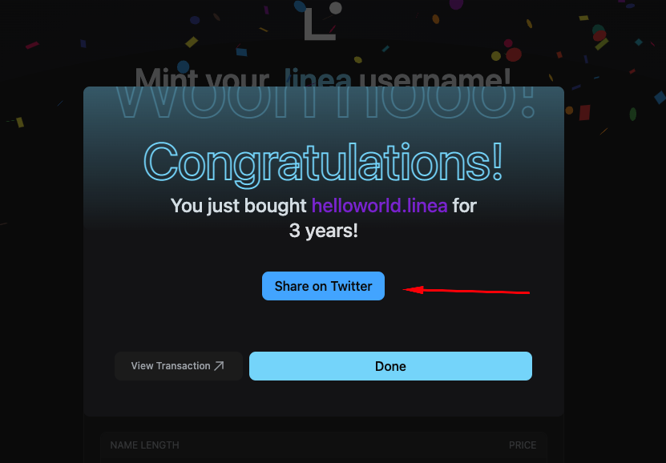

# Linea L2 Domains

[Linea L2 Domains](https://www.lineal2.domains/) offers .linea Community Namespaces for the Linea network. They are ownable/tradable usernames, are compatible with ENS at `joe.linea.usr.id`, and all fees go towards funding public goods for the Linea ecosystem!

In this guide, we'll walk you through how to buy a username!

Before you begin, ensure your wallet is [configured to use Linea](/use-mainnet/set-up-your-wallet.mdx).

## Buy a Username

1. First, navigate to the [Linea L2 Domains](https://www.lineal2.domains/) website and connect your wallet.

If needed, switch to the Linea testnet in your wallet.

2. Type a username into the textbox to check whether it's available. It must be 3+ characters, not taken, and you can register it for any number of years.

3. Click "Buy domain" and sign the transaction with your wallet.

4. Wait for the transaction to mine and you're done! Share to Twitter for future rewards! 🥳👀

## Get Support

If you run into issues using Linea L2 Domains, ask for help in the `🚩-linea-domains-support` channel in our [Discord](https://discord.gg/EAFPKSRyth).
