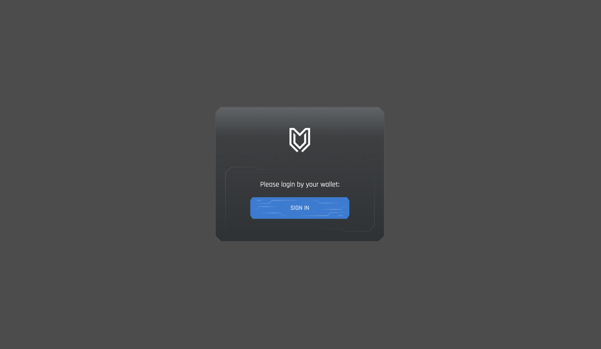
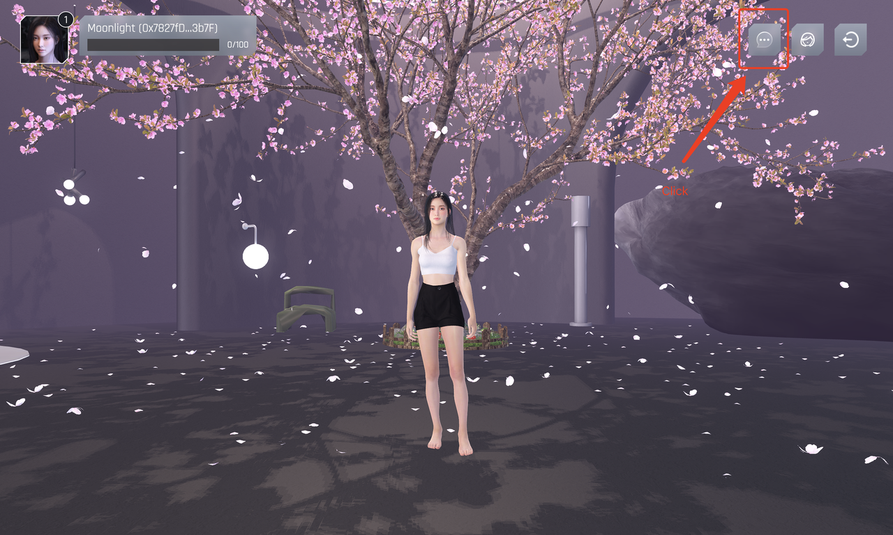
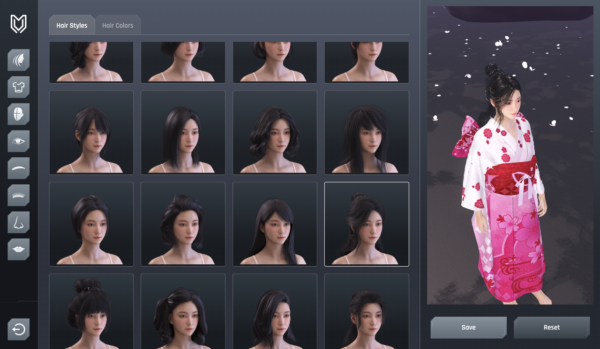
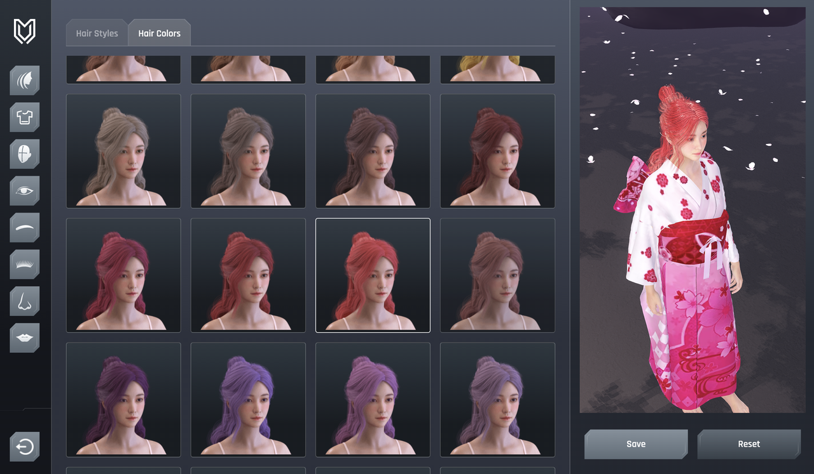
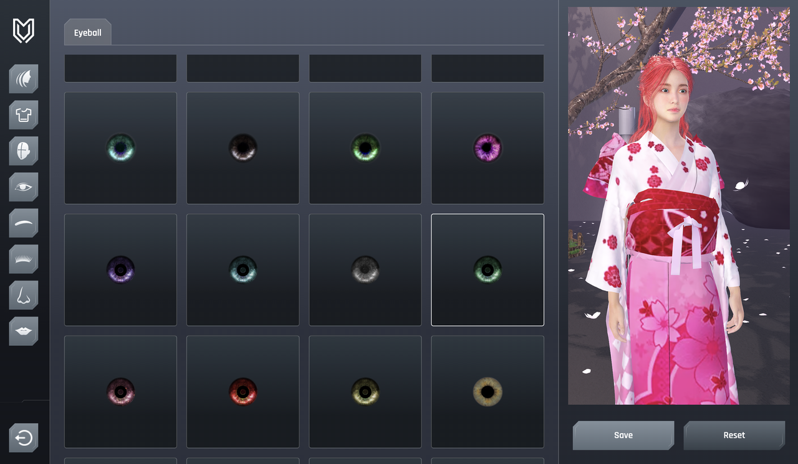
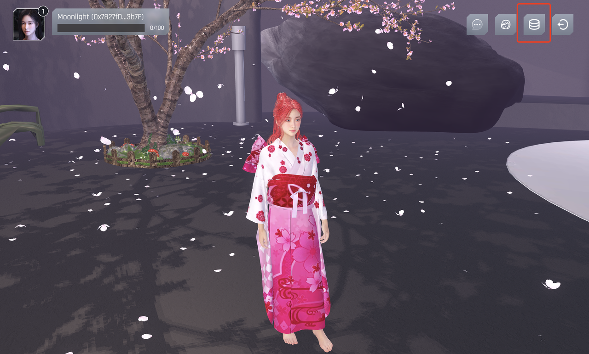

# Ultiverse Moonlight Linea Game Tutorial

## What is Moonlight

Ultiverse Moonlight is a collection of AI-powered 3D avatar NFTs that possess distinctive personalities and talents. Moonlight effortlessly performs a range of tasks within Terminus, serving as your trusted MetaGF and MetaBFF within the Ultiverse MetaFi ecosystem. Personalize your Moonlight NFT to your heart’s content, from their hairstyle and facial features to their physique and attire. Every crucial aspect of your Moonlight NFT can be uniquely tailored with your personal touch!

## To Start:

### Before you begin, ensure your wallet is:

[Configured to use Linea](https://docs.linea.build/use-linea-testnet/set-up-your-wallet/)

[Funded with Goerli ETH](https://docs.linea.build/use-linea-testnet/fund#get-test-eth-on-goerli/)

### Step 1 - Wallet Login

Visit the official website of [Moonlight Linea](https://moonlight-linea-show.ultiverse.io/)

Click on "SIGN IN" to connect your wallet:

Choose the method to connect your wallet and proceed with wallet signature login (some wallets may require manually switching to the Linea chain):

Please select a wallet to play the game. Each Ultiverse account can bind multiple wallet addresses, and each wallet address can mint one Moonlight NFT.

### Step 2 - Chat with Moonlight

Click on the chat button in the top right corner:

Enter your message and press the "Enter" key to chat with Moonlight:

### Step 3 - Customize Moonlight

Click on the "Customize Moonlight" button in the top right corner:

Customize your Moonlight by selecting your preferred outfits in the customization panel:

- Choose a hairstyle:

- Select hair color:

- Choose clothing:

- Select eye style:

Click "Save" or "Reset":

- Save: Generate a record of your custom data and store it on the Linea chain.

- Reset: Revert your unsaved modifications to the previous saved state.

Stay tuned for the official release of the "Customize Moonlight" full version for more exciting features.

### Step 4 - Mint Your Moonlight NFT

Click the "Mint" button in the top right corner, and mint your Moonlight NFT on the Linea chain. Friendly reminder: each wallet address can only mint one Moonlight NFT.

## Tips

In order to have a better experience, it is recommended to use a PC to "Customize Moonlight".

## Get Support

If you run into an issue, please feel free to ask questions on [Ultiverse Twitter](https://twitter.com/ultiversedao/), [Moonlight Twitter](https://twitter.com/metagf_), or [Ultiverse Discord](https://discord.com/invite/ultiverse).
