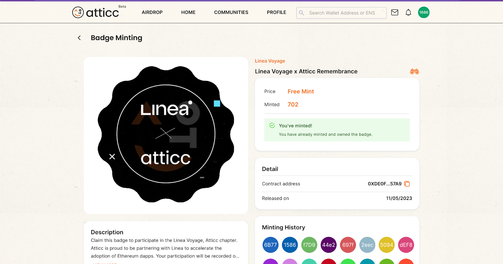
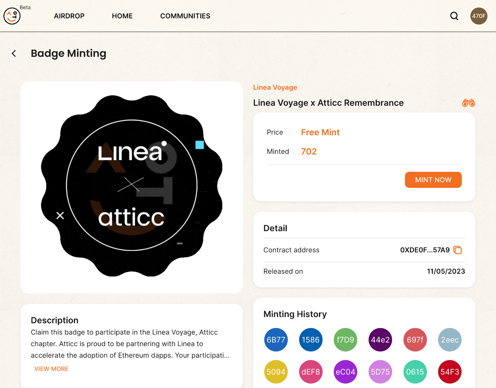

[Atticc](https://atticc.xyz) A Web3 social platform helping decentralized communities to launch and grow. Come for the community, stay for the possibility.

This step-by-step guide teaches how to mint the Atticc Remembrance NFT via [Atticc](https://atticc.xyz/badge_minting) and participate in Linea vs Atticc Remembrance quest.

**Chapter 0. Preparation.**

**Step 1.** **Download [MetaMask](https://metamask.io/download/)**

**Step 2.** **Add Linea Goerli test network to your MetaMask.**

Open your MetaMask, go to “Networks” -> “Add network” -> Put “Linea Goerli test network” in search and add it.

**Step 3.** **Claim LineaETH.**

In order to get the Linea ETH please use this step-by-step [guide](https://docs.linea.build/use-linea/fund#get-test-eth-on-goerli).

**Chapter 1. Atticc Campaign.**

**Step 1**. **Join Atticc’s community on atticc.xyz.**

Visit Atticc Community Home page:

[Atticc EAP community](https://atticc.xyz/c/0xa186D739CA2b3022b966194004C6b01855D59571/posts) 

You need to connect a wallet in order to join us. Please use metamask for this campaign. Feel free to also leave a message in the community as we always would like to hear from you :) For this step, it doesn’t matter which network you connect with but it might speed up a little if you stay on mainnet temporarily.

**Step 2.** **Mint Linea Voyage x Atticc Remembrance Badge**

There are two options to enter the badge minting page

Access the link directly

Go to the homepage of Atticc and click on the Promotion banner

On the homepage, kindly set up your user profile and click on the promotion banner. You can use your ENS, Unstoppable Domain, or any other identifier as your Atticc username. Alternatively, you can simply close the window and directly enter the minting page.

Note: Each user/wallet is limited to minting only 1 Badge NFT. If you have already minted one, you will not be able to mint another one using the same wallet. Instead, you will see the following prompt but don’t worry you have already claimed your NFT.

Alternatively, you can start minting your badge and stay tuned for any perks you might collect when Atticc launches on Linea mainnet!

