# Bilinear

The [Bilinear](https://bilinear.io/) NFT marketplace is designed by KNOBS to perform the typical functions of a marketplace with a very user friendly and intuitable user experience. At Bilinear.io NFT marketplace, we are building an intuitive, simple and compelling use interface, to give anyone the opportunity to enter the world of collectibles and Non Fungible Tokens.

Within the marketplace, a user will be able to perform the following actions:

- mint a collection
- mint an NFT
- sell an NFT
- buy an NFT
- delist an NFT (not part of the campaign)
- mint an NFT of NFT Factory collection

Before you begin, ensure your wallet is:

1. [Configured to use Linea](../set-up-your-wallet.md).
1. [Funded with Goerli ETH](/docs/use-linea/fund.md#get-test-eth-on-goerli)

## Mint a collection

The user opens the marketplace and lands on the homepage where she/he can view the last three collections in the preview and two other collection sections, which show cards from the last 10 collections.

To connect her or his wallet, the user clicks on the CTA “Connect wallet”, where she/he can choose between Metamask, Rainbow, Coinbase wallet e WalletConnect.

The user clicks on “send message” CTA to proceed with the wallet connection.

The user confirms the transaction on the MetaMask popup.

Once the user connects to her/his wallet, she/he clicks on the profile icon on the top-right corner of the homepage and clicks on the CTA “My collections”, to open the “My collections” page.

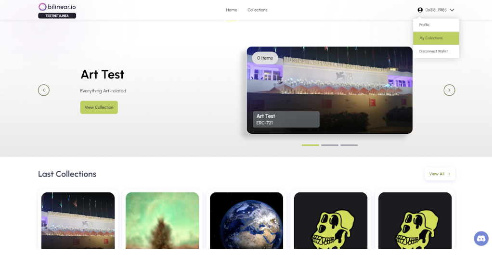

The user clicks on the button “Add new collection” in order to add a new collection.

The user uploads the collection image and the cover image (optional), she/he fills all the fields and decides which token standard to use (ERC-721 or ERC-1155), the amount of the supply and also the amount of the royalties for each NFT.

Once the user fills all the mandatory fields, she/he clicks on the button “Create collection” to proceed with the minting of the collection.

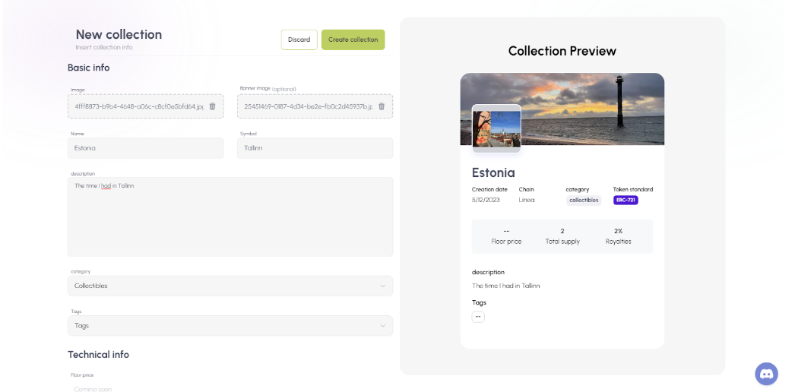

The user confirms the transaction on the MetaMask popup.

Once the minting is done, the user sees the new collection on the “My collection page”.

## Mint a NFT

The user opens the marketplace and lands on the homepage where she/he can view the last three collections in the preview and two other collection sections, which show cards from the last 10 collections.

To connect her or his wallet, the user clicks on the CTA “Connect wallet”, where she/he can choose between Metamask, Rainbow, Coinbase wallet e WalletConnect.

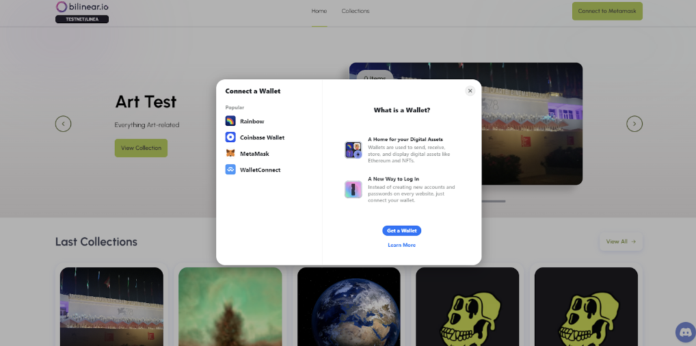

The user clicks on “send message” CTA to proceed with the wallet connection.

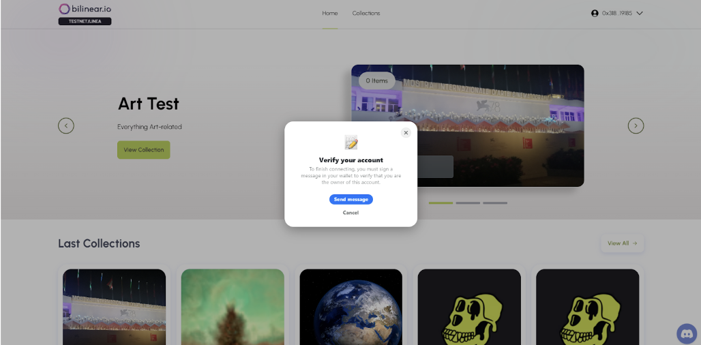

The user confirms the transaction on the MetaMask popup.

Once the user connects to her/his wallet, she/he clicks on the profile icon on the top-right corner of the homepage and clicks on the CTA “My collections”, to open the “My collections” page.

In the “My collection” page, the user sees all the collections that are already minted.

The user clicks on a collection that is minted previously, to see the collection detail page. In the collection detail page, the user clicks on the CTA “Add New NFT” on the top-right corner of the collection page, to mint a NFT with the standard of the collection.

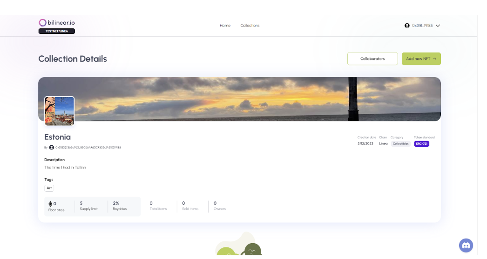

In the NFT creation page, the user uploads the image, and fills all the mandatory fields. Once the user fills all the fields and set a price, she/he clicks on the CTA “Create NFT”.

The user confirms the transaction on the MetaMask popup.

Once the user mints the NFT, she/he sees the Collection detail page, where the user can see the NFT just minted.

## Sell a NFT

The user opens the marketplace and lands on the homepage where she/he can view the last three collections in the preview and two other collection sections, which show cards from the last 10 collections.

To connect her or his wallet, the user clicks on the CTA “Connect wallet”, where she/he can choose between Metamask, Rainbow, Coinbase wallet e WalletConnect.

The user clicks on “send message” CTA to proceed with the wallet connection.

The user confirms the transaction on the MetaMask popup.

Once the user connects to her/his wallet, she/he clicks on the profile icon on the top-right corner of the homepage and clicks on the CTA “Profile”, to open the “Profile” page.

In this page, the user sees all the NFTs owned and clicks on one of them to see the NFT detail page.

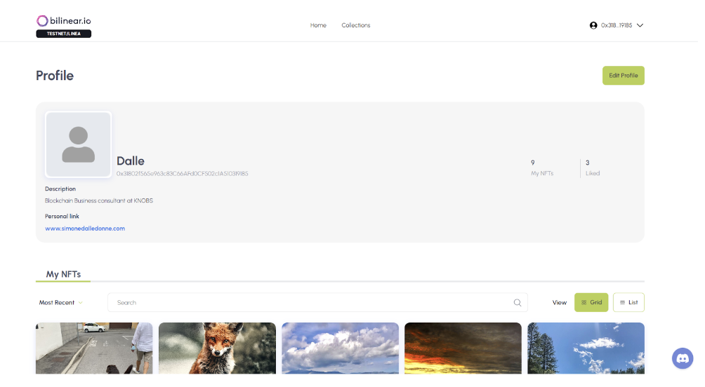

In this page the user clicks on the CTA “Sell”, in order to list her/his NFT. Once the user clicks on the CTA, she/he sees the “NFT listing” page, where she/he must fill the mandatory fields to list the NFT.

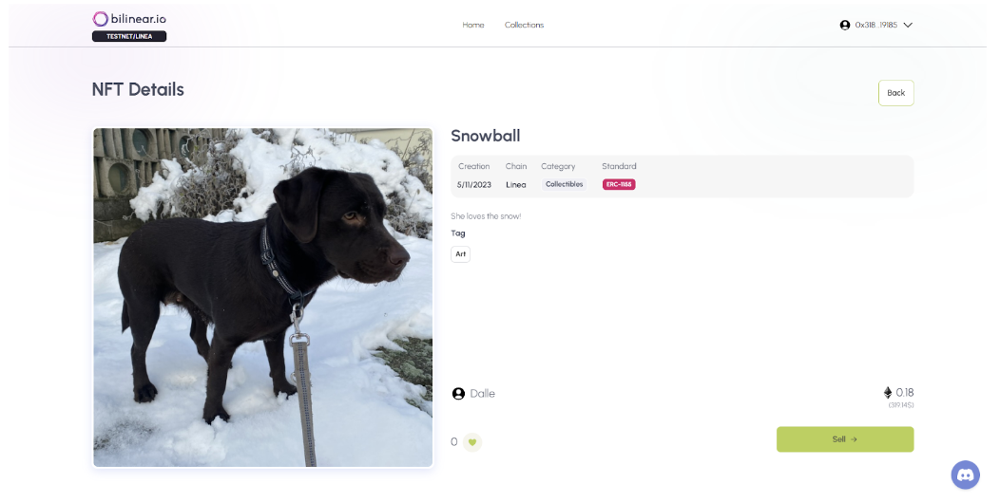

Once the user fills all the fields, she/he sees the “Listing Recap” with all the information inserted in the “NFT listing” page. Clicking on the “Sell” button, the user lists her/his NFT on the marketplace.

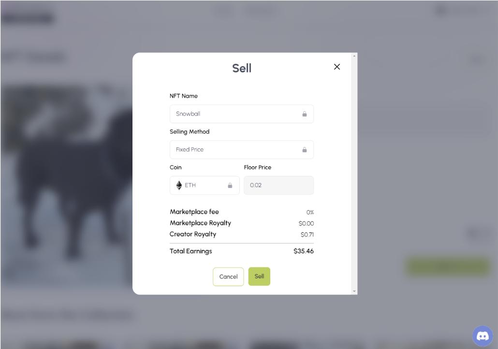

The user confirms the transaction on the MetaMask popup.

The user sees that the NFT is on sale in the marketplace from the “NFT detail” page.

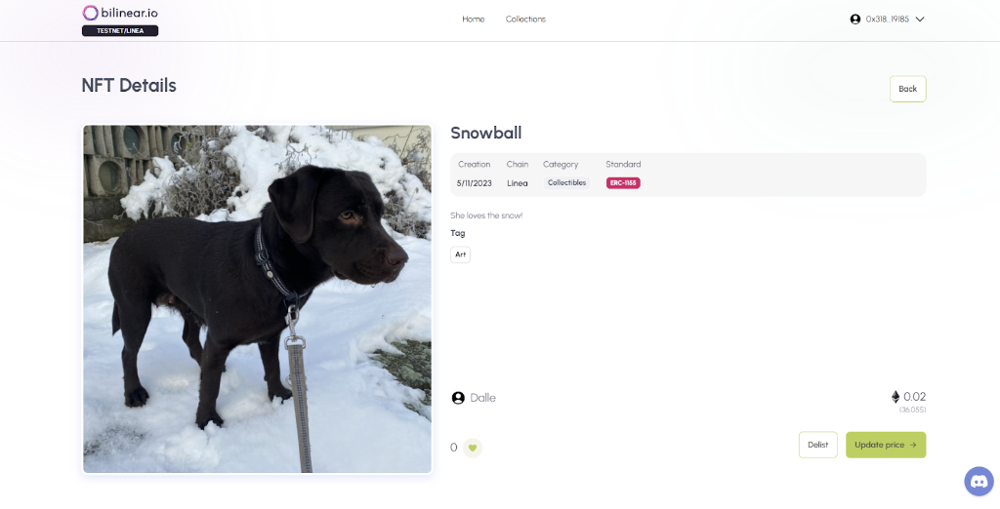

## Buy a NFT

The user opens the marketplace and lands on the homepage where she/he can view the last three collections in the preview and two other collection sections, which show cards from the last 10 collections.

To connect her or his wallet, the user clicks on the CTA “Connect wallet”, where she/he can choose between Metamask, Rainbow, Coinbase wallet, or WalletConnect.

The user clicks on “send message” CTA to proceed with the wallet connection.

The user confirms the transaction on the MetaMask popup.

To see the detail of a collection, the user can click on a collection directly from the homepage or click on the "View All" CTA, landing on the page with all collections, and in which he or she can click on a collection.

To see the NFT detail, the user must click on a NFT inside the selected collection detail page, where there are all the minted NFTs related to that collection.

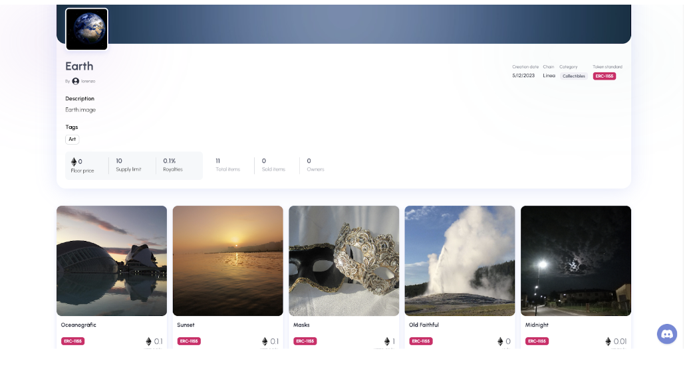

Inside the NFT detail page, the user clicks on the CTA “Buy Now” and the purchase modal opens.

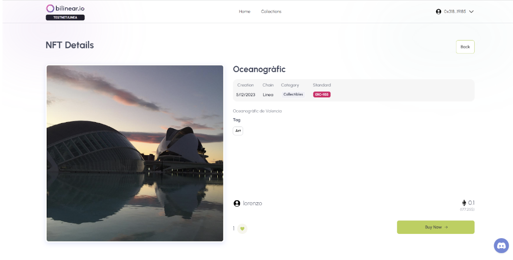

The user sees all the details of the purchase and she/he clicks on the “Buy” button and finalizes the purchase.

The user confirms the transaction on the MetaMask popup.

The user sees the NFT detail page with the “Sell” CTA, instead of the “Buy” CTA.

## Delist a NFT

The user opens the marketplace and lands on the homepage where she/he can view the last three collections in the preview and two other collection sections, which show cards from the last 10 collections.

To connect her or his wallet, the user clicks on the CTA “Connect wallet”, where she/he can choose between Metamask, Rainbow, Coinbase wallet e WalletConnect.

The user must choose one of the proposed options.

The user clicks on “send message” CTA to proceed the wallet connection.

The user confirms the transaction on the MetaMask popup.

Once the user connects to her/his wallet, she/he clicks on the profile icon on the top-right corner of the homepage and clicks on the CTA “Profile”, to open the “Profile” page.

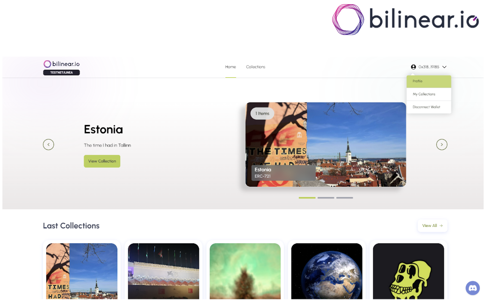

In this page, the user sees all the NFTs owned and clicks on one of the NFT that is listed on the marketplace.

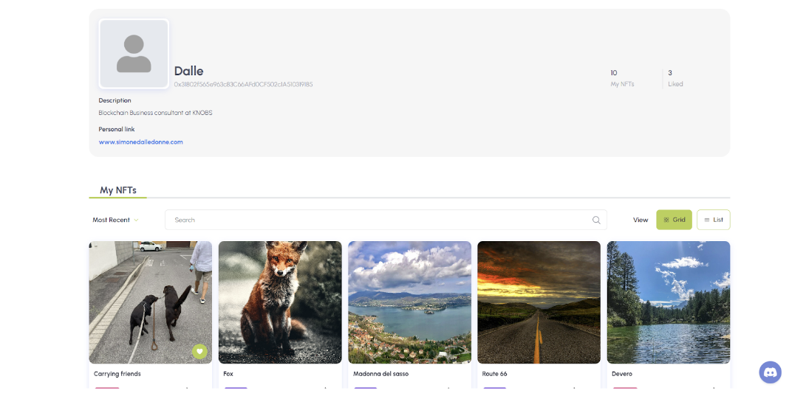

In the NFT detail page, the user clicks on the CTA “Delist”, in order to list her/his NFT.

Once the user clicks on the CTA, she/he sees the Metamask transaction page and confirms the transaction.

Once the NFT is delisted, the user sees the NFT detail page with the CTA “Sell”.

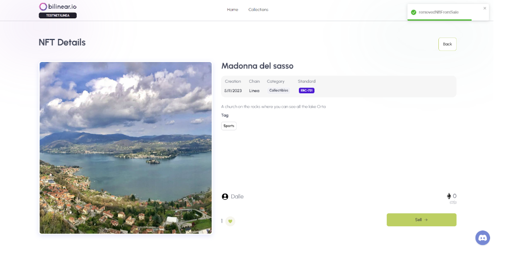

## Mint a NFT from NFT Factory collection

The marketplace, available on the Linea testnet, will offer users an array of collections and NFTs that they can purchase the first time they land on the homepage.

KNOBS is partnering with NFT Factory, an Italian startup that specializes in developing PC video games using blockchain technology, to create a new collection. This collection will offer users the chance to buy a special Game Pass, which they can use to play "Cataclysm: Zero Mission". This game serves as a prelude to the upcoming video game "Cataclysm", which is a blockchain-enhanced, free-to-play multiplayer PC game that will be launched in late 2023.

_How does it work?_

Upon landing on the marketplace homepage, the user will immediately see a preview section featuring the last three collections added to the platform. Below the preview section, there is a second section showcasing the last ten collections added to the platform.

To connect their wallet, the user can click on the "Connect wallet" call-to-action (CTA). Upon clicking, they will be presented with a selection of wallet options, including Metamask, Rainbow, Coinbase wallet, and WalletConnect. The user must choose one of the proposed option.

The user clicks on “send message” CTA to proceed the wallet connection.

The user confirms the transaction on the MetaMask popup.

To see the details of a collection, the user can either click on a collection directly from the homepage or click on the "View All" call-to-action (CTA). Clicking on "View All" will take them to a page displaying all collections, where they can select and click on the specific collection they wish to explore.

When the user clicks on the NFT Factory collection, she/he will be taken to the collection detail page, where the user can see all the information about the collection. From there, the user can mint the NFT token gated for the "Cataclysm: Zero Mission" game by clicking on the "Mint" call-to-action (CTA).

The user confirms the transaction on the MetaMask popup.

The user is redirected to the “NFT detail” page, where she/he can see that he is the owner of the NFT.

## Get Support

If you need help, please contact the Bilinear team [here](https://discord.gg/hVZQsTArzK)!
