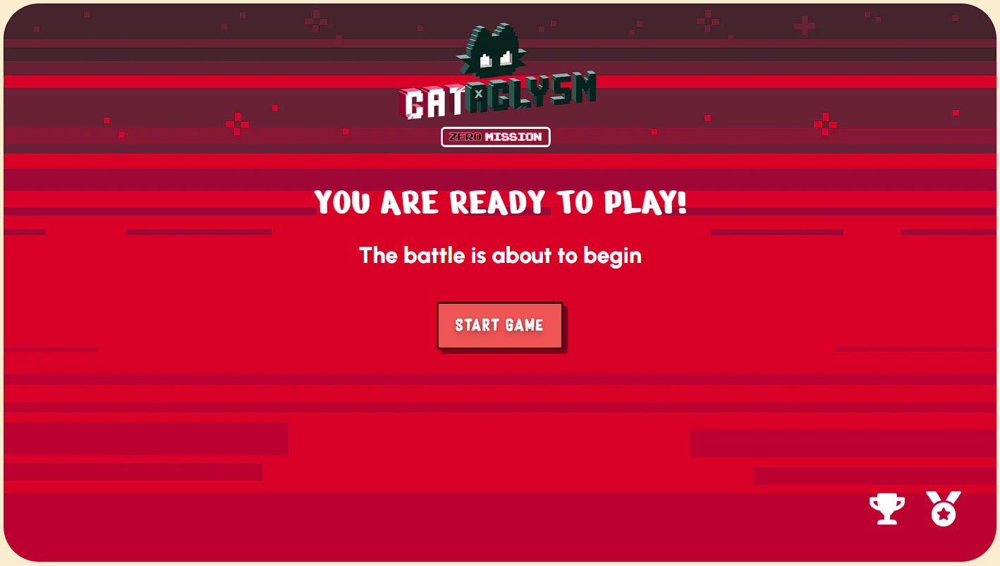
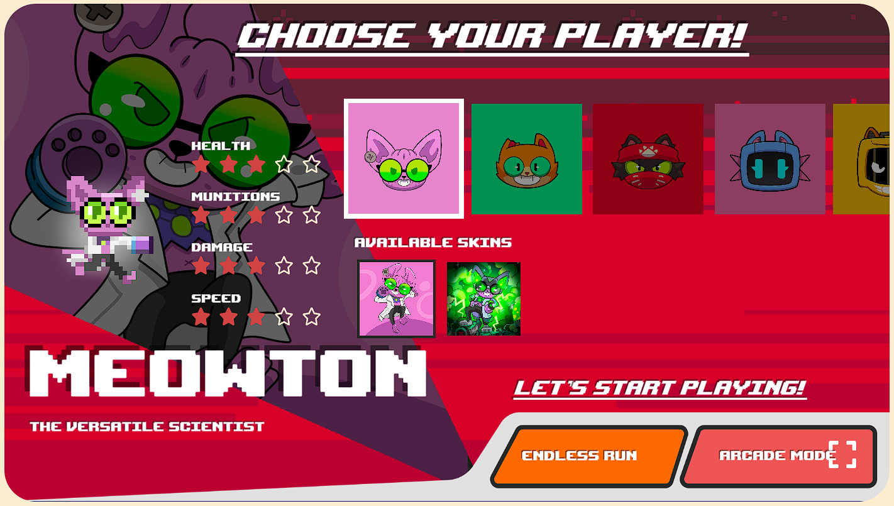
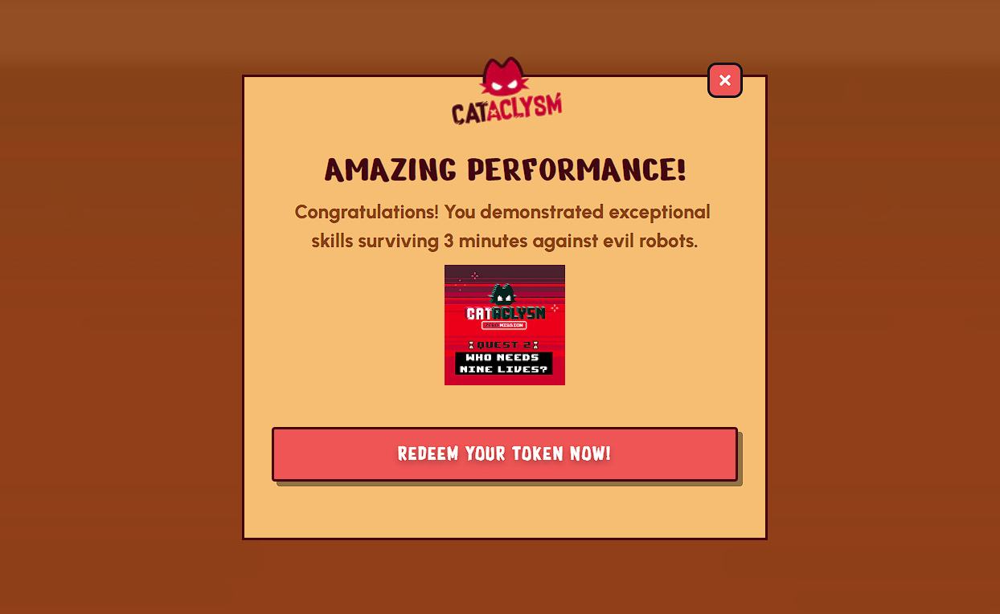

# Cataclysm: Zero Mission

To complete the tasks of the game "Cataclysm: Zero Mission" for the Linea Voyage Quest, users will need to access the game page through the [provided link](https://cataclysm-game.com/zero-mission), available on the Linea’s space on Galxe, in the Cataclysm tasks.

Once on the game page, users will see two options: "Connect MetaMask" and "Wallet Connect". They can click on either button to connect their wallet. **_Please note that this step is mandatory to play “Cataclysm: Zero Mission”._**

After connecting their wallet, users will be ready to start playing. There are two available tasks for the Linea Voyage Quest: the first one is in the **_endless run_** mode, and the second one is in the **_arcade_** mode.

In the endless run mode, waves of robots relentlessly swarm the game, testing the player's endurance and reflexes. Each wave becomes increasingly challenging, requiring quick thinking and precise movements to survive.

In the arcade mode, the player embarks on an epic journey through the game's dynamic map, encountering various obstacles and enemies along the way. Their ultimate objective is to confront and defeat the formidable boss, utilizing their skills, power-ups, and strategic maneuvers to emerge victorious.

## How to complete the task in the Endless Run mode

**In the endless run mode, the objective of the first task is to survive in the game for at least 3 minutes**. Once they achieve this goal and finish the game, a pop-up will appear confirming they can now redeem the token by clicking on the designated button.

As soon as the user clicks on this button, MetaMask will open, where the users can confirm the operation and complete the token minting process.

If the transaction fails, for example, due to network connection issues, the users can simply refresh the page. After the refresh, the victory confirmation pop-up will reappear with the button to redeem the token, allowing the users to repeat the aforementioned process.

Once the token has been redeemed, a confirmation pop-up will appear to confirm that the redeem has been successfully completed.

At this point, the user can take three actions:

1. Close the pop-up and the page
2. Close the pop-up and continue playing
3. Click on the CTA (Call to Action) that will take them to join the Cataclysm Discord

## How to complete the task in the Arcade mode

**In the arcade mode, the objective of the task is to kill at least 10 enemies.** Once the 10 enemies are defeated and the game comes to an end, regardless of whether the users win or lose, a pop-up will appear confirming their victory. Afterward, they can proceed with the same steps described in the endless run mode to mint the token.

The successful minting of the tokens will indicate the fulfillment of the two tasks.
