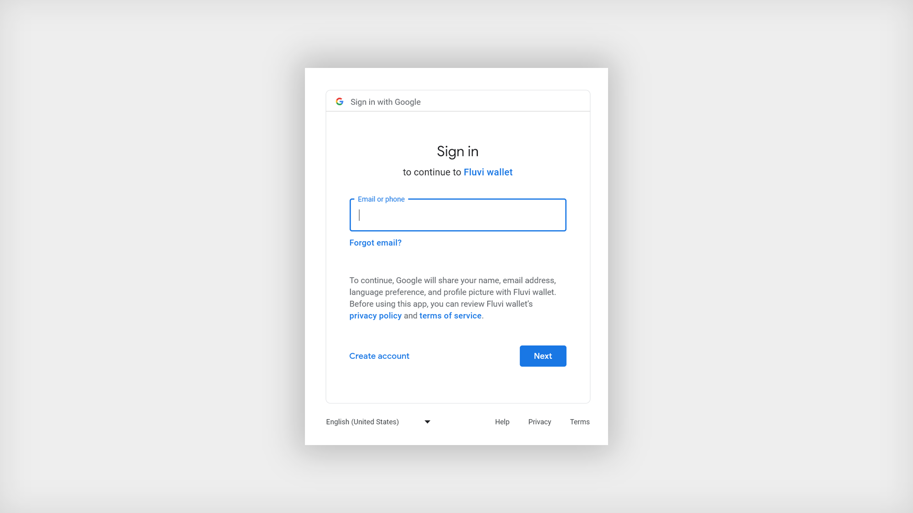
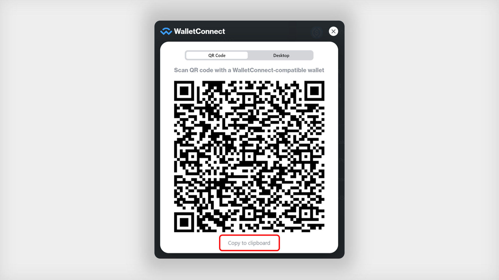
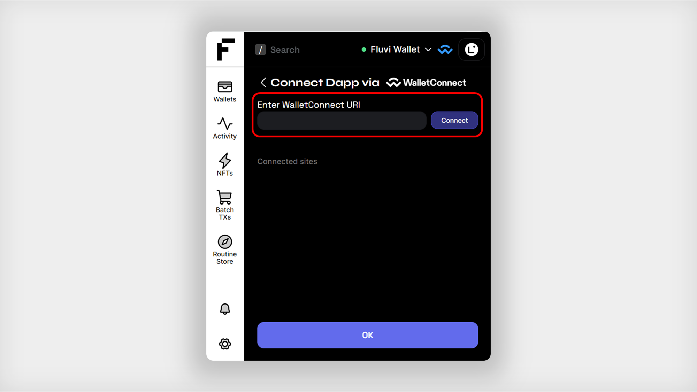
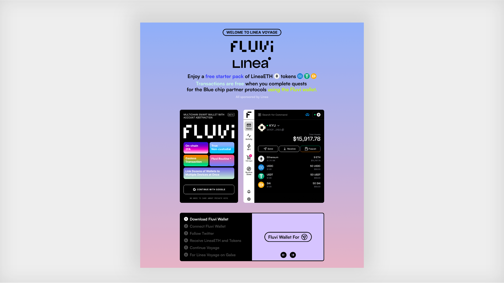

  
# [Fluvi Wallet](https://fluviwallet.xyz/) - Your web3 life made easy. 
 As one of the first smart contract wallets that leverages <b>Account Abstraction (AA)</b> technology, Fluvi stands at the forefront, ready to redefine your Web3 experience.  
This non-custodial wallet ensures you retain complete control of your digital assets, striking a seamless balance between security, simplicity, and absolute ownership. 
 Fluvi offers unique features such as <b>non-custodial multi-device synchronization</b>, On-Chain 2FA, Seedless Recovery, Batch Transactions, Gasless Transactions, and many more while complying with the EIP-4337 standard.

In this simple guide, we'll help you install Fluvi Wallet and use it to complete the tasks based on the unique features of AA on Linea!

Or, you can use the <b>[Linea Voyage Guide page](http://linea-quest.fluvi.io) </b>provided by Fluvi Wallet itself to claim the necessary tokens and progress through the quests!

## Install Fluvi Wallet and Create Your Account

To install Fluvi Wallet, we recommend using Chrome as a desktop browser.

1.  Install the [Fluvi Wallet Chrome extension](https://chrome.google.com/webstore/detail/fluvi-wallet/mmmjbcfofconkannjonfmjjajpllddbg) from Google Chrome Web Store and press Add to Chrome.  
      
    
2.  Once installed, open Fluvi Wallet and sign in with your Google account  
    
    
3.  Set an unlock password for security  
    
    
4.  Now, you're all ready to use Fluvi Wallet! Plain and easy right?  
    
    

## Connect to dApps with Wallet Connect

## To complete quests in Linea Voyage, you'll need to connect to the dApp via Wallet Connect.

1.  After pressing “Connect Wallet”, click on the “Wallet Connect” option.  
    Copy the Wallet Connect URI from the dApp by clicking on “Copy to clipboard” (below the QR code)  
      
      
    
2.  Click on the Wallet Connect button at the top of Fluvi Wallet  
    
    
3.  Paste the Wallet Connect URI and click on the Connect button  
    
    
4.  Now you're all set to use your selected dApps with Fluvi Wallet!
    

 
Unlike other connection methods of Fluvi Wallet, transaction requests are stacked in the Notification menu without any pop-ups.

## More Voyage Fun with Gas Sponsorship

Below is a list of our partner dApps supporting gasless transactions, which is continuously updated:

-   Velocore
    
-   PancakeSwap
    
-   Compound Finance
    
-   SushiSwap(will be live on Mainnet)
    

## Link Fluvi Wallet with MetaMask

The quests carried out via Fluvi Wallet can be verified using the wallet address created within Fluvi Wallet. To complete quests via MetaMask, it's necessary to link and submit both Fluvi Wallet and MetaMask addresses.

* Note that you must have made at least one transaction through your Fluvi wallet address before you can submit.

We've made this process straightforward with a dedicated tool:

1.  Open up the link to the [Linea Voyage Guide page  
    ](http://linea-quest.fluvi.io)  
    `
    
2.  Navigate to the "For Linea Voyage on Galxe" tab in the middle of the page  
    
    
3.  Connect your MetaMask and Fluvi Wallet and check if your wallet address is correctly displayed at the bottom
    
4.  Submit your wallet addresses by clicking the 'Submit' button.
    

Please note that the independent wallet address of the Fluvi Wallet can only be linked to a single MetaMask wallet address, and once submitted, the linked wallet cannot be changed.

  

During the Linea Voyage campaign, we will have a cohort partnership with certain dApps that will enable you to transact without spending any gas fees through Fluvi Wallet's gasless feature. Our hope is that this will enhance and encourage your Linea Voyage questing experience.

  

## Get Support[​](https://docs.linea.build/use-linea/explore/use-celer#get-support)

For any inquiries, ideas, or issues with Fluvi Wallet, feel free to reach out to us on our [Discord](https://discord.com/invite/TVdGd8R5rk)!