# ghostNFT

ghostNFT is the first application of ERC721Envious Standard aimed at adding collateral to NFTs. ghostNFT introduces an intuitive user experience enabling creators and users to add, redeem, and view collateral to individual NFTs and NFT collections. ghostNFT targets NFT collections, NFT owners, Token Holders, and Web3 Users.

Before you begin, ensure your wallet is:

1. [Configured to use Linea](../set-up-your-wallet.mdx).
1. [Funded with Goerli ETH](../fund.md#get-test-eth-on-goerli) (at least .06 ETH)

## Get DAI on Linea testnet

You can get DAI by navigating to the [Linea faucet](../fund.md). Then,

1. Connect your wallet to Goerli
1. [Lock .01 ETH to mint DAI](../fund.md/#get-other-tokens-on-goerli) 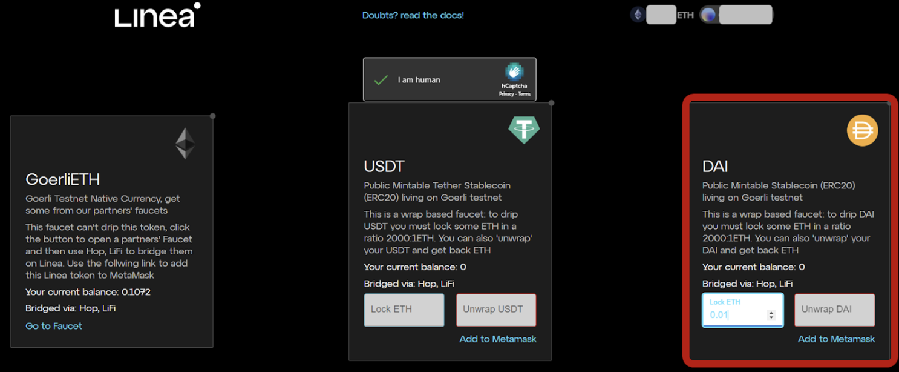
1. [Bridge DAI from Goerli to Linea](https://goerli.hop.exchange/#/send?token=DAI&sourceNetwork=ethereum&destNetwork=linea)

## Claim FREE JML gNFT

JML gNFT is a dynamic NFT that becomes rarer as you add more collateral in GMV tokens. Follow easy steps below to claim your free JML gNFT.

1. Visit [ghostAirdrop](https://airdrop.ghostchain.io/#/linea/0xD500EFDef75E89Bf6caF5C98F7633575d0049a72) on Linea Testnet. Make sure that the Linea network is selected in the drop down. 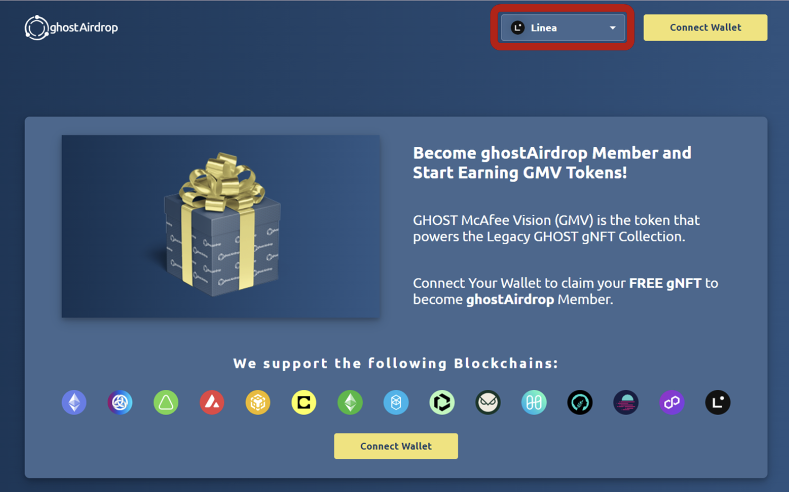
1. Connect your MetaMask wallet and click on the **Claim Free gNFT NOW**. 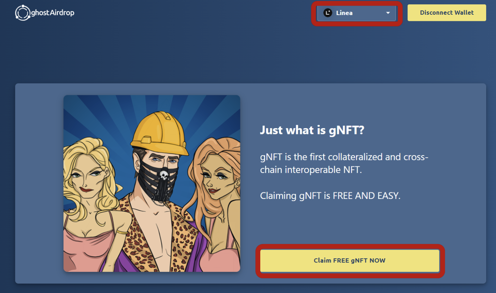
1. You will be automatically redirected to your personal ghostAirdrop dashboard. 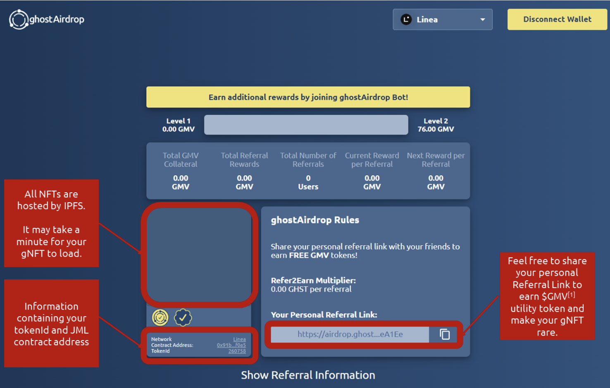

   

## Mint your NFT collection

1. The ghostNFT platform allows for the inclusion of collateral in standard ERC721 NFT collections.
1. Visit [NFTs2Me](https://nfts2me.com/) and click on the **Create Your Project** button. 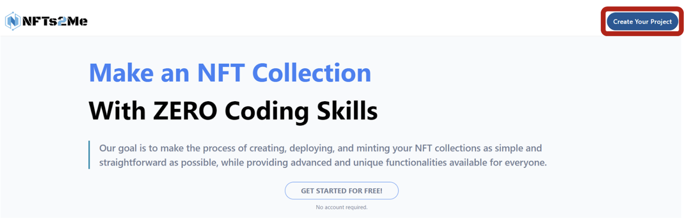
1. For this example, we will proceed with **Drops** 
1. Fill out all relevant information, including Project Name, Token Symbol, Project Description, etc.
1. Upload your artwork, add metadata, and proceed to connecting your wallet.
1. You can choose between **Mint NFTs** and **Create Collection** options. We will proceed with the Mint NFTs options. Fill out all relevant information regarding collection size, ownership addresses, etc. 

   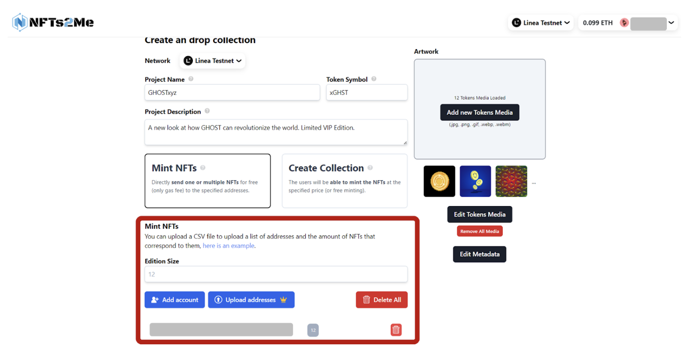

1. Proceed to minting your NFT collection: 
1. Wait for the following steps to be completed: 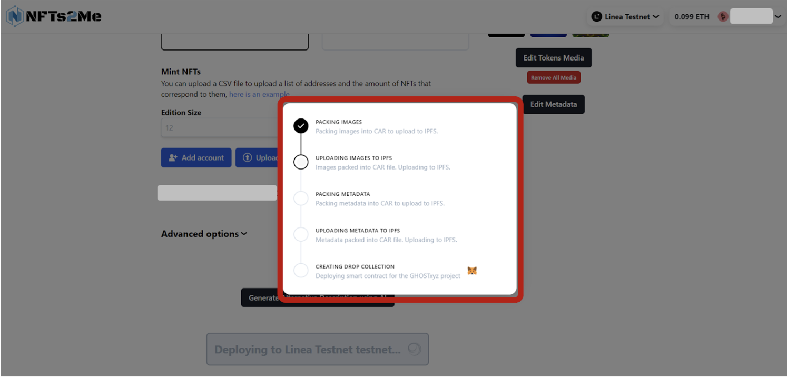
1. Extract collection address to move on thru the registration process on ghostNFT: 

## Register Your NFT collection on ghostNFT

Now all is ready to move to the final stages.

Any NFT collection can be collateralized through ghostNFT.

1. Visit [ghostNFT](https://app.nft.ghostchain.io/#/linea), and make sure Linea Testnet is selected in the dropdown. 
1. Paste the contract address of your NFT collection in the search bar. If such collection has not been registered yet, the modal window will pop-up: 
1. Connect your wallet and proceed to fill out the required fields. Use [ghostNFT docs](https://docs.nft.ghostchain.io/en/latest/envious-house-usage.html) for further guidance.

**IMPORTANT**: Minimum amount to be dispersed to all tokenIds in the collection is 0.044 Linea-ETH. Make sure to have this amount in your MetaMask.

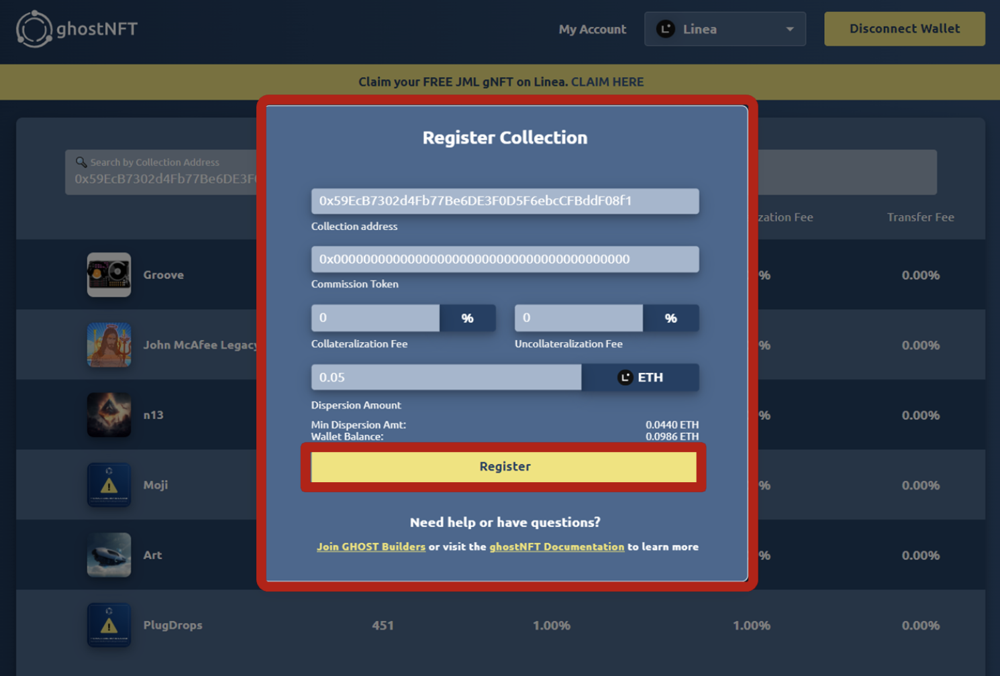

## Collateralize your NFT collection on ghostNFT

1. After the registration has been successfully completed, paste the contract address of your collection into the search bar. Click on the **Explore NFTs** button. 
1. Select any NFT from the collection, and click on View NFT. 
1. Click on the **Add Collateral button** to add collateral in ETH and DAI to increase the price floor of your gNFT. Start with ETH. 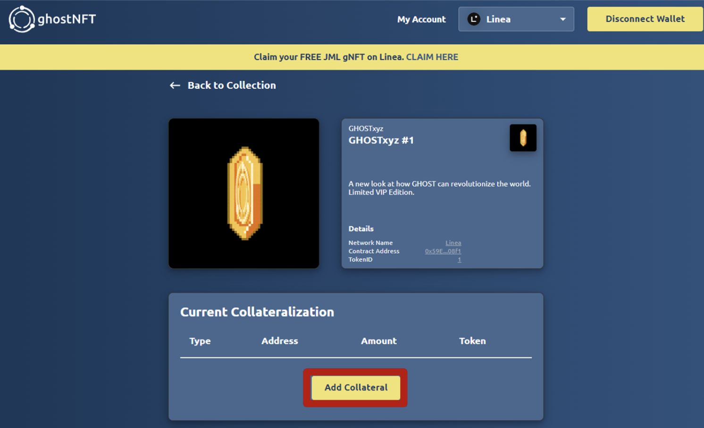

   

1. First, approve the DAI amount, and then proceed to collateralization. 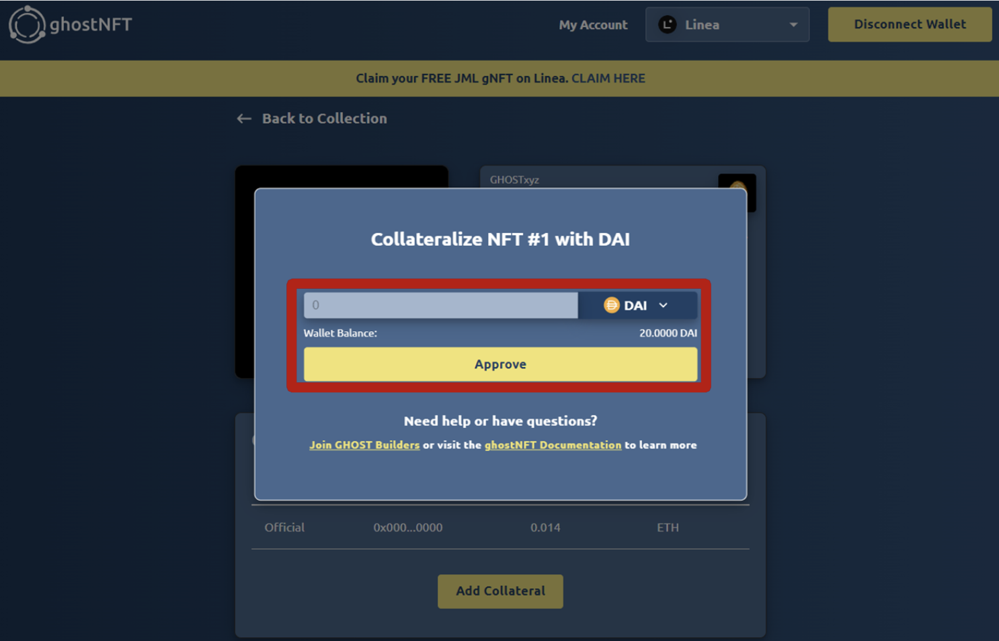
1. Nice! Now the gNFT has a price floor equivalent to 0.014 ETH and 10 DAI. 

## Uncollateralize your NFT collection on ghostNFT

You can as easily redeem the entire balance you placed as collateral.

**IMPORTANT**: Make sure that you’re the owner of the gNFT. Only owners are able to redeem collateral.

1. Once you have located your gNFT, click on the **Redeem** button to redeem both ETH and DAI. 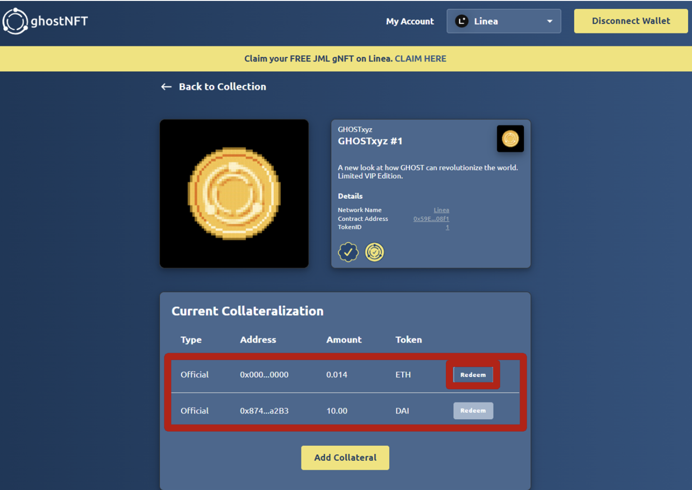
1. After ETH collateral is redeemed, proceed to redeem DAI collateral. 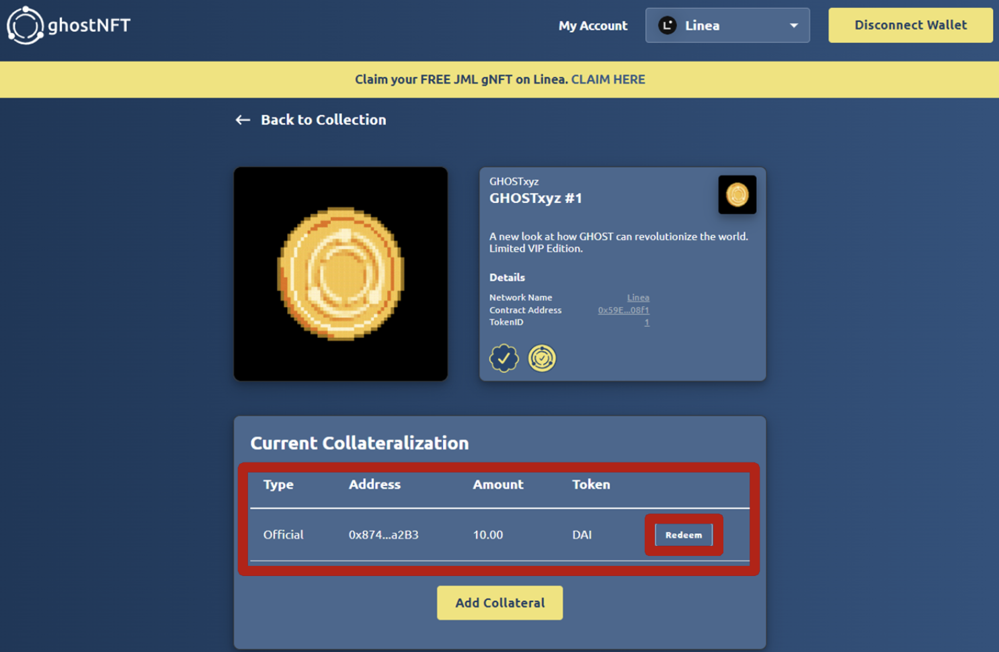

## Collateralize your JML gNFT

In the similar fashion, you can add and redeem collateral from your JML gNFT that you minted via [ghostAirdrop](https://airdrop.ghostchain.io/#/linea/0xD500EFDef75E89Bf6caF5C98F7633575d0049a72) on Linea Testnet.

1. Visit [ghostAirdrop](https://airdrop.ghostchain.io/#/linea/0xD500EFDef75E89Bf6caF5C98F7633575d0049a72) on Linea Testnet. Make sure that the Linea testnet is selected in the drop down.
1. Click on the **NFT Profile** button to be redirected to the ghostNFT profile. 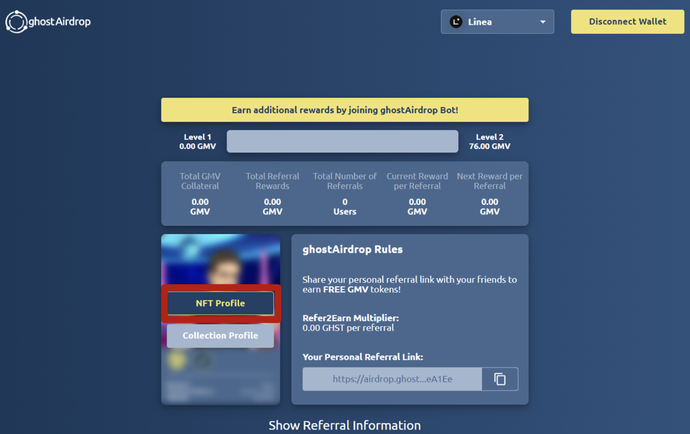
1. In a similar fashion, go ahead and add ETH and DAI collateral. 
1. Start with adding ETH collateral. 
1. Proceed with collateralizing your JML gNFT with DAI. Approve DAI first, and then add the desired amount. In this example, we collateralized our JML with 10 DAI. 
1. Congratulations! The price floor of our JML is now 0.013 ETH and 10 DAI. 

## Uncollateralize your JML gNFT

You can as easily redeem the entire balance you placed as collateral.

**IMPORTANT**: Make sure that you’re the owner of the gNFT. Only owners are able to redeem collateral.

1. Locate your gNFT, and click on the **Redeem** button to redeem both ETH and DAI. 
1. After ETH collateral is redeemed, proceed to redeem DAI collateral. 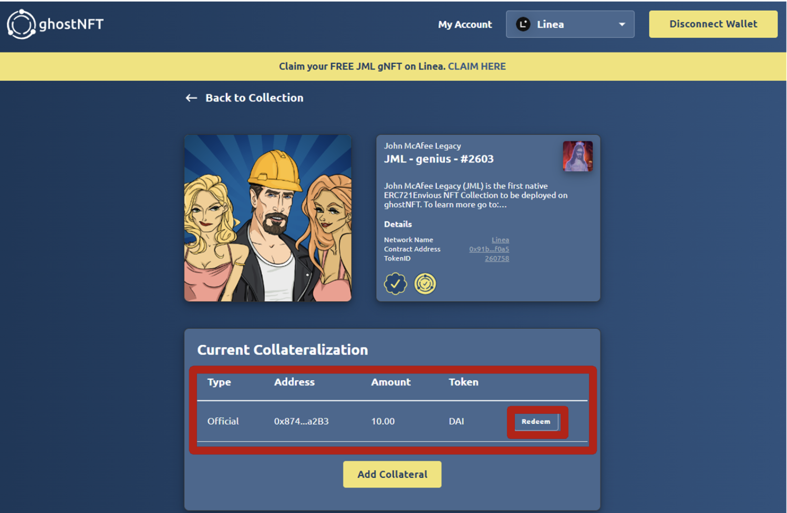

## Congratulations

Congratulations on completing all the steps of using ghostNFT!
