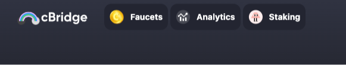

# Celer

[Celer cBridge](https://dev-cbridge-v2.netlify.app/97/59140/BNB) is a decentralized and non-custodial asset bridge, which you can read more about [here](https://celer.network/).

In this guide, we'll walk you through how to bridge TBNB and tBUSD from Binance Smart Chain (BSC) over to Linea!

Before you begin, ensure your wallet is [configured to use Linea](../set-up-your-wallet.md).

## Add BSC testnet to your MetaMask wallet

First, we'll need to add BSC testnet to our MetaMask wallet. We can easily do so by heading over to [chainlist.wtf](https://chainlist.wtf/). Then, search for Binance Smart Chain. Finally, click `Connect Wallet` and then click `Add Chain` for the Binance Smart Chain Testnet with chain ID 97.

You should now see the test network in your MetaMask wallet.

## Get TBNB

Now that the network is added, we can head over to the Linea faucet, to get BNB. To do so:

1. Navigate to the [Linea faucet](https://faucet.goerli.linea.build/)
1. Connect your wallet and switch to the Linea Goerli test network
1. Go to the [BNB faucet](https://testnet.bnbchain.org/faucet-smart) linked through the BNB card

   

1. Complete a captcha
1. Input your wallet address and dispense 0.1 TBNB

   

After it's been dispensed, you should be able to see it in your MetaMask wallet.

## Bridge TBNB

To bridge over TBNB, you'll need to:

1. Navigate to the [Celer bridge](https://dev-cbridge-v2.netlify.app/97/59140/BNB)
1. Connect your wallet and change to the BSC test network
1. Make sure the "From" chain is BSC testnet, the "To" chain is Linea, and the desired token is BNB

   

1. Put the desired amount in the "Send" field. Make sure you have enough TBNB to cover the gas fee. Note that you need to prefix decimal values with `0.` like `0.1` to indicate a real number.
1. Click on and confirm transfer

   

1. Confirm the transaction in the MetaMask pop up

Your transaction should now be sent! You may have to wait a few minutes before the transaction and bridging have been finalized.

## Get BUSD

Before you get BUSD, make sure you've [added BSC testnet to your wallet](#add-bsc-testnet-to-your-metamask-wallet). Then, you should:

1. Navigate to the [Celer bridge](https://dev-cbridge-v2.netlify.app/97/59140/BNB)
1. Click on "Faucets" on the top left of the page

   

1. Click on "Test Tokens (BUSD)" in the modal that pops up (ensure you are on the BSC testnet network!)

   

1. Confirm the transaction on MetaMask

To see the BUSD in your MetaMask wallet on the BSC testnet, you'll need add the BUSD token to your MetaMask wallet. To easily do so, you can:

1. Click "Import tokens"
1. Add `0xeb3eb991d39dac92616da64b7c6d5af5ccff1627` under "Token contract address"
1. BUSD and 18 should automatically populate for the "Token symbol" and "Token decimal"

## Bridge BUSD from BSC testnet to Linea

Now, to bridge BUSD, you'll need to:

1. Navigate to the [Celer bridge](https://dev-cbridge-v2.netlify.app/97/59140/BNB)
1. Connect your wallet and change to the BSC test network
1. Make sure the "From" chain is BSC testnet, the "To" chain is Linea, and the desired token is BUSD

   

1. Put the desired amount in the "Send" field
1. Approve BUSD to be sent by clicking on the button "Approve BUSD"
1. Confirm the transaction on MetaMask (as Custom Spending Cap, you can put “Maximum”)
1. Wait for the transaction to be confirmed
1. Click on Transfer on the Celer bridge and confirm the transaction in MetaMask

To see the BUSD in your MetaMask wallet on Linea, you'll need add the BUSD token to your MetaMask wallet. To easily do so, you can:

1. Navigate to the [Linea faucet](https://faucet.goerli.linea.build/)
1. Connect your wallet to the Linea Goerli testnet
1. Find the BUSD card
1. Click "Add to MetaMask"

## Get Support

If you run into issues using the Celer bridge, you can find their support form [here](https://form.typeform.com/to/Q4LMjUaK?typeform-source=cbridge.celer.network).
