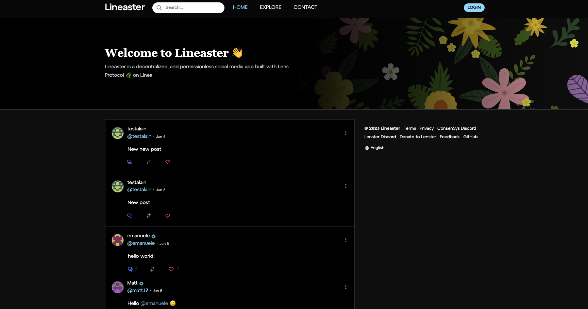
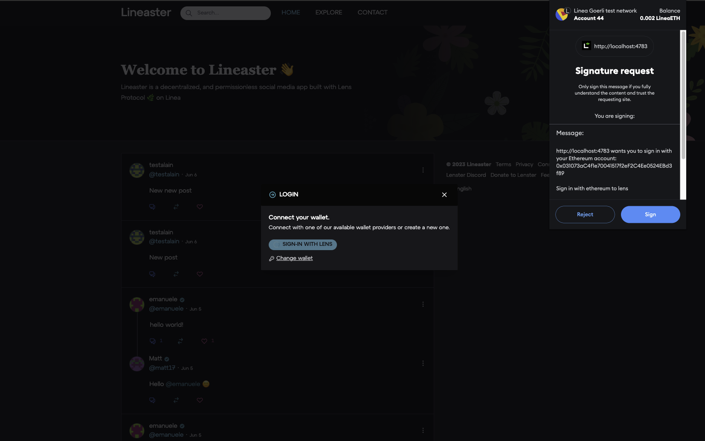
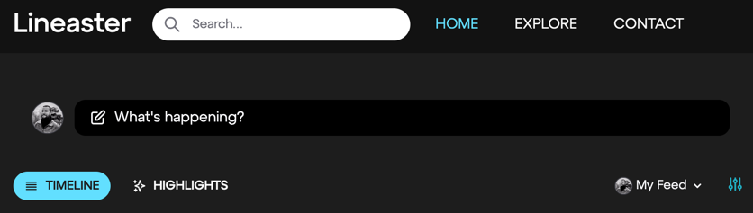
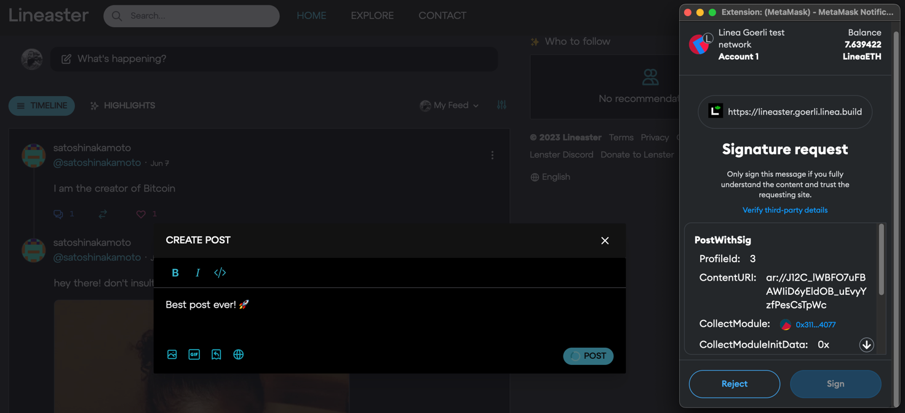
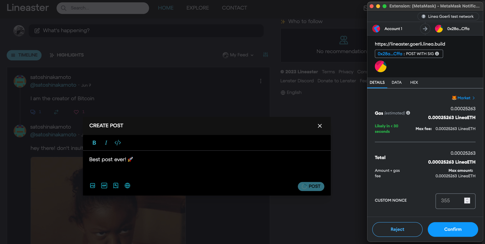
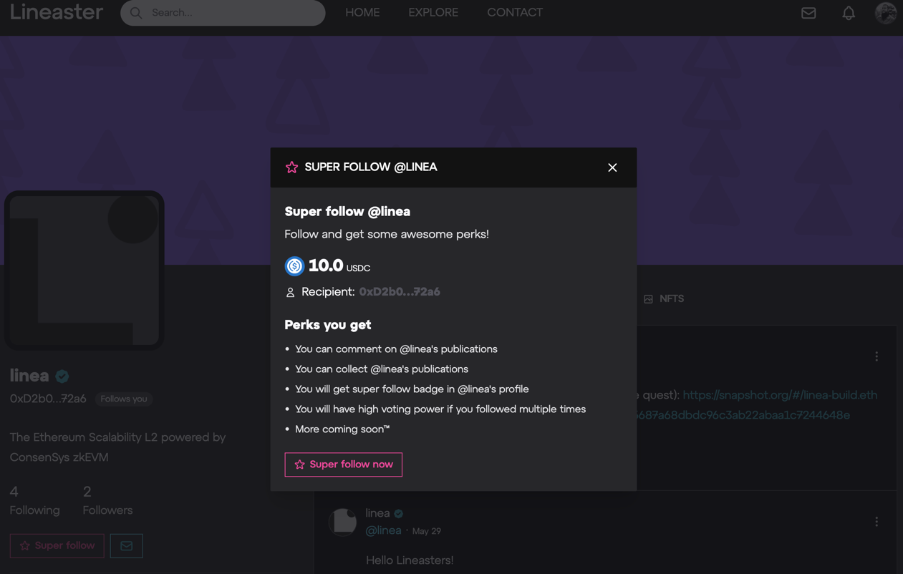
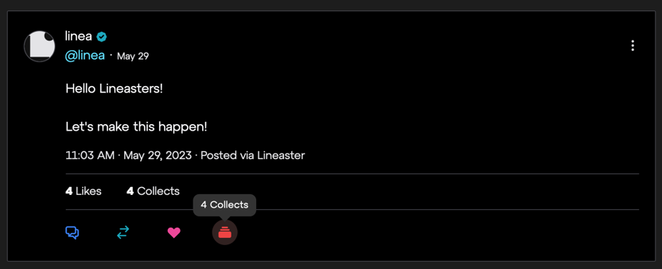
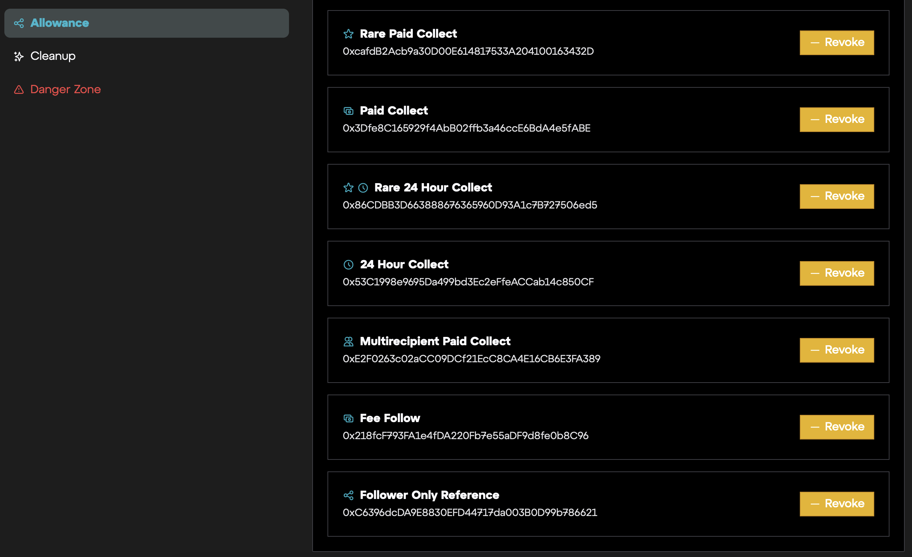

# Lineaster

Lineaster is the Linea version of [Lenster](https://lenster.xyz/), the most popular frontend built on top of the [Lens Protocol](https://www.lens.xyz/) 🌿.

:::danger

Lineaster is an awesome decentralized social network that promotes a welcoming community.  
However, it is important to be cautious and not blindly trust everything you read or click on suspicious links.  
Stay safe frens!

:::

## Step 1: Create a Lineaster profile

To create a Lineaster handle, you must have a Linea ENS domain

### Mandatory action: create a Linea ENS domain

1. Go to <https://ens.goerli.linea.build/> 
2. Register a domain
3. Wait for it to be confirmed on L2 (not L1)

### Create a Lineaster profile

1. You must have created a Linea ENS domain to create your Lineaster profile!
2. Go to <https://lineaster.goerli.linea.build/> 
3. Click on ‘Login’ (top right)
4. Connect via MetaMask 🦊 
5. Sign-in with Lens 🌿 → Sign the message 
6. Create your handle (more than 5 characters, no special character) and then confirm the transaction 
7. Wait for the transaction to be confirmed 
8. You can now log in to your profile!  

## Step 2: Create a post

1. From the [homepage](https://lineaster.goerli.linea.build/) or from your profile page, click on ‘What’s happening?’ 
2. Write your post, you can add pictures, etc.
3. Post it by signing the data and the transaction  
4. Wait for it to be confirmed, then indexed by the Lens 🌿 API
5. Your post can now be seen on your profile feed!

## Step 3: Super Follow @Linea

1. Go to <https://lineaster.goerli.linea.build/u/linea>
2. Click on ‘Super Follow’ 
3. Allow the Follow Module with 10 USDC or more  
   _Need some USDC? Get some via our faucet:_ [ _https://faucet.goerli.linea.build/_](https://faucet.goerli.linea.build/)

   

4. Wait for the transaction to be confirmed
5. Super Follow @Linea
6. You are now a proud supporter of Linea!

## Step 4: Collect a post from @Linea

1. Go to <https://lineaster.goerli.linea.build/posts/0x26-0x03>
2. Click on ‘Collect’, then sign the transaction 
3. Wait for the transaction to be confirmed
4. You are now a proud supporter of Linea, and you can see the post you collected on your profile (‘Collected’ tab)

## Troubleshooting / FAQ

### I created my handle, but I can’t connect

_When the Linea network is massively used, our RPC endpoints might have trouble handling the load. This leads to some transactions not being indexed by the Lens 🌿 API, and your handle might not be taken into account by Lineaster._

1. I’ve created a handle, I own the token associated to it
2. When I try to log into Lineaster, I’m asked to create a handle, but an error says I already have one
3. First solution is to use another Ethereum address and start the process from scratch
4. Second solution is to get rid of the token you got from the first handle creation:
5. Go to [Zonic](https://testnet.zonic.app/profile?filter=%7B%22tab%22:0,%22chain%22:59140%7D) marketplace testnet
6. Select the token representing your Lineaster handle
7. Transfer it to another address
8. Create your handle once again from [Lineaster](https://lineaster.goerli.linea.build/)

### I created a post, but it is not displayed

_When the Linea network is massively used, our RPC endpoints might have trouble handling the load. This leads to some transactions not being indexed by the Lens 🌿 API, and your post not being picked up by Lineaster._

1. I’ve created a post, but it is not displayed on my profile’s feed
2. Please create a new post, for it to be indexed successfully this time

### I created a post, but it stays in an ‘indexing’ state

_When the Linea network is massively used, our RPC endpoints might have trouble handling the load. This leads to some transactions not being indexed by the Lens 🌿 API, and your post not being picked up by Lineaster._

1. I’ve created a post, but it is displayed as ‘indexing’ on the homepage for more than 1 hour
2. You can clean your publications pending for indexation via your [Cleanup](https://lineaster.goerli.linea.build/settings/cleanup) menu
3. Please create a new post, for it to be indexed successfully this time

### I need some USDC to complete the tasks, where can I get some?

_As we are on a testnet, you can get test tokens such as USDC easily._

1. Go to the Linea testnet faucet: [ _https://faucet.goerli.linea.build/_](https://faucet.goerli.linea.build/)
2. Lock some ETH to get USDC in exchange

### I get an error when trying to follow @linea

_When trying to follow the @linea profile, I get the following error message:_

> You do not have enough allowance to follow this profile

1. Got to https://lineaster.goerli.linea.build/settings/allowance
2. Revoke the **Fee Follow** allowance by clicking on the corresponding ‘Revoke’ yellow button and validating the transaction
3. Then, retry following @linea, and this time increase the allowance above 10 USDC
