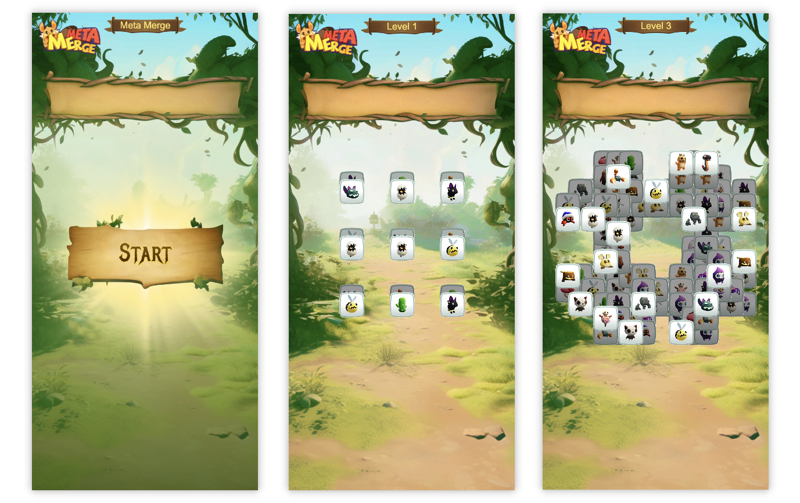
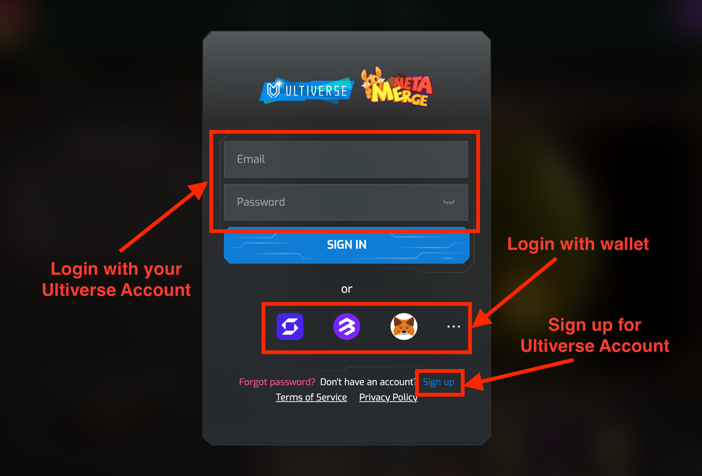

# Meta Merge Match3 Linea Game

## What is Meta Merge?

🐹 Meta Merge is a metaverse combining AIGC, NFTs, DeFi, and Gaming.

- We cordially invite the community to collaborate to develop the AIGC experience. With Meta Merge AIGC, our technology that generates exceptional and commanding pets for NFT holders, the community can actively participate in shaping its evolution.
- Embark on a journey of discovery as you solve unique quests, strengthen your team, and create your own storyline.
- With intense PvP and PvE battles, you'll have the opportunity to become a legend in the arena. Join open tournaments for a chance to win prizes.
- Capture, collect, and merge monsters to create even stronger and more unique creatures. With endless possibilities and combinations, the sky's the limit in creating the ultimate team.

Meta Merge Match3 is a mini game that allows everyone to quickly get to know pets and achieve Linea network accomplishments.

## What is Meta Merge Match3 Game?

🕹️ Meta Merge Match3 is an elimination game developed by Meta Merge Team. In the game, players need to select three identical pets to eliminate them with some skill😉.

- The pets will continue to overlap, and players can only select the top layer of them.
- There could be more than 30 types of pets in the game
- Players can obtain by Ultiverse account or wallet connection.
- The game may become very difficult and challenging after the high level.

I hope this information helps! If you have any other questions, feel free to ask me.

## To Start:

### Visit Meta Merge Match3 and Login.

Visit the Meta Merge official website: https://match3-linea.metamerge.xyz/ and you will find that there are 2 ways of logging in.

1. If you already have an Ultiverse account, you may login directly with your Ultiverse Account. You can also sign up your Ultiverse account here.
2. (recommended) Login with your preferred wallet address. You will need to connect and sign with your selected digital wallet.

### Confirm wallet and start the Game

Once you have successfully logged in, you can click on the "Linea Game" link at the top to enter the mini-game. Before starting the game, please select the connected wallet with which you will interact during the game. Only then can you begin playing. If you logged with account, You can choose any of the wallets under your account.

After players click on the cards in the central area of the game, the cards will move up to the top frame. The top frame can store a total of 7 cards. When there are 3 identical cards, they will be eliminated, for example, three of the same cards will result in an elimination. Then click "Play" and let's get started!

When there are no cards that can be eliminated by forming a set of 3 on the game board, players can observe the temporarily unused cards in the lower layer. By clicking on the cards in the upper layer, the cards in the lower layer become available for use. However, when using this technique, it is important to avoid accumulating useless cards in hand, as it can ultimately lead to game failure.

If the cards in hand has already been 7 and there are not 3 identical cards here. Then unfortunately The game is over, Please start over again from level one.

### Mint Badge for Gaming

After completing each level firstly, you will have the opportunity to earn a Mint badge!

Clicking the "Mint NFT" button will initiate a transaction to mint OAT corresponding to the current level. Whether the minting process is completed or not, you can also move on to the next level of the challenge. Note: If you have already minted the OAT for a level, there is no need to mint it again. You can directly start the next level of the game.

In the later stages of the game higher levels, the game will become very difficult and challenging, go get more eliminations and higher level records, good luck! 😉

## Get support

If you run into an issue, please feel free to contact us through Meta Merge Twitter (https://twitter.com/metamerge_xyz)  or Ultiverse Discord.
