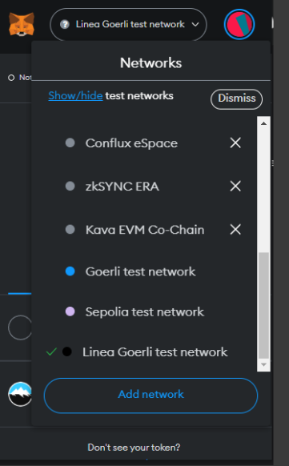
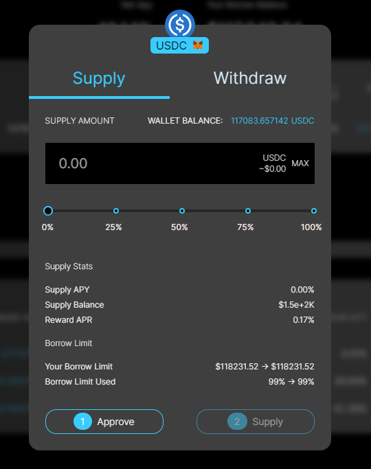
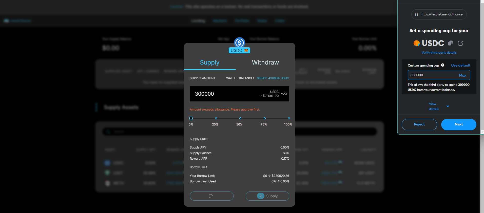

# Use Mendi Finance Lending Protocol

Mendi Finance lending protocol is deployed on Linea testnet. Use the [Mendi app](https://testnet.mendi.finance/) to supply collateral and borrow against it.

## Supply collateral

1. Navigate to the [Mendi app](https://testnet.mendi.finance/) and select the Linea network in your MetaMask wallet. (You might need to click on _show/hide test networks_ to have testnets appear in the list)

   

1. Connect your wallet to the app, by clicking **Connect wallet** and selecting **MetaMask**. Your wallet address will appear in the top-right corner.

   

1. Select the **Lending** tab.

   

1. Select USDC/USDT/WETH to supply to the protocol and click on it.

   

1. Enter the amount you want to use for each token.

   

1. Click **Approve** and check the details.

   

1. Click **Supply** to confirm and approve the transaction.

## Borrow tokens

1. Navigate to the [Mendi app](https://testnet.mendi.finance/) and select the Linea network in your MetaMask wallet. (You might need to click on _show/hide test networks_ to have testnets appear in the list)

   

1. Connect your wallet to the app, by clicking **Connect wallet** and selecting **MetaMask**. Your wallet address will appear in the top-right corner.

   

1. Select the **Lending** tab. Make sure your supplied assets can be used as **Collateral**!

    

1. Select USDC/USDT/WETH to borrow from the protocol and click on it.
1. Enter the amount you want to borrow.

   

1. Click **Borrow** to confirm and approve the transaction.
