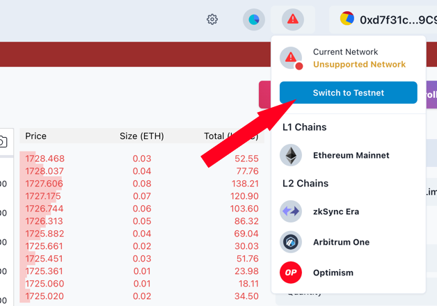
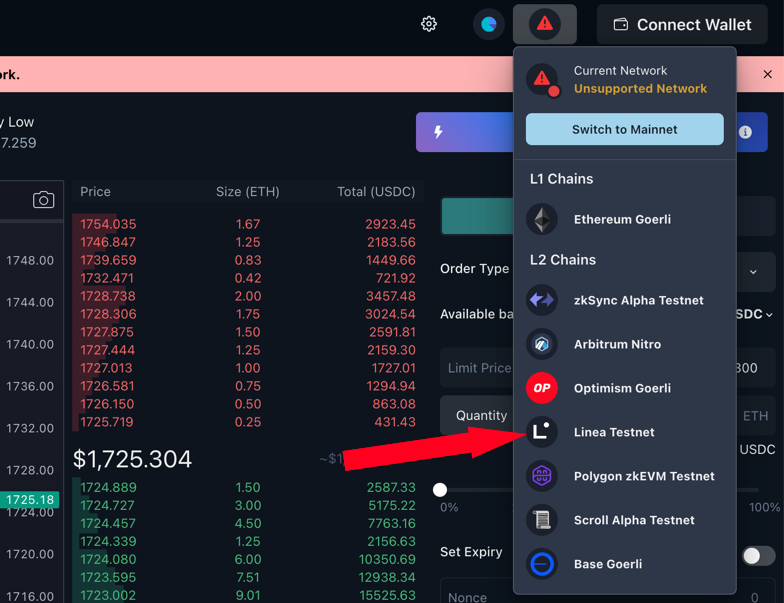
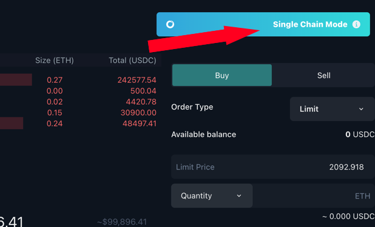
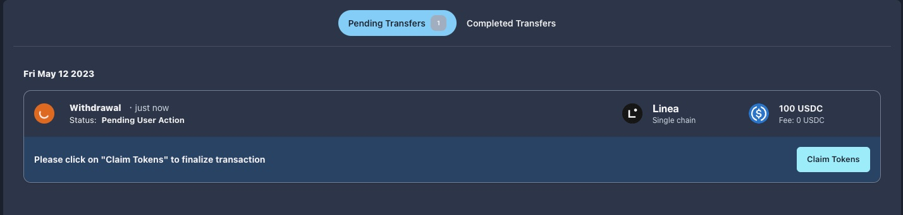

# MES Protocol

Linea DeFi Week Tutorial
MES Protocol is a cross-rollup orderbook DEX, you can learn more about it [here](https://www.mesprotocol.com/). This guide would walk you through how to complete the tasks. Before you begin, make sure your wallet is [configured to use Linea](https://docs.linea.build/use-linea/set-up-your-wallet), and your wallet is [funded with the Linea faucet](https://docs.linea.build/use-linea/fund).

## Tasks

1. Deposit any asset on Linea testnet
2. Place and close an order at Spot Trading or MES Convert page
3. Withdraw asset on Linea testnet

## Switch to Linea Testnet

1. Navigate to [MES Protocol app](https://app.mesprotocol.com/)
2. Switch to Testnet

3. Connect wallet
4. Select Linea Testnet and confirm to switch to Linea at your wallet

## Deposit

1. Click on “Deposit/Withdraw Tokens” and you will be navigated to the Portfolio page

2. Click on the "Deposit" button at the row of token you want to deposit
3. Input the amount of token you want to deposit and proceed to the next step
4. Approve a spending limit if it is your first time interacting with our contract. Select a suitable spending limit that you are comfortable with. If you have no idea what spending limit to set, just simply use the default setting
5. The Metamask window will pop up again, you can double check the amount and adjust the gas fee if needed; confirm this transaction if everything is fine, a few seconds later you’ll be able to see your token balance updated

## Place an Order (Spot Trading)

1. Tap and choose the cryptocurrency pairs you want to trade.

2. Choose to trade in “Single Chain Mode” or “Cross-rollup Mode”, this is what differentiates MES from other DEXs.
  - In Single Chain Mode - your order placed is matched and settled with other orders on Linea (your currently connected chain) only.
  - In Cross-Rollup Mode, your order could match and settle with orders on any chains supported by MES. You enjoy deeper liquidity in this mode, but you may need to bridge the assets when you withdraw.
  
3. Choose the order direction to buy or sell the token
4. Choose to place a Market Order or Limit Order
5. Fill in the Limit Price (applicable to Limit Orders only) and the quantity, then place the order.

## Place an Order (MES Convert)

1. Navigate to MES Convert page by selecting “MES Convert” under “Trade”

2. Select order type - Market Order or Limit Order
3. Select the source chain and token, and the destination chain and token (Linea would be the source and destination chains in this event)

4. Fill in the amount to send
5. Click “Preview Conversion”
6. The conversion rate is displayed, it is for reference only and the actual settlement rate is subject to the price movement. You can adjust the conversion rate here if you are placing a Limit Order. Click "Submit" if you confirm the details of your trade

## Withdraw Linea Balance Only

1. Same as deposit, navigate to the trading page and click on “Deposit/Withdraw Tokens”
2. Click on the "Withdraw" button at the row of token you want to withdraw
3. Choose a withdrawal mode - “Withdraw Linea Balance Only” allows you to withdraw assets on Linea only, or “Withdraw Cross-chain Balance” that aggregates your assets into Linea then and withdraw.

4. Single Chain Withdrawal - input the withdrawal amount and proceed to withdraw
5. Sign the message on your wallet to confirm the withdrawal
6. Click on “Go to Transfer Records” at the prompt message

7. Claim token to your wallet at “Pending Transfer” page

## Withdraw Cross-chain Balance
1. Select Linea as the destination chain

2. You are then navigated to “MES Convert” page to bridge your selected asset to Linea
3. After you have aggregated your assets to Linea, you can follow Step 4 above to withdraw the assets under Single Chain Withdrawal Mode.
