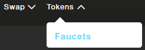
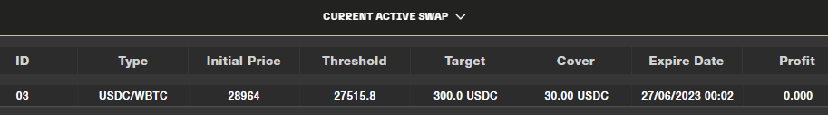
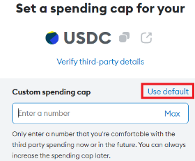
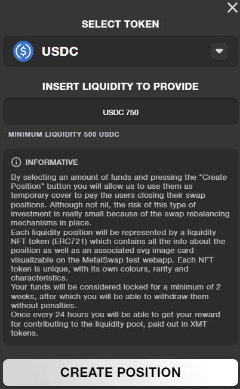
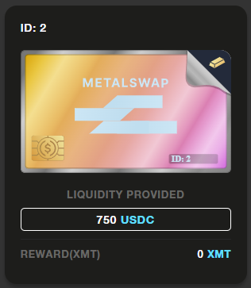

# Use Metalswap to Protect From Volatility - Linea Goerli Testnet

## **Chapter 1: Getting the Demo Tokens**

- Obtain Goerli ETH tokens for transaction fee payments.
- Also, 0,1 Goerli ETH will be asked to get WBTC and USDC test tokens.
- Visit the MetalSwap demo interface at [https://testnet-linea.metalswap.finance](https://testnet-linea.metalswap.finance).
- Click on "Tokens➝ Faucets" to request WBTC and USDC test tokens.

- If prompted, switch networks to the Linea Goerli network.

- Click on "GET GOERLI TEST WBTC AND USDC".
- Add WBTC and USDC test token on Metamask by clicking on the respective buttons.

## **Chapter 2: Hedging Swap**

- Navigate to "Swap➝ Swap" to use the Hedging Swap tool.

- Get to the Hedging Swap Dashboard and set the Hedging Swap variables: **Target Size**, **Duration**, and **Cover**.
- By selecting USDC, you're hedging against a **rising price of WBTC**. You'll pay **Premium** and **Cover** with USDC. On the contrary, the "blue zone" Profit section goes to the left direction and you'd pay with WBTC. Give allowance accordingly to your direction choice.

- After giving allowance, and double check the numbers set, the only thing remained to do is to click "Execute Swap".

### Managing Active Swaps

- Active swaps are displayed in the "Current Active Swap" section.

- Manage swaps by clicking on them and adjusting settings or closing them early.
- If the price goes in the opposite (red) direction, the Cover gets eroded and if the Threshold price is reached, your order can be Liquidated. On the contrary, if the price goes in the protected blue direction, you get to the Profit "blue zone" according to the Initial Price and the Target Size, you'll be payed back with WBTC in this case.

If you want to know more, please visit MetalSwap's official documentation linked below.

## **Chapter 3: NFT Liquidity Providing**

- Click on Liquidity Pools in the top menu to provide liquidity.

- Click on "CREATE NEW POSITION".

- Select the token and amount of Liquidity to Provide.

- Enter the amount of liquidity you wish to provide and give allowance setting the spending cap: we recommend to "Use default" so to don't have to pay the allowance again to do a similar move.

- Click on "CREATE POSITION".

- A new Liquidity Providing NFT is minted!

### Managing NFTs

- NFTs represent the liquidity locked in MetalSwap’s platform.
- Manage NFTs by clicking on it and: redeem rewards, add or remove liquidity, or transfer ownership.

To learn more about specific details related to these operations, we recommend consulting the following documents: [Hedging Swap ETH](https://docs.metalswap.finance/launch-app/hedging-swap-eth-v2) [Liquidity Pools](https://docs.metalswap.finance/launch-app/liquidity-pools)

The Hedging Swap Tool is LIVE NOW on both [Ethereum Main Chain](https://app.metalswap.finance/#/swap?chain=ethereum) and [Optimism Layer2](https://app.metalswap.finance/#/swap?chain=optimism)!

[https://metalswap.finance](https://metalswap.finance)

Goodbye volatility!
