# NFTs2Me

[NFTs2Me](https://nfts2me.com/app/linea-testnet/) is a free, multichain platform that makes it easy for users to create, deploy, and manage their NFT collections and communities. It provides a user-friendly interface for creating NFT Projects, uploading its digital assets and metadata to IPFS.

The platform also offers optimized contract deployment on the blockchain, with ultra-low fees and advanced functionalities such as different minting types (sequential, specify, random), minting using any ERC-20 or native coin, credit card payments with no wallet and upgradeable contracts. It embraces the management of NFT collections and its community, including the community aspect, through custom subdomains, minting widgets, allowlists, whitelists, airdrops, and token-gated content only accessible for your holders.

With NFTs2Me, users can fully realize the potential of NFTs and bring their creative visions to life.

In this guide, we'll walk you through the steps to create a new NFT collection, setting it for public minting, airdropping, creating a gated content for the NFT holders and even activating on-chain affiliation for users who mint your NFTs over Linea!

Before you begin, ensure your wallet is:

1. [Configured to use Linea](../set-up-your-wallet.md).
1. [Funded with Goerli ETH](/docs/use-linea/fund.md#get-test-eth-on-goerli)

## Create a new NFT Collection​ (using AI)

Before creating/minting NFTs you need to create a smart contract, which will define your NFT Collection. On NFTs2Me you have three ways to create a new NFT Project:

1. **Editions (1 artwork - multiple NFTs)\_\_** - This is the **easiest** way to start. Using Editions you can create an NFT collection where all the NFTs will share the same artwork. It also allows you to create the artwork using Artificial Intelligence in case you don’t have the artwork yet.
1. **Drops (n artworks - n NFTs)** - Do you already have the images for each NFT? Using Drops you can choose different images for each NFT.
1. **Generative Art (combination of artworks)** - This is the **advanced** mode. Using the Generative Art editor you’ll be able to combine image layers (even using PSD) to generate thousands of different NFTs.

Let’s create an Edition Project.

1. If you haven’t done it already, press on “Connect Wallet”.

   

1. Click on the wallet you’re using. For the example we’ll use “MetaMask”.

   

1. It will ask you to verify your account to verify that you are the owner of the account. This message is safe and free to sign, there is no TX sent to do that. Click on “Send message” and then verify the signature.

   

   

1. After signing in, click on “Editions”

   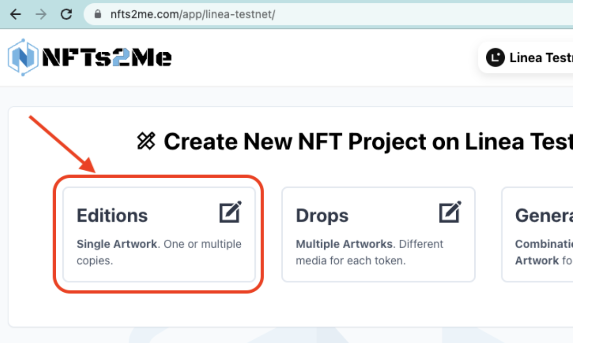

Now, let’s define the collection settings.

1. Set a **“Project Name”**. This will be used for the name of your NFTs.
1. Set a **“Token Symbol”**. This will be the NFT collection symbol.
1. Set a **“Project Description”**.
1. Add a new **“token media”** (you can also press on “Generate Artwork using AI to create an image using AI from the project name and description).
1. Click on **“Create Collection”**.

   

1. Specify a **“Minting Fee”**. It will be the price that the user has to pay to mint the NFT and you’ll receive for each mint, set 0 for “free minting”. By default it is set on native ETH. If you prefer to set the price using an ERC-20 like USDC, you can press on “ETH” and choose a different token.
1. Set the **“Edition Size”**. This will be the maximum number of NFTs that can be minted for the collection.
1. Click **“Deploy to Linea Testnet”**.

After clicking on “Deploy to Linea Testnet”, it will upload images to IPFS and then ask to confirm the TX

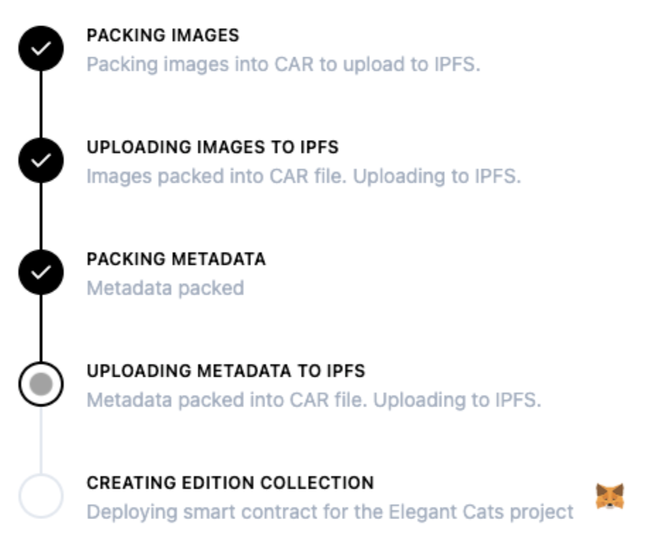

Click on “Confirm” to create the contract for your new NFT Collection.

Congratulations! 🙌🏼 You've deployed a new NFT Project on Linea Testnet.

After the transaction is confirmed, a modal will appear with information about what are the usual next steps with your NFT project.

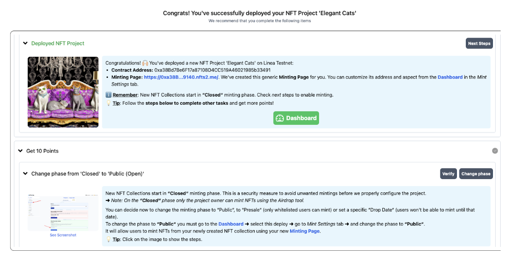

A new generic minting Page with your own custom subdomain has been created for you. You can customize its address and aspect from the Dashboard in the Mint Settings tab.

ℹ Remember: New NFT Collections start in “Closed“ minting phase. Check next steps to enable minting.

⚠️ **IMPORTANT**: When creating a collection, the one who deploys it will be owner (i.e. you). You’ll receive an ownership NFT. The owner of that NFT is the owner of the collection. This can be very useful, as you could even sell the collection (including the fees you receive from primary sales and royalties). But if you transfer that NFT, you’ll lose control of the collection!

## Change phase from ‘Closed’ to ‘Public (Open)’

Click on the “Dashboard” button or go to https://nfts2me.com/app/linea-testnet/. You’ll see all your Projects. Click on the last created project:

It will open the Project Dashboard. There, you can configure the Smart Contract, the minting page, withdraw earning, airdrop tokens, create whitelists, token gated content, affiliation or even enable Credit Card Payments for your collection (not available on Linea testnet for obvious reasons 🙂).

New NFT Collections start in “Closed” minting phase. This is a security measure to avoid unwanted mintings before we properly configure the project.

Note: On the “Closed” phase only the project owner can mint NFTs using the Airdrop tool. You can decide now to change the minting phase to ”Public” to “Presale” (only whitelisted users can mint) or set a specific “Drop Date” (users won’t be able to mint until the specified date).

Being on the Dashboard, to change the phase to **“Public”** you must:

1. Go to Mint Settings tab
1. Change the phase to “Public”, and click “Update”.

This will send an on-chain transaction to change the contract state. It will allow users to mint NFTs from your newly created NFT collection using your new Minting Page.

## Mint from the project Minting Page

As described above, when you deployed the smart contract for you NFT Project a new Minting Page was created for you.

On the Dashboard menu of your Project, below "Overview" you have the "Minting Page" tab. Click on it. You'll see the different customization options you have available:

- **Collection URL**. You can create your own custom subdomain for the Minting page.
- **Collection Name and Collection Description**. By default the Project Name and Project Description, but you can change it at any time. Note that this doesn't change the contract information (which is mostly immutable), but only the minting page information shown to your users.
- **Logo image**. The image shown on the minting page. Changing it will only affect the minting page as well as the listing on Marketplaces like OpenSea.
- **Banner image**. The image shown on the minting page.
- **Featured image**. The thumbnail image shown when sharing the collection link.
- **Links**. You can add links to your website or social networks (e.g. Twitter, Discord) to your Minting Page.
- **NFT Showcase**. Show or hide your NFTs on the Minting Page. If you don’t want them to be visible, disable this. Remember that you can use a Placeholder if you don’t want to show the final artwork until a future point in time, or even use real on-chain Random minting to really hide the artwork from the users before they mint it.
- **Widget Cod**. If you prefer to host the minting on your own website, you can use the customizable Widget Code.

📝 Remember to **click on Save** after setting the changes to avoid losing them!

Once you’ve saved your changes, click on “Visit Page” to open the Minting Page (step 3 on the image).

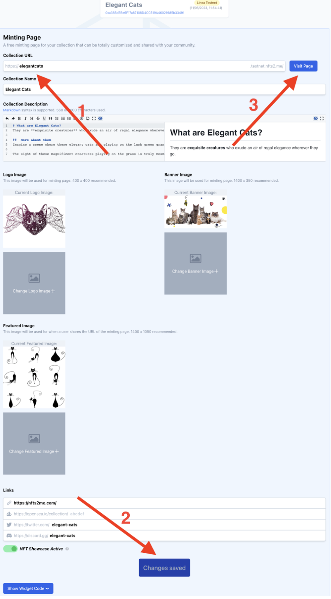

That’s your new Minting Page. You’ll get something like this:

You can choose to Mint to other wallet or even ENS name using the “Mint to other Wallet” option.

For this example, it’s enough to just click on “Mint”, that we’ll Mint an NFT for you.

Confirm the transaction on MetaMask and wait until it’s done.

You can even click on “You own 1 NFT from this Collection” and see the NFT on the Linea Block Explorer:

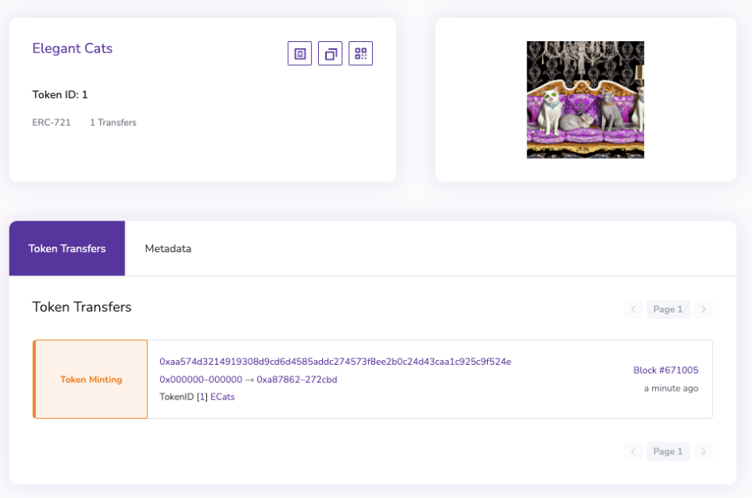

As well as the metadata:

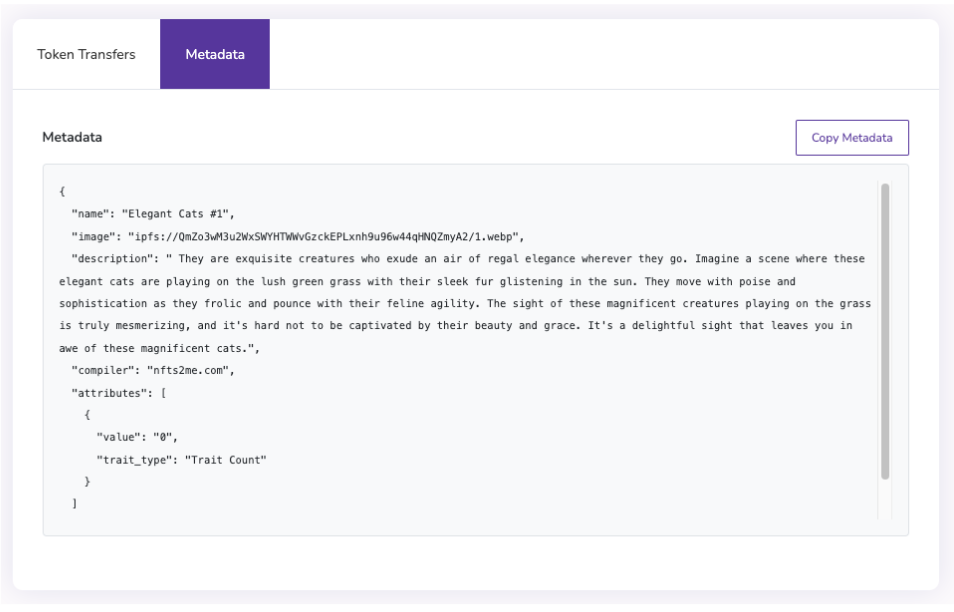

In a real case scenario you wouldn’t buy the NFT to yourself, but rather share the Minting Page link to your users for them to mint. However, you may want to get an NFT from your collection, but it doesn’t make much sense to pay for it, right? So, what do we do? Airdrops! 🪂

## Send an Airdrop

An Airdrop is a way to send NFTs to the desired address or addresses for free. It may be similar to Whitelist, but it doesn’t have to be.

In the case of Airdrops you send the NFTs directly to the users. They have to do nothing to receive them. In the case of Whitelists, the users have to mint the NFT, which can be at a customized price or even for free. But they are the ones doing the minting. Both Airdrops and whitelists can be very useful to use as a reward to encourage the most active members of your community. You can even take a list of addresses got from a previous allowlist and upload to the Dashboard to allow the OG or whitelisted users to mint before the rest.

This is useful in a bunch of cases:

- You want to keep one NFT for yourself before you open the Drop Date (the date when the mint begins).
- A way to send POAPs.
- You want to send free (or at discount) NFTs to colleagues.
- Allowlists.
- …

Keep in mind that only the collection owner can send Airdrops.

BUT, there is more. NFTs2Me allows “Soulbound” Airdrops. Soulbound NFTs (SBT) are NFTs that can’t be transferred. You can have a Soulbound collection, where NFTs can’t be transferred, but you can also have a regular collection where NFTs can be transferred except for the specified when Airdropping or Whitelisting. This can be very useful if you, for instance, want to send NFTs to your friends but don’t want them to resell to lower the Floor price of your collection (as they got them for free!).

So, how do I send a Soulbound Airdrop?

1. Go back to the Dashboard of your NFT Project.
1. Click on the Airdrops tab from the Dashboard menu.
1. Click on the toggle to change “Transferable NFTs” to “Soulbound NFTs”.
1. Click “Add account”.

   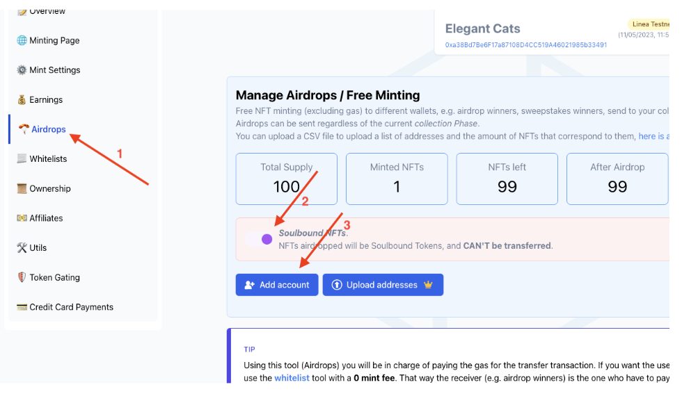

1. Enter the receiver address. For the example, we’ll use an ENS domain: “nfts2me.eth”.
1. Specify the amount of NFTs to Airdrop (1 in the example).
1. Click “Add to Airdrop”.

   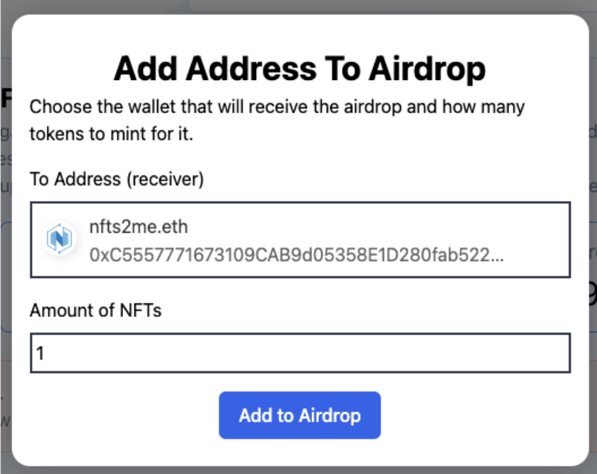

1. Finally, check that everything is right and press “Send Airdrop”. In the example we have already 1 NFT minted from the previous step, 99 left, and after the Airdrop we’ll have 98 NFTs left.

   

   It will pop up a new transaction confirmation on Metamask. Confirm, and wait the TX to be confirmed on the Blockchain.

   

   

That’s it!

You’ve airdropped a Soulbound NFT that can’t be transferred using an ENS domain name as receiver.

## Create Token Gated content

Token gating is a mechanism where access to certain content or benefits associated with an NFT is restricted based on whether the user holds a token from your Collection. This can be seen as a way to reward and incentivize long-term holders of an NFT, as they may be given exclusive access to features or experiences that are not available to others. Token gating provides a way to create unique and exclusive experiences for NFT holders, while also adding value to the underlying tokens themselves.

**TIP:** Using the Token Gating tool you'll be able to create multiple pages for different gated content. This can be used not only to offer private content to the owners of your collection, but also to create membership sites for your holders, with different sections, a great way to create a Web3 membership/digital product.

You can create a general token gating landing page as well as individual items. Every content gated item created has a public description as well as a private information.

**How to create Token Gated Content?**

1. Go back to the Project Dashboard and click on the “Token Gating” tab.
1. First, let’s create the Public Token Gating Landing Page for your Token Gated Content. This frontpage is open for everyone to see. Don’t share any private content here. Just a name and description of what the people can expect to see in the private content gated part.

   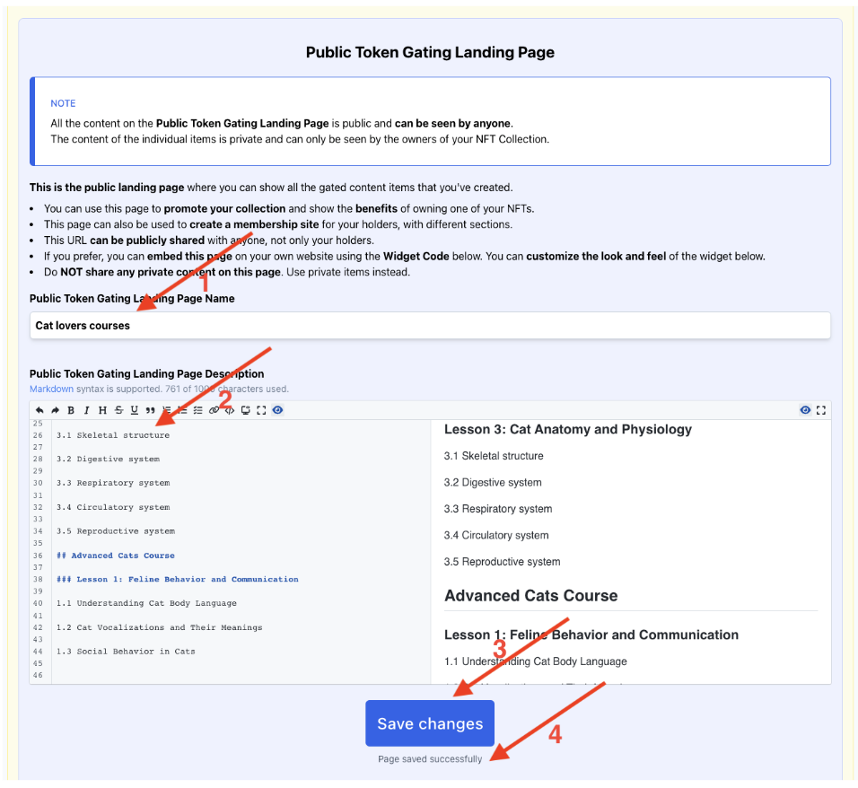

1. **Write a name** for the landing page. In this case, it will be courses for cat lovers, so “Cat lovers courses”.
1. **Write a description.** This is public content everybody will see before authenticating. In this case, it will be the course outline.
1. **Save changes.**
1. Confirm that changes were saved.

You’ve just created the landing for your gated content. After that, Let’s create the first private item (e.g. First lesson of the course).

- Click on “Create New Private Item”.

  

Now, it’s time to create the private token gated item.

Let’s start by setting a name and URL:

Then, set a Public Description. It’s shown even before unlocking the content. This is public content that can be seen by everyone. You can use Markdown to format it. In the example, it can be the outline of the course. Everybody can see it!

Now it’s time for the private content! This is the content that will be unlocked by the holders of your NFTs. This content is private and can only be seen by the owners of your NFTs. In the example, this is the content of the course.

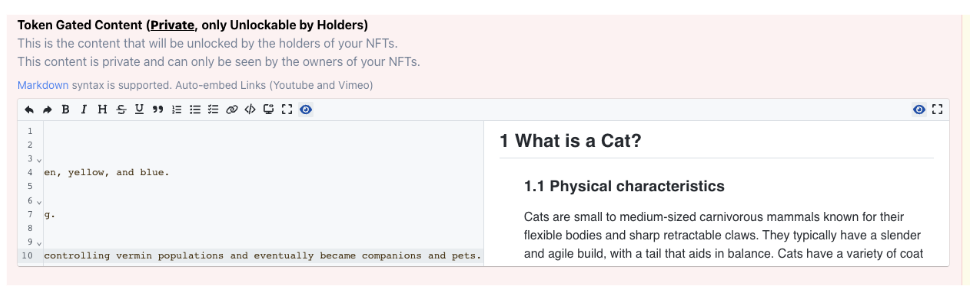

You can optionally upload an image for the item. This will also be used when shared on Social Networks.

Finally, you can choose to group the items under groups. In the course, we’ll group them by “Courses”, and we want it to be listed on the mainpage.

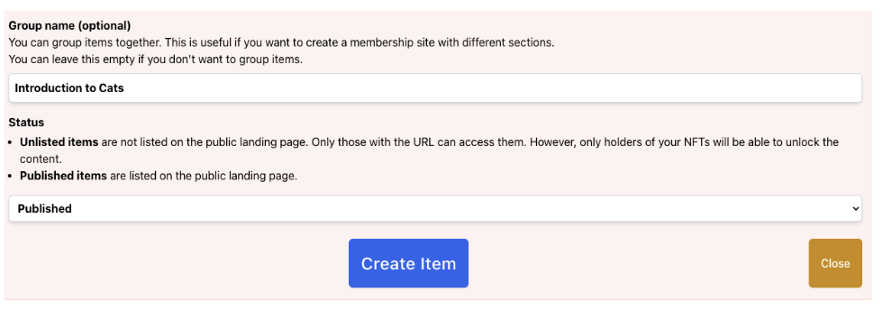

Press on **“Create Item”** to continue.

You’ll see your new created token gated item:

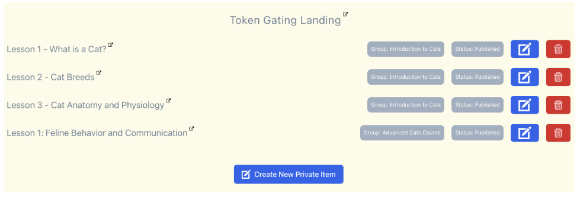

You can now go to your new Gated Content page (e.g. https://elegantcats.testnet.nfts2.me/gated/) to see all the created information.

When clicking on any of the private items, you’ll only see the public information.

Connect your wallet to be able to see the private content!

That's it! You’ve created your token gated community!

## Activate on-chain affiliation

Using the affiliates system you'll be able to both **reward affiliates** who help you sell your collection, as well as **offer** an optional **discount** for the end user coming from an affiliate link.

The optional discount is a great way to help **promote your collection** through affiliates, as these ensure that their audience will want to use their reference.

You can choose to set a **general affiliation information** (commission and user discount), but you can also set a different and **custom per wallet affiliation information** (commission and user discount). That way, you can provide special commission conditions for top affiliates.

It is disabled by default:

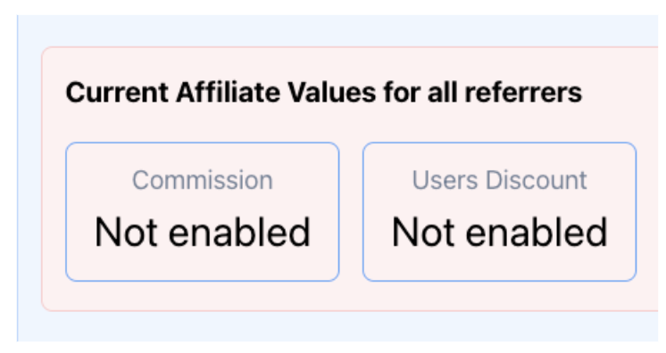

In the example, we’ll offer a 50% discount for the users coming from affiliate links, and an Affiliate Commission Percentage of the 10%. The mint price will be 0.0001 ETH instead of 0.0002 ETH.

💡 TIPS: You can use custom affiliate links for each referrer, and let them have different affiliation values. Affiliation commission can be as high as 100% (all the benefits from their affiliate sales will go entirely to them), and the same applies for user discounts (so people coming from the affiliate link will have “free minting” indeed!). Let’s say you create a collection with a partner, and you want every sale coming from your partner to be 100% for him. You can just create an affiliate link for him with 100% of commission and 0% discount.

⚠️ IMPORTANT! Once fixed, you won't be able to lower the percentages, just raise them. This is to give confidence to the referrer.

Click on “Update” and confirm the transaction. Check it has successfully updated the affiliation information:

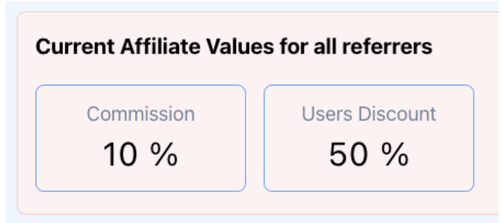

After that, let’s Generate the Affiliate Links. In the example we are generating an invite link for “vitalik.eth”, so every on sale done through that link “vitalik.eth” will receive 10% of the minting price.

Let’s click on the Affiliate Link, and now, we’ll see that the minting price is discounted:

**Connect your wallet**, and **click on “Mint”**. You’ll see that the actual price is the discounted one:

Congratulations! You’ve minted an NFT at a discount price using an affiliate link. The collection owner have received 90% of the minting price, while “vitalik.eth” have received 10%. Let’s take a look at the affiliate dashboard:

Yuhu!! “vitalik.eth” can now claim its revenue!

## Get Support

If you run into issues using the NFTs2Me, you can find their support channel in their [Discord](https://discord.com/invite/8nVSkdAwtP).
