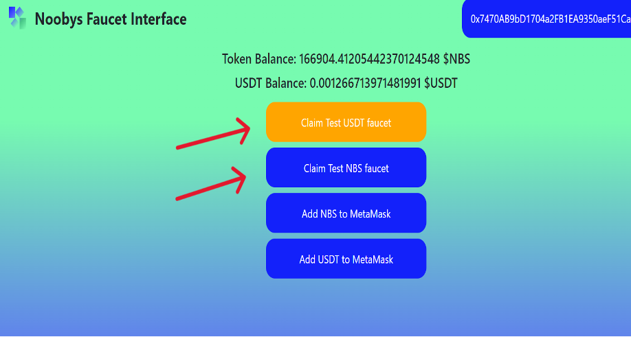
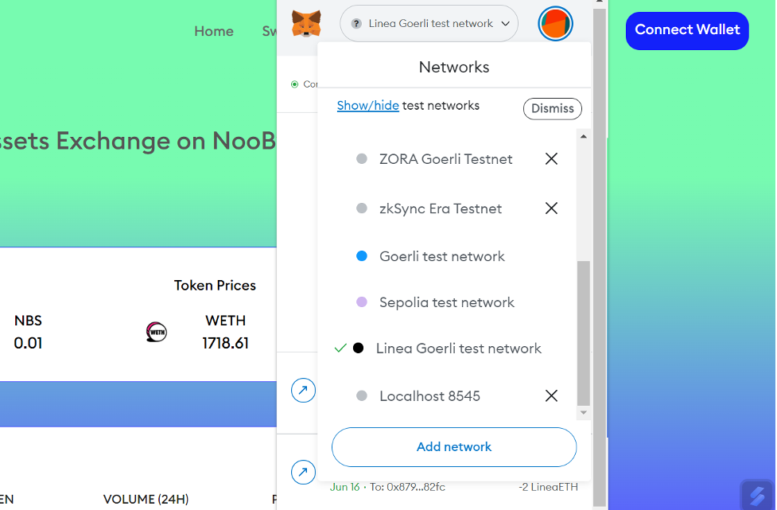
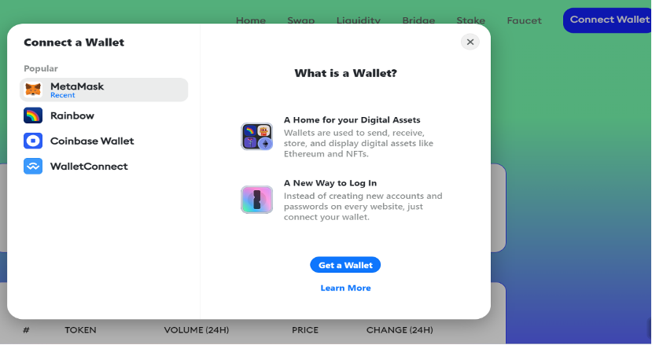
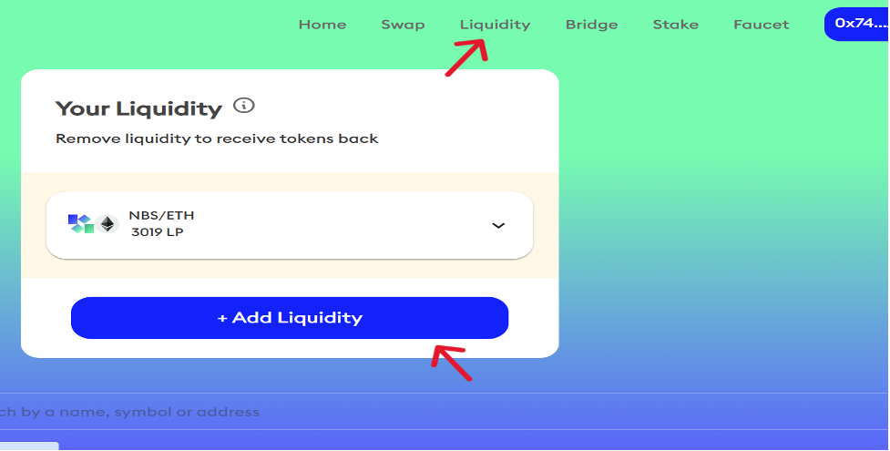

#Noobysswap

NooBysSwap.io is a decentralized exchange (DEX) built on a Linea blockchain L2 that enables users to trade digital assets in a secure and transparent manner, without the need for a centralized intermediary. The exchange is designed to be user-friendly, with low transaction fees and a seamless interface that makes trading digital assets easy and intuitive for users of all levels of experience. In this guide, we'll walk you through how to Swap & Add LP with NooBysSwap.io Before you begin,

1. [Configured to use Linea](../set-up-your-wallet.md).
2. [Funded with Goerli ETH](../fund.md#get-test-eth-on-goerli)

Claim USDT & NBS token on Faucet

1. Select the Faucet tab
2. Connect your wallet
3. Click Claim USDT/NBS testnet Faucet

Swap tokens

1. Navigate to the https://noobysswap.io/ , and select Linea in your MetaMask wallet. 

2. Connect your wallet to the app. Click Connect wallet and select MetaMask. Your wallet address will appear in the top-right corner.

3. Select the Swap tab & Enter the tokens that you want to swap.
4. Enter the amount you want to swap.
5. Select Swap and check the details.
6. Confirm the swap by selecting Confirm Swap. 

Add liquidity

1. Navigate to the NooBys App, and select the Linea network in your MetaMask wallet 
2. Connect your wallet to the app, by clicking Connect wallet and selecting MetaMask. Your wallet address will appear in the top-right corner.  
   
3. Select the Liquidity tab & click Add Liquidity button 

4. Select Pair USDT-NBS or ETH-NBS and click Next 

5. Enter the amount you want to use for each token.
6. Click Supply and check the details.
7. Click the Confirm Supply to confirm and approve the transaction

Get Support If you run into issues using the NooBys Swap, you can find their Discord https://discord.gg/mDEFx6YUtS
