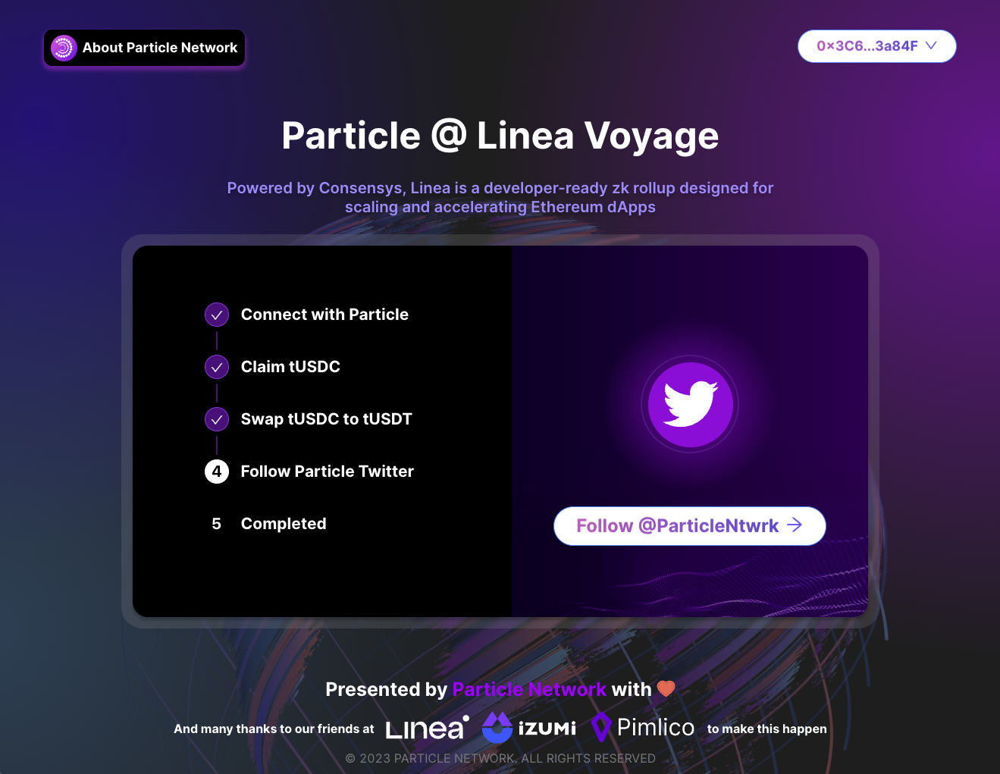
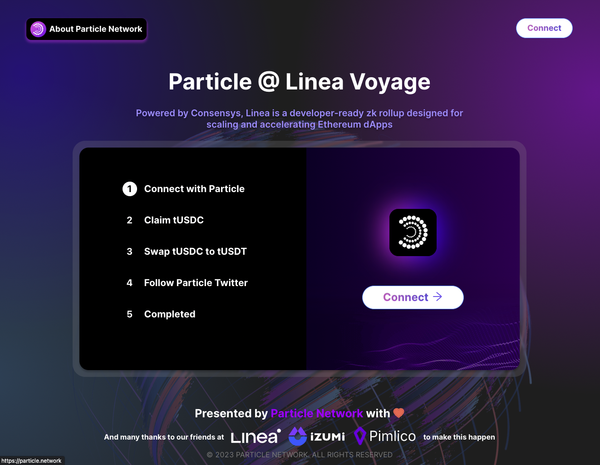
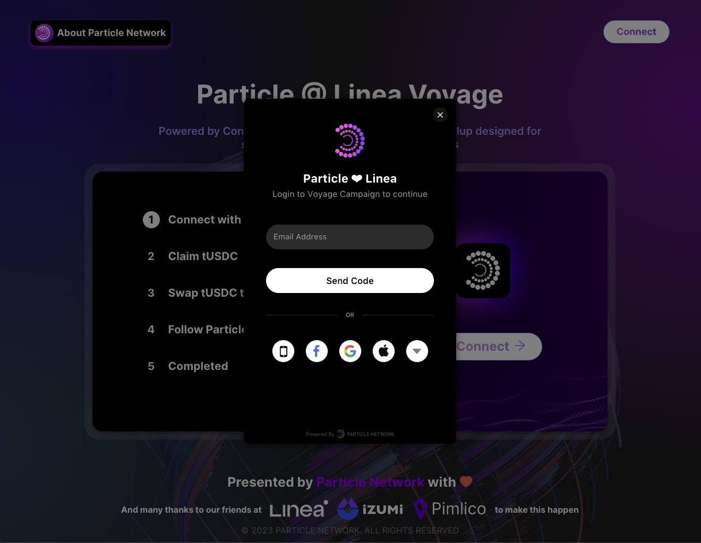
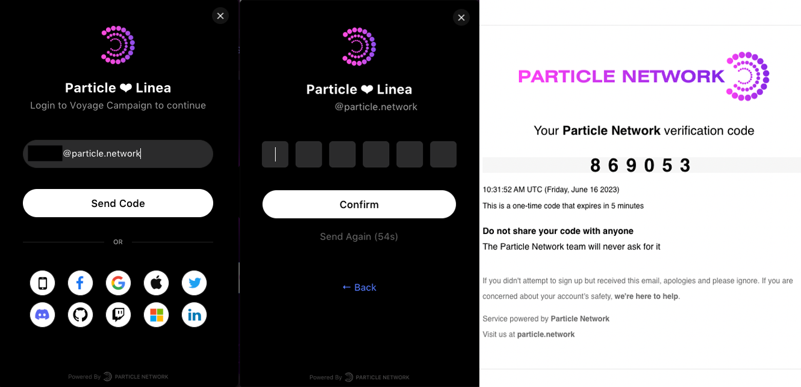
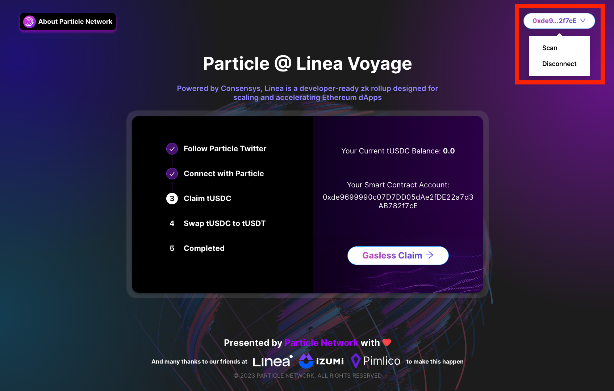
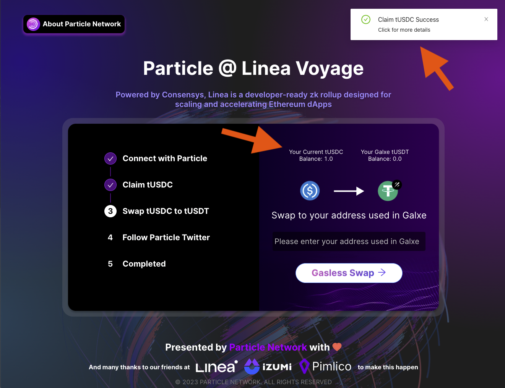
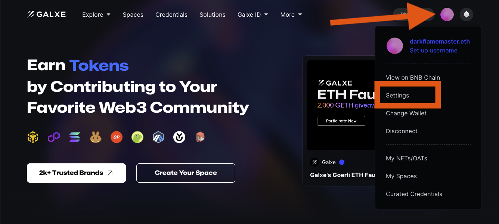
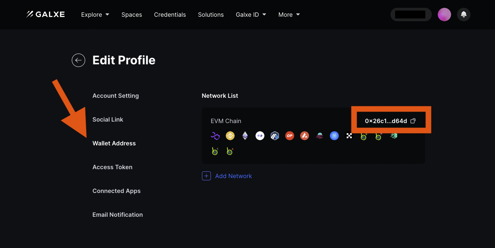
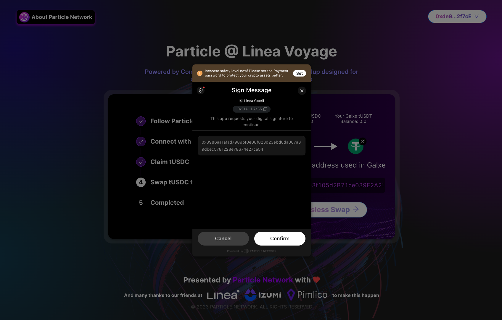
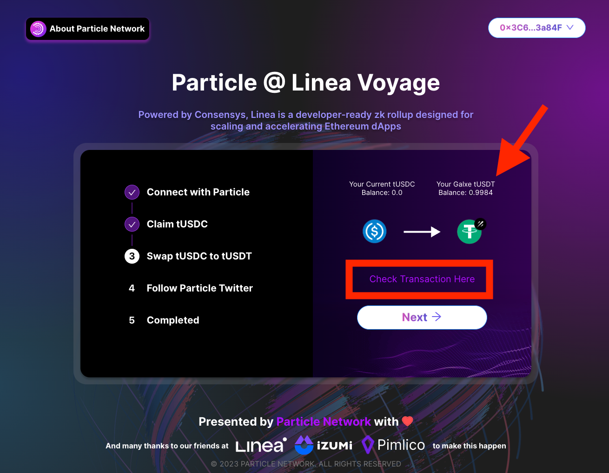

[Particle Network](https://particle.network/) provides solutions to simplify the process of building and operating Web3 applications.

The product offerings include secure Authentication and Wallet-as-a-Service Middleware powered by Multi-Party Computation & Account-Abstraction. There are also other offerings including a one-stop NFT solution, Node RPC and Data API Service.

Particle Network's solutions have demonstrated remarkable results for their clients, increasing new user conversion rate from 15% to 95%.

In this guide, we’ll walk you through how to
- Create a Particle Account Abstraction (AA) Wallet and
- Claim tUSDC gaslessly
- Swap the tUSDC to tUSDT gaslessly with your Galxe Address as the recipient

After which, you’ll have a glimpse of how smooth the onboarding and user experience for DeFi will be on Linea!

# Beginning

At the beginning, please follow our twitter to begin the journey, appreciate the support!

# Create a Particle Account Abstraction (AA) Wallet

On this page you will see your first mission - Connect with Particle

Simply click the Connect button and a login page will pop-up in front of you like this:

Here, you’ll see a bunch of login methods for you to login with Particle, you can choose your preferred social accounts for creating a Particle AA Wallet. For example, here we were using Email:

After which, you have successfully created an AA wallet, you can also check its on-chain status by checking the linea explorer as below:

# Claim tUSDC Gaslessly

Now you are ready for the second step, claim a testing token tUSDC with the gasless feature of the AA wallet. Simply press the “Gasless Claim” button and sign off an signature

Press “Confirm”, and wait for a few second, the transaction will succeed. You are supposed to get 1.0 tUSDC, and you can also check for more detail for the transaction:

# Swap the tUSDC to tUSDT Gaslessly with Your Galxe Address as the Recipient

In this step, you’ll be swapping your tUSDC to tUSDT gaslessly, that is to say, you don’t need to have any goerliETH to trigger off the transaction.

Now, please put “Your Galxe Address” in the text field.

PAY ATTENTION! It must be the address you used for participating this campaign, **otherwise you may not be able to verify your completion!**

If you are not sure about how to get your Galxe Address, follow the steps below:

Now let’s make the Gasless Swap!

Sign another message, wait for a while, and Voilà! You’ve successfully swapped it!

