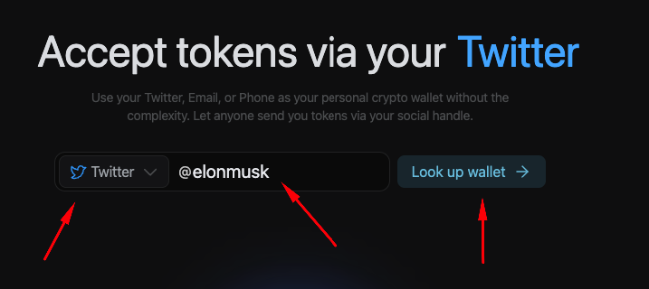
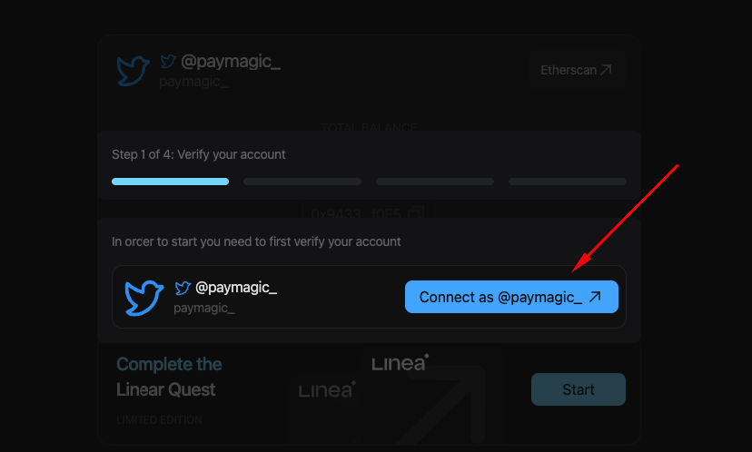
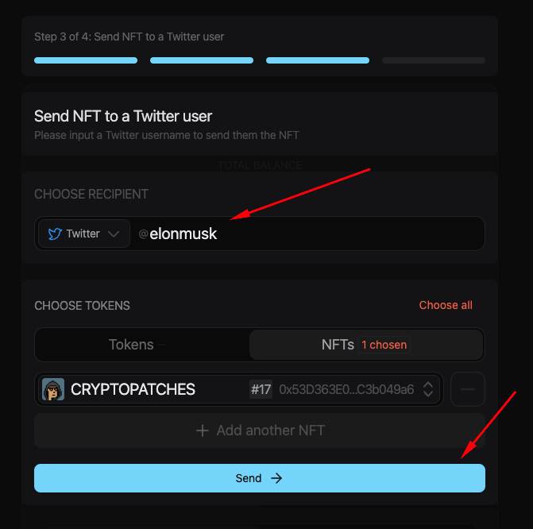
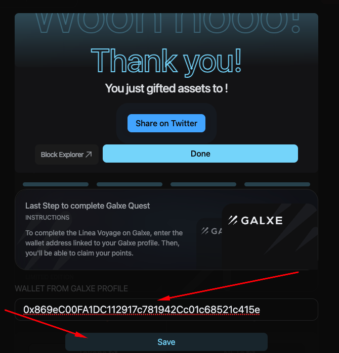

# Patch Wallet
[Patch Wallet](https://linea.patchwallet.com/) is a "zero onboarding" wallet attached to every Twitter account, email, and telephone number. There's no app to download, no gas, or even sign-up. Every Twitter user has a wallet automatically and can start receiving tokens and NFTs!

In this guide, we'll walk you through how to access your Patch wallet connected to your Twitter, mint an NFT, and send it to *any* Twitter user...[Elon Musk](https://linea.patchwallet.com/twitter:elonmusk), [Cristiano Ronaldo](https://linea.patchwallet.com/twitter:cristiano), [Narendra Modi](https://linea.patchwallet.com/twitter:narendramodi) or anyone else!

**You will not need to set up a MetaMask wallet to use Patch Wallet**

## Start Linea Quest
1. First, Navigate to the [Linea Patch Wallet site](https://linea.patchwallet.com) where you'll find web site wallets for all Twitter usernames, emails, and phone numbers.

1. Search for your Twitter username to find your Patch wallet.

3. Once on the wallet page for your Twitter account, click the 'Start' button to begin the Linea Quest. You're going to mint an NFT and send it to any Twitter user. 

4. Sign into your Twitter account. You must sign in to send transactions through your Patch wallet.

5. Once signed in, select an NFT to mint and click the 'Mint' button. The NFT will take 5-10 seconds to mint. Stay on the page. There will not be a MetaMask/external wallet transaction.

6. Once the NFT is minted, it's in your Patch wallet. Choose a Twitter user to send the NFT to and click 'Send NFT'. Stay on the page. There will not be a MetaMask/external wallet transaction.

The Twitter user could be a family member, a friend, a celebrity, a politician, or anyone with the Twitter account!

7. Once the NFT has been sent, you'll see the Success screen! 🥳 Make sure to enter the wallet from your Galxe profile to get credit!

**Important**
Make sure to enter the wallet from your Galxe profile! Otherwise, you might not receive points for completing the quest!

8. You're done! 🥂 Thanks for trying Patch Wallet on the Linea network! You can use Patch wallet on Polygon at [app.patchwallet.com](https://app.patchwallet.com)!

## Get Support

If you run into issues using Patch Wallet, ask for help in the `🚩-support` channel in our [Discord](https://discord.gg/EAFPKSRyth).
