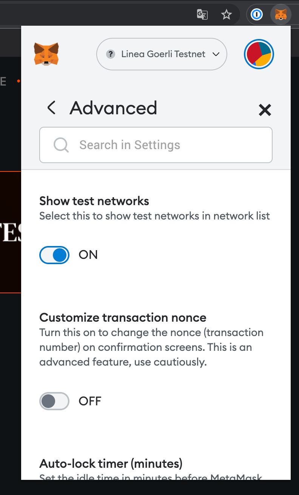
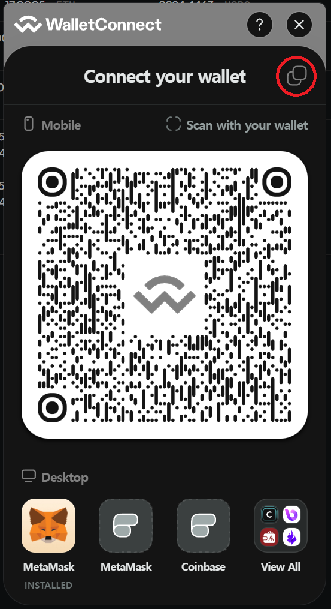
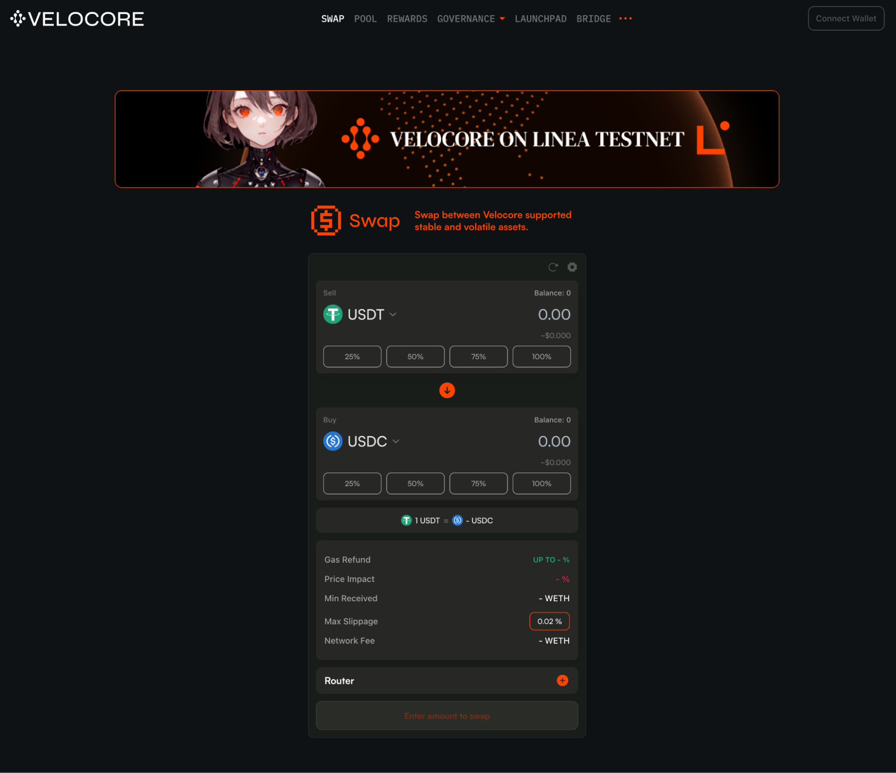
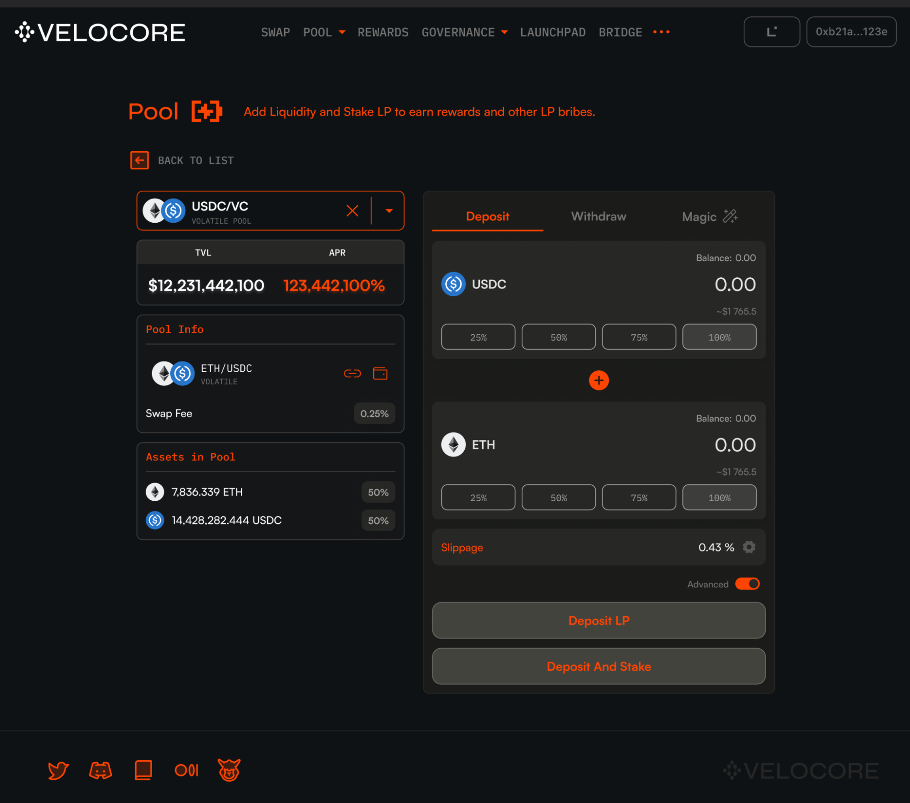

# Velocore
 

[Velocore](http://linea.velocore.xyz) is a next-gen decentralized exchange that aims to facilitate all trading by reducing costs, minimizing trade slippage, and providing a hassle-free governance experience. It helps to alleviate the stress on protocols from having to inflate their token rewards, thereby fostering a more sustainable and equitable DeFi environment. Our vision is to provide a DEX experience unlike any other.  
  
In terms of its standout features, Velocore employs 
- TokenVault-style AMM : This permits the utilization of a myriad of pools, even including stablecoins, all at the lowest gas spending possible. 
- Predictable and easy governance method : removes the epoch-based style of traditional ve(3,3) DEXs. With our Real-time Bribe and Free Flowing Vote Mechanism, Velocore provides an intuitive and streamlined governance experience. And the innovation doesn't stop here 
- Velocore has a host of other exciting features to explore. Find out more [here](https://docs.velocore.xyz).

In this simple guide, we’ll gladly walk you through how to swap and add liquidity to complete Voyage Quest!

### Voyage Quest - "Swap and provide liquidity with any tokens"    

## Preparing your wallet for the Linea Testnet

If you don't have any tokens in your wallet yet, you have two options:

1.  Our partner Fluvi wallet offers [one-click Faucets and sponsored transactions](https://linea-quest.fluvi.io) to support your completion of Voyage quests. Simply connect your wallet and proceed with the tasks.
    
2.  Or go to the [Linea Faucet Site](https://faucet.goerli.linea.build) and verify for testnet tokens
    

Make sure to turn on “show/hide test network” option on Metamask and connect to the Linea Goerli Testnet

## Swap tokens
1.  Fire up the [Velocore Linea testnet page here](https://linea.velocore.xyz/) and click “Connect Wallet” on the upper right corner.  

For first time Fluvi Wallet or Wallet Connect Users:  

* After clicking on “Connect Wallet”, click the copy icon on the top right corner of the module. 

* Access your Fluvi Wallet then click on the WalletConnect symbol 

* Enter the WalletConnect URL you copied, then press connect.

  

  
  
  

2.  Once connected, select any tokens would like to swap
    
3.  Enter the amount and click the “Swap” button. You may need to approve your token if you are using it for the first time.
    If you’re encountering approval problems with Wallet Connect, be sure to check your notifications tab for pending transaction signing.
    
  

4.  Lastly, confirm the transaction on your wallet.
    
## Add Liquidity

1.  Click the “Pool” tab on the right beside the “Swap” option
    

2.  Select the LP you want to add from the pool list and click the arrow button to start managing

    

3.  Enter the amount, click “Deposit LP”, and confirm the transaction in your wallet. If it's your first time, a token approval transaction will be requested first, followed by a deposit transaction.
    

4.  “Magic” deposit and withdraw will allow you to easily add and remove tokens with a native zap, even if you don't own them on the Mainnet
    
5.  Finally, you can manage both rewards for staked LPs and rewards for votes at once in the “Rewards” tab
    

And that’s it! You’re all set. Feel free to try more of Velocore out and stay tuned for some juicy news as we come out with our V2 release.  #BeTheCore

## Get Support

If you run into issues using the app, you can find support on our discord channel [here](https://discord.gg/velocorexyz).