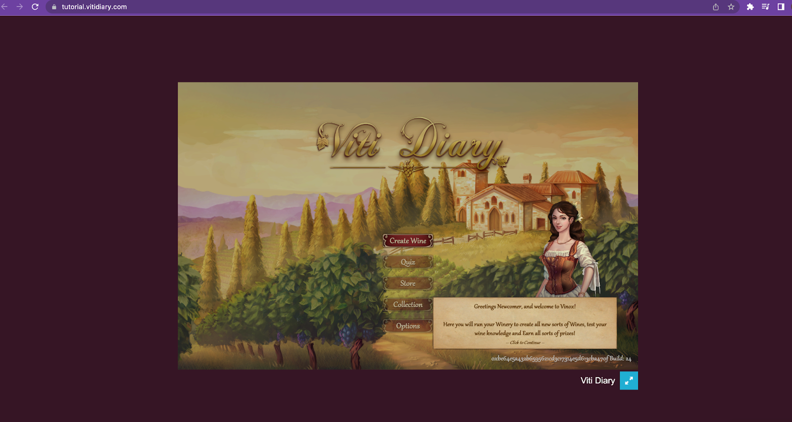
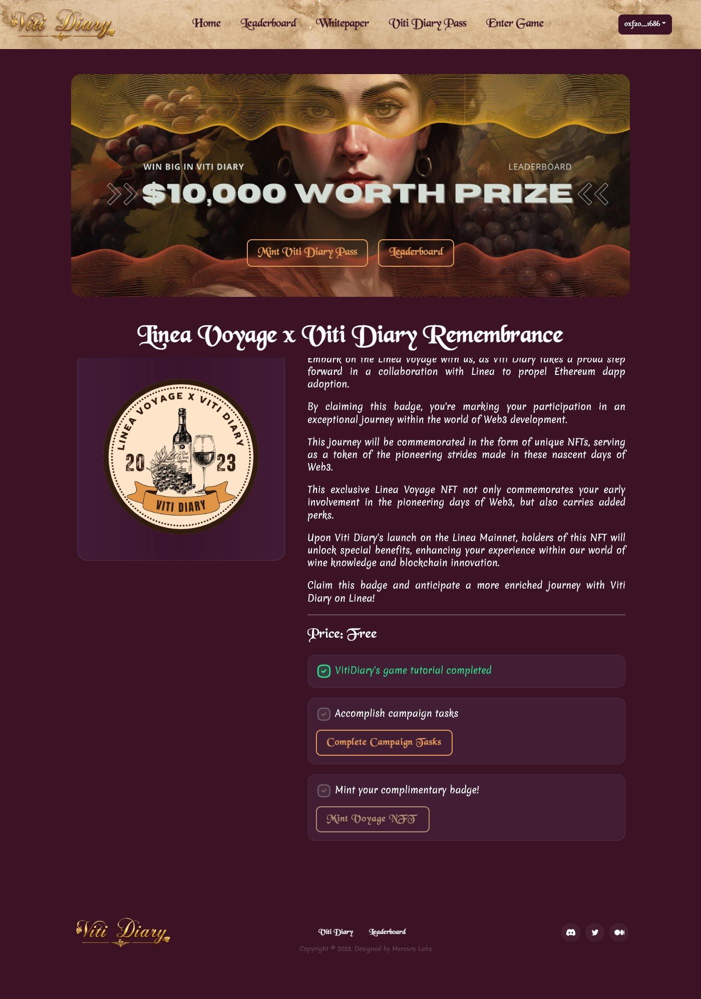
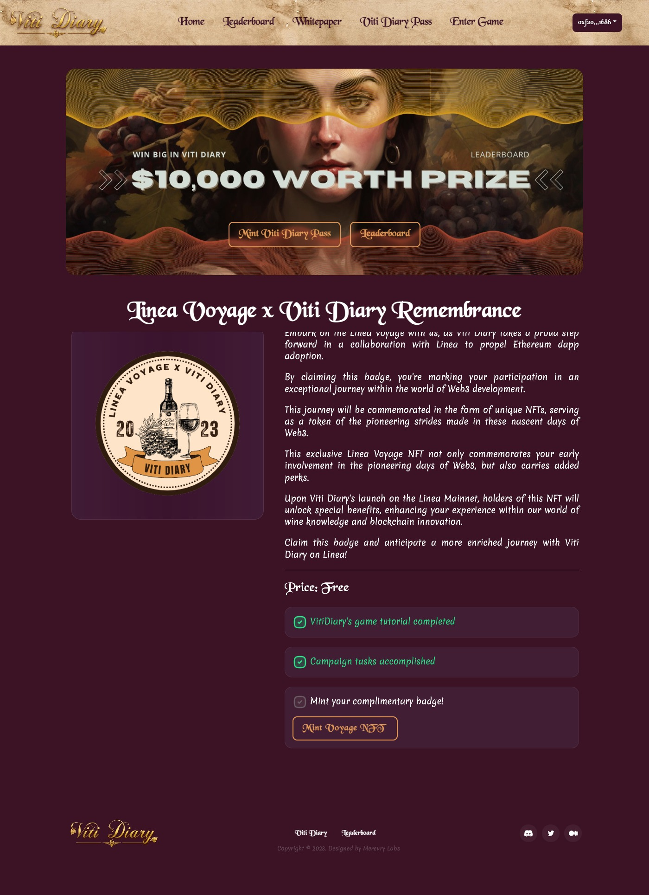
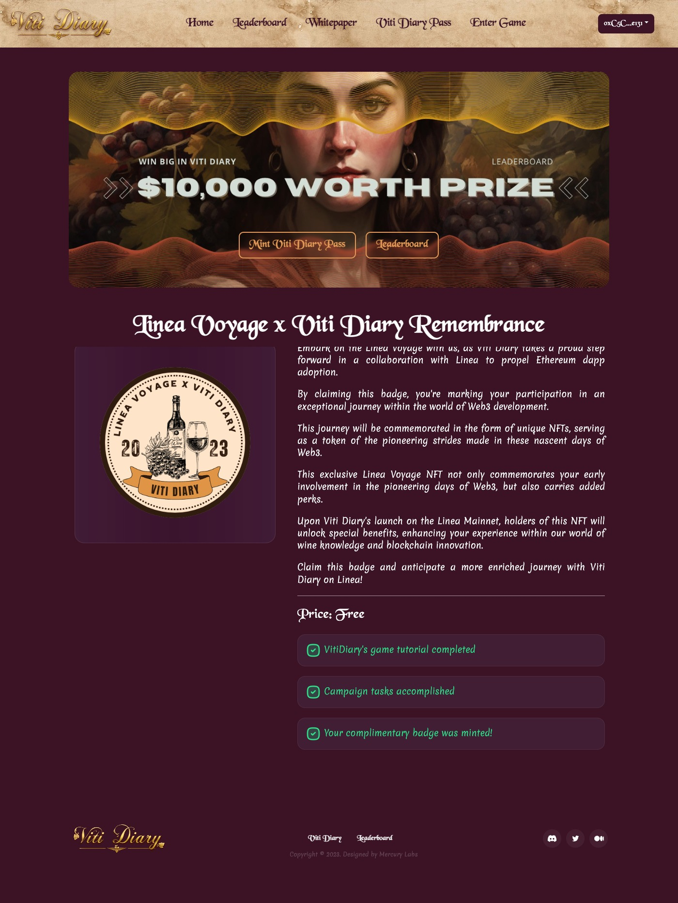

[VitiDiary](https://vitidiary.com) is A revolutionary wine-themed gaming experience. Enhance your wine knowledge, engage in quizzes, and create unique wines using NFTs. Unveil the world of wine!

What is Viti Diary

Viti Diary is a web3 game that combines blockchain technology, wine knowledge, and wine making to create a unique gaming and learning experience.

In Viti Diary, players can create their own unique wine NFTs by combining NFTs that represent grape varieties, terroirs, tools, and characters.

Viti Diary is more than just a game - it's a learning platform that aims to educate players on viticulture, wine making, and wine trading. With over 1,000 wine knowledge questions and over 500 wine making recipes based on real-world techniques, players can develop their wine expertise while having fun.

This step-by-step guide teaches how to complete the Game Tutorials and mint Voyage NFT via [Vitidiary](https://vitidiary.com/) tutorial and participate in Linea vs VitiDiary” quest.

**Chapter 0. Preparation.**

**Step 1.** **Download [MetaMask](https://metamask.io/download/)**

**Step 2.** **Add Linea Goerli test network to your MetaMask.** Open your MetaMask, go to “Networks” -> “Add network” -> Put “Linea Goerli test network” in search and add it.

**Step 3.** **Claim LineaETH.**

In order to get the Linea ETH please use this step-by-step [guide](https://docs.linea.build/use-linea/fund#get-test-eth-on-goerli).

**Chapter 1. VitiDiary Campaign.**

**Step 1**. **Complete our game tutorial on [Tutorial](https://tutorial.vitidiary.com)**

Click the login button, select "Linea Test" network to start the game tutorial

Follow the on-screen instructions to navigate through the tutorial steps and once you reach the end of the tutorial, you'll be prompted to complete the tutorial.

At the end of the journey, you will be prompted to click the "Complete" button to finish. 

And you will need to sign the transaction which will prove your wallet's completion on chain.

Once you've completed the step, click the 'Continue' button to be redirected to our website for information regarding the second task.

**Step 2**. **Visit Our site [Vitidiary](https://vitidiary.com/badge_minting) to mint Remembrance NFT**

Make sure you already have testETH to cover the gas for the minting.

By now, you should already completed the task 1 and click the "Complete Campaign Tasks" button to start minting the Remembrance NFT process. 

After completing task 2, you will be able to mint the Remembrance NFT by signing the transaction on Linea Testnet.

Congratulations, you have completed all tasks we prepared. Please stay tuned for our official launch on Linea. 

