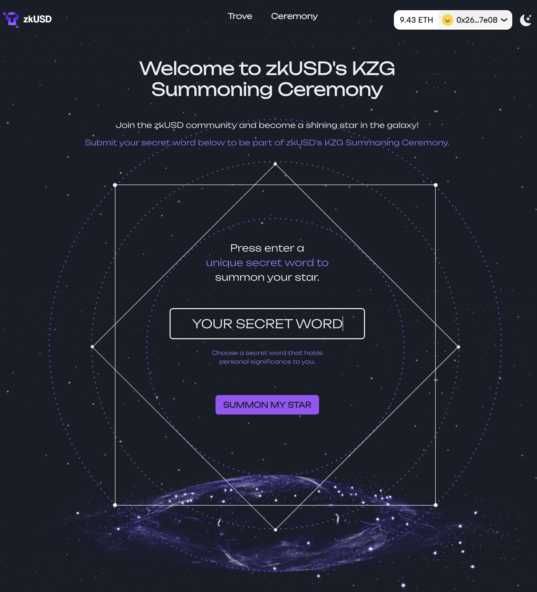
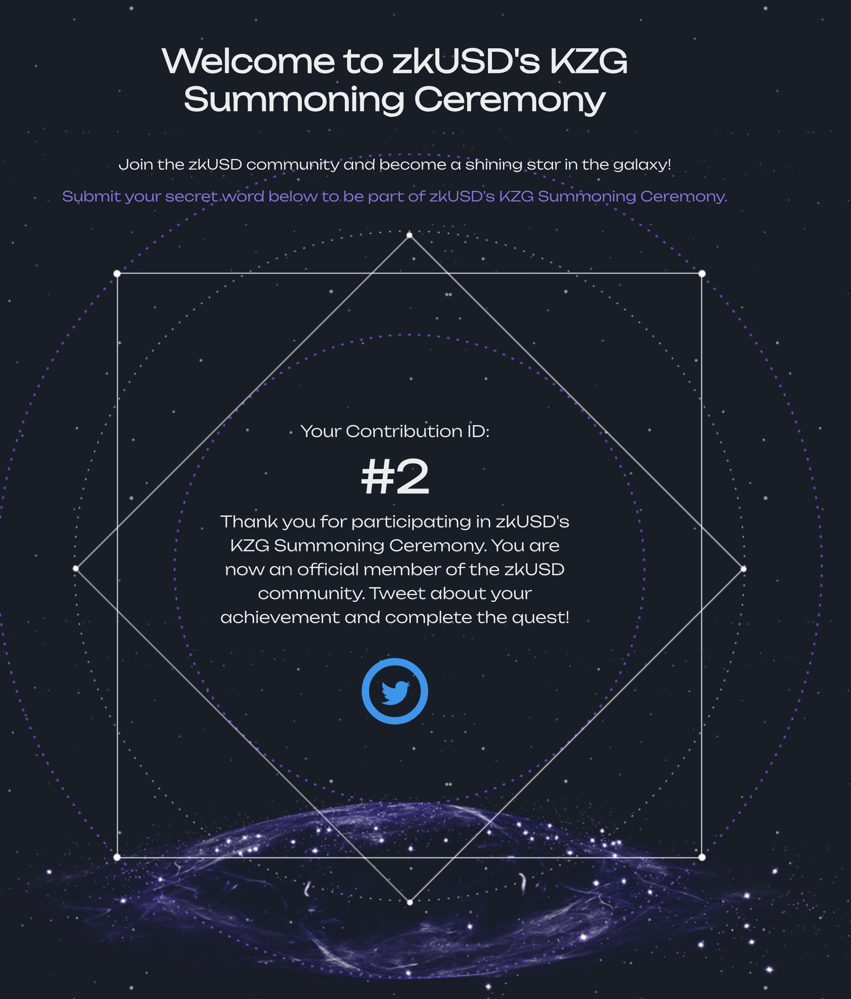
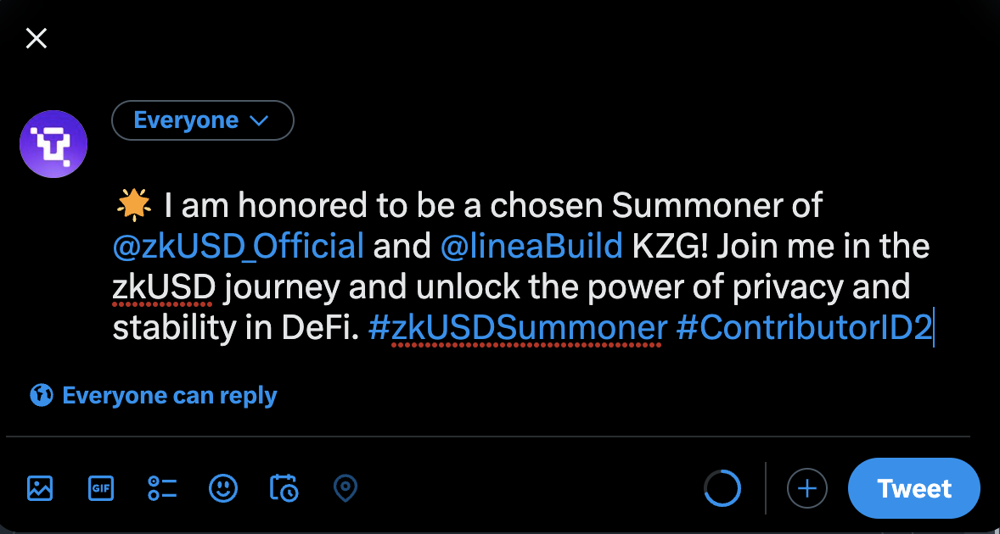

# Use zkUSD

[zkUSD](https://zkusd.money) is a powerful stablecoin built on the Linea platform, offering privacy and stability for decentralized finance (DeFi) applications. By using zkUSD, you can participate in various DeFi activities and benefit from its secure and efficient features.

Before you begin, ensure your wallet is:

1. [Configured to use Linea](https://docs.linea.build/use-linea/set-up-your-wallet).
2. [Funded with Goerli ETH](https://docs.linea.build/use-linea/fund#get-test-eth-on-goerli)

## zkUSD Deposit Tutorial

In this tutorial, we will guide you through the basic functionalities of zkUSD, an innovative stablecoin that offers both simplicity and powerful features. By following the steps below, you will gain a better understanding of how zkUSD works and its potential benefits:

1. Ensure that you have a wallet connected to the Linea platform and that it is funded with at least 0.001 ETH. 
2. Connect your Metamask wallet to the zkUSD Trove Page. (http://linea.zkusd.money/)
3. Enter the amount of 0.001 ETH you wish to deposit and confirm the transaction. Once the transaction is confirmed, you will receive 1 zkUSD in your Linea wallet.

4. Send 1 zkUSD to zkUSD’s quest address: `0x00000000043DD264ca5E68e6853790E818e9Edb8`. Then we can identify your wallet as a quest participant.

## zkUSD KZG Summoning Ceremony Tutorial

Welcome to the zkUSD KZG Summoning Ceremony Tutorial! In this tutorial, we will guide you through the process of participating in the zkUSD KZG Summoning Ceremony, also known as the "Summon My Star For zkUSD" event.

The zkUSD KZG Summoning Ceremony is a unique opportunity for you to become part of the zkUSD ecosystem by submitting your secret word. This secret word will be encrypted in your browser and used to help generate a Structured Reference String (SRS) that is essential for the functioning of zkUSD.

Follow the steps below to participate in the zkUSD KZG Summoning Ceremony:

Step 1: Visit the zkUSD official website at https://linea.zkusd.money/ceremony and navigate to the Ceremony page. 

Step 2: Read the instructions and guidelines provided on the Ceremony page carefully.

Step 3: Enter your secret word in the designated input field.

Step 4: Click the "SUMMON MY STAR" button to securely encrypt your secret word in the browser.

Step 5: Wait for the encryption process to complete. This may take a few moments.

Step 6: Once the encryption is complete, you will receive a confirmation message indicating your successful participation in the zkUSD KZG Summoning Ceremony. 

Step 7: Join the zkUSD community and showcase your achievement as a chosen Summoner. Click the Tweet Button and tweet your success to @zkUSD_Official and @lineaBuild KZG, using the hashtag #zkUSDSummoner and your Contributor ID. Let the world know that you are an integral part of zkUSD's journey.

By participating in the zkUSD KZG Summoning Ceremony, you contribute to the creation of a secure and trusted zkUSD ecosystem. Your encrypted secret word plays a crucial role in generating the necessary cryptographic components for zkUSD's operation.

Thank you for joining us on this mystical journey of summoning your star for zkUSD! Together, let's unlock the power of privacy and stability in decentralized finance.

Note: The zkUSD KZG Summoning Ceremony is a limited-time event, so make sure to participate before the deadline. Stay tuned for updates and announcements on the zkUSD official website and social media channels

Get support If you run into an issue using zkUSD, you can find their support channel in their [Twitter](https://twitter.com/zkUSD_Official) or [Telegram](https://t.me/zkUSDOfficial).
