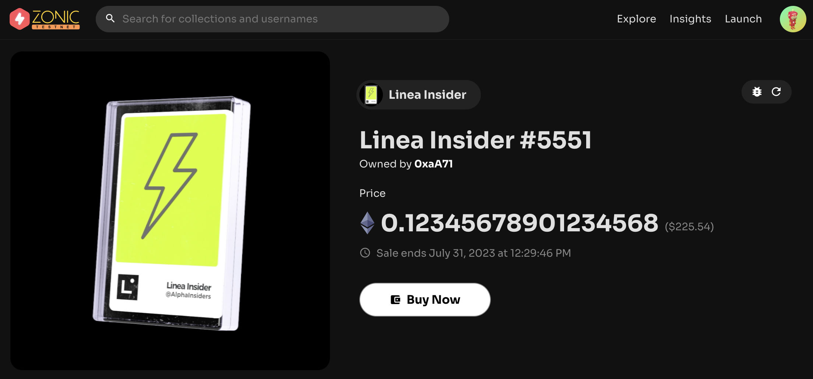

# Zonic ⚡️

Zonic is a cutting-edge NFT marketplace for Ethereum Layer-2 that enables lightning-fast transactions and multichain support for buying and selling NFTs. Our platform is devoted to empowering creators and collectors with a user-focused approach that values security, speed, and innovation. We firmly believe that NFTs are revolutionizing the world of digital ownership, and our mission is to create a seamless and secure marketplace that enables anyone to participate in this exciting new industry, regardless of their preferred blockchain.

In this guide, we will walk you through the fundamental functions of the Zonic NFT Marketplace, including selling, buying, and transferring NFTs.

Before you begin, ensure your wallet is:

1. [Configured to use Linea](../set-up-your-wallet.md).
2. [Funded with Goerli ETH](/docs/use-linea/fund.md#get-test-eth-on-goerli)

## Listing your NFT for sale

You can easily list an NFT for sale with just a couple of clicks.

1. Go to [My NFTs](https://testnet.zonic.app/profile) and view any NFT you own on Linea Goerli.

2. Click **"Sell NFT"** button and put your preferred price.

3. Review the details and click **"List Item"** to start listing.

4. Approve the transferring permission for this NFT collection. (First time only)

5. Sign a message to perform the gasless listing.

6. Done!

## Buying an NFT

1. Go to [Explore NFTs on Linea Goerli](https://testnet.zonic.app/explore?filter={%22sort_by%22:%22listed_lowest_price%22,%22tab%22:1,%22chain%22:59140}) page to see the list of NFT listed for sale on Linea.

2. Click on an NFT you want to buy.

3. Click **Buy Now** and approve the transaction.

4. Done!

## Transferring an NFT

1. Go to [My NFTs](https://testnet.zonic.app/profile) and view any NFT you want to transfer on Linea Goerli.

2. Click **"Transfer NFT"** and put the recipient address.

3. Click **Transfer Item** and approve the transaction to initiate the transfer of the NFT.

4. Done.

## Get support

If you run into an issue using Apetimism Launchpad, you can find their support channel in their [Twitter](https://twitter.com/zonic) or [Discord](https://discord.gg/zonic).
