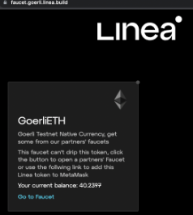

# Use the Linea faucet

If you want to drip Goerli ETH directly to Linea, find the [Infura Linea faucet here](https://infura.io/faucet/linea). Note that you will need to enter your actual address — ENS names will not work.

If you want to drip other tokens, you can find the [multi-token Linea faucet here](https://faucet.goerli.linea.build/), which lists the different tokens you can add to your wallet on the Goerli and Linea Goerli testnet.

## Set up

Before you begin, ensure your wallet is [configured to use Linea](./set-up-your-wallet.md)

## Get test ETH on Goerli

To get Goerli ETH, you'll need to:

1. Navigate to the [Linea faucet](https://faucet.goerli.linea.build/)
1. Connect your wallet and switch to the Goerli test network (make sure you are showing test networks) 
1. Navigate to the list of faucets linked through the Goerli card
1. Select a faucet and drip Goerli ETH

Transactions on Linea are much cheaper than Ethereum mainnet. Therefore, 0.2 ETH is enough to execute a basic workflow, but feel free to get as much as you need!

## Get test ETH on Linea

In order to interact with Linea, you can either:

1. [Drip 0.5 Goerli ETH directly to Linea through the Infura faucet](https://infura.io/faucet/linea)
1. [Bridge Goerli ETH to Linea](bridge-funds.md)

## Get other tokens on Goerli

1. Navigate to the [Linea faucet](https://faucet.goerli.linea.build/)
1. Connect your MetaMask wallet
1. Select the Goerli network in your MetaMask wallet
1. Select the desired token from the list of available tokens

If you want to get tokens that are not ETH or USDC, you'll need to lock ETH as a countermeasure for draining liquidity pools.

For example, if you wanted to get 1 USDT on Goerli, you would:

1. Navigate to the [Linea faucet](https://faucet.goerli.linea.build/)
1. Connect your MetaMask wallet
1. Select the Goerli network in your MetaMask wallet
1. Add the USDT token to MetaMask by selecting `Add to MetaMask` on the USDT card
1. Lock 0.0005 ETH by typing in 0.0005 on the USDT card, clicking claim, and confirming and paying the gas for the MetaMask transaction.

To get your ETH back, you would unwrap your USDT in the USDT card to receive ETH in a 2000:1 ratio. For example, to get back 0.0005 ETH, you would need to unwrap 1 USDT by typing in 1 on the USDT card, clicking unwrap, and confirming and paying the gas for the MetaMask transaction.

## Get other tokens on Linea

Selecting the Linea network on the [Linea faucet page](https://faucet.goerli.linea.build/) will show you the available tokens on Linea.

:::info

Not all available tokens will drip directly onto Linea. If they are, you will see a `CLAIM` button. Otherwise, you will need to navigate to that token's faucet to get it on Goerli and then bridge.

:::

Specific tokens require specific bridges. If you want to bridge from Goerli to Linea, you can find the tokens, contract addresses, and associated bridges [here](../developers/useful-info.md#token-contract-addresses-and-bridges).

<!--markdown-link-check-enable -->
