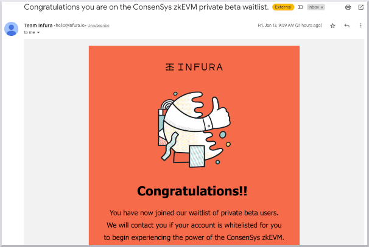
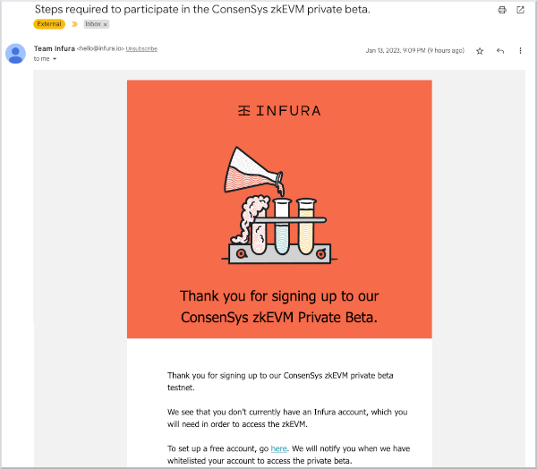
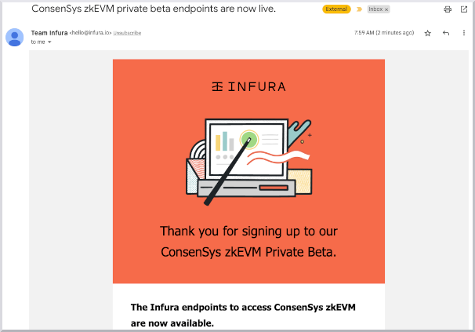

:::info

The waitlist for the ConsenSys zkEVM private beta is closed.

:::

To ensure the system is secure and stable, we're gradually onboarding new users in the order signed up to the waitlist. The number of daily onboarded users vary, but we'll try to onboard everyone who signed up as quick as possible.

If you signed up for the waitlist, the onboarding process is as follows:

1. If you're a registered Infura user, you'll receive an Infura email confirming your place on the waiting list.

   

   If you're not a registered Infura user, you'll receive an email with the steps required to participate in the ConsenSys zkEVM private beta. You must create a free Infura account to be eligible for testing ConsenSys zkEVM.

   

1. After you've been onboarded you'll receive an email confirming access to ConsenSys zkEVM. This email provides instructions on how to access your unique RPC URL.

   

You can now use the RPC URL in Infura to configure MetaMask and begin testing the network. Follow the [testing environment setup](https://goerli.zkevm.consensys.net/) to set up MetaMask and bridge funds to ConsenSys zkEVM to start testing.

:::note

We recommend testing ConsenSys zkEVM on a desktop browser rather than tablet or mobile.

:::
